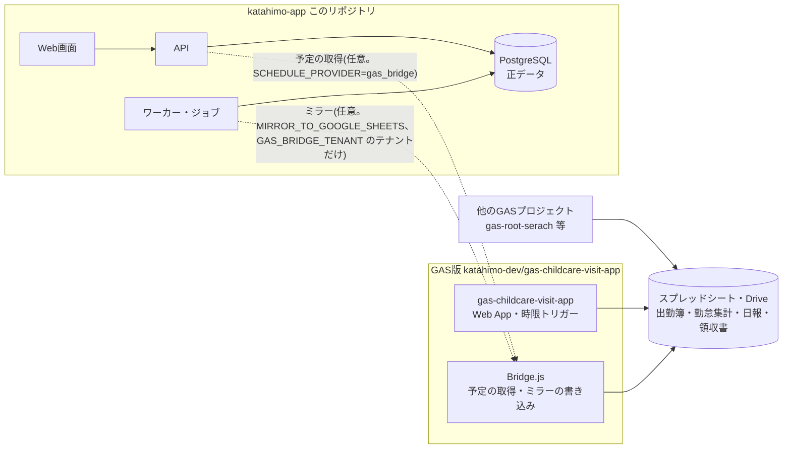
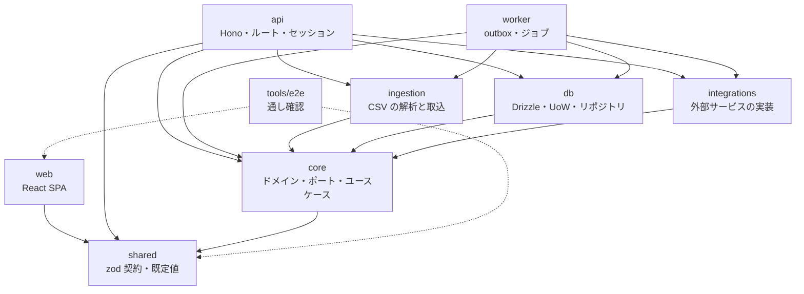
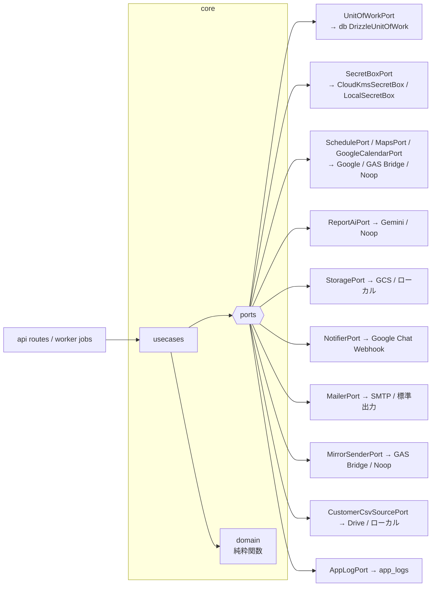
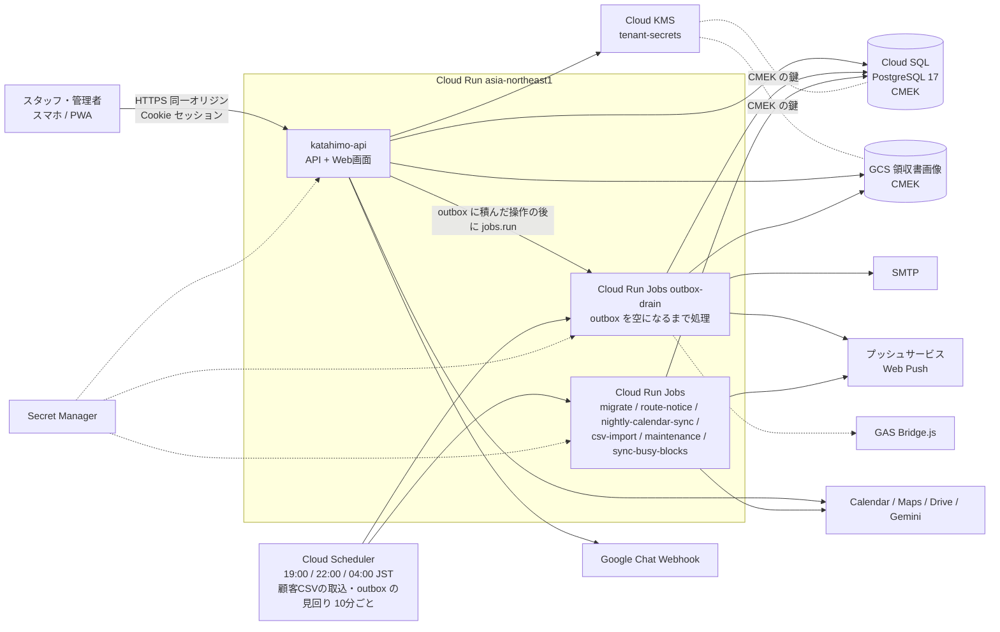
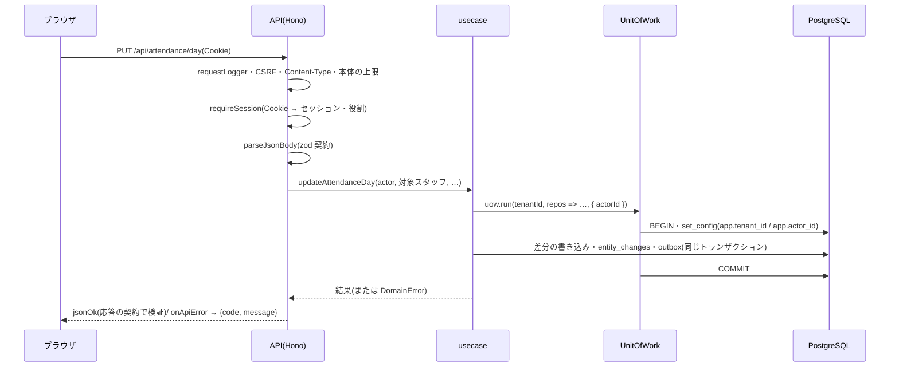

# 01. システム概要

- 目的: katahimo-app が何のためのシステムで、どこまでを受け持ち、どう組み立てられているかを1つにまとめる。
  個々の詳細(画面・DB・API・連携・運用)は 02〜09 に分け、ここからリンクする。
- 対象読者: このリポジトリに初めて触る開発者・運用者・レビューを頼む有識者。

## 1. 目的と範囲

保育訪問(ベビーシッター)事業のスタッフ用 Web アプリ。スタッフはスマホ(PWA)で、今日・明日の予定と訪問先へのルート、
お客様の情報とこれまでの記録、日報・事故報告・ヒヤリハット(AI の下書き)、領収書(写真の読み取り)、出勤簿を扱う。

もとは Google Apps Script(GAS)の Web アプリ `gas-childcare-visit-app`(1法人専用。Google スプレッドシート・Drive・
カレンダーをデータの置き場として直接読み書きする)。katahimo-app はそれを次の方針で作り直したもの。

| 方針 | 内容 |
| --- | --- |
| 画面は GAS版を出発点に | 画面は GAS版の見た目・文言・操作の流れをもとに作っている(慣れたスタッフがそのまま使える)。文言・振る舞いはこのアプリのコードが正で、画面の変更はこのアプリの中で判断し、GAS版との見た目の一致は求めない |
| 結果は同じ | 予定の分類・ルート・出勤簿の計算・カレンダーからの反映は、GAS版のコードそのものをテストの中で動かして出力の一致を確かめる(gasParity テスト) |
| 中身は作り直し | PostgreSQL を正データにし、複数法人(マルチテナント)を RLS で分離、保存データの暗号化(CMEK)、Cookie セッション、操作ログ、Cloud Run での運用。GAS・スプレッドシートへの依存は移行期のミラー書き込み(任意)だけに閉じ込める |
| GAS版の穴は塞ぐ | 他人の日報を上書きできた・秘密値を画面に平文で返していた等は直し、違いとして記録する(02 の「GAS版と意図的に変えた点」) |

範囲外(未実装): Google アカウントでのログイン、管理者がスタッフを割り当てるマッチング(表だけ。10)、請求・決済。

## 2. GAS版との関係

- GAS版のソースは読み取り専用のサブモジュール `legacy/gas-childcare-visit-app`(→ `katahimo-dev/gas-childcare-visit-app`)。
  **業務ロジックの仕様の正**であり、このリポジトリからは直さない(直すときは GAS版のリポジトリで直し、参照コミットを上げる)。
- テスト(gasParity)が GAS版のコードをそのまま動かして計算結果の一致を確かめる。
- 切替後もしばらくは、GAS版の画面や他の GAS プロジェクトがスプレッドシートを読むため、ワーカー(outbox-drain 等のジョブ)が outbox 経由で
  GAS版の `Bridge.js`(**Ver. 1.1.38 以降**)にミラーを書き込める(既定は off。05「GAS Bridge」)。

### GAS のプロジェクトとトリガーの扱い

切替日の手順は [09_移行計画.md](09_移行計画.md)。

| プロジェクト / トリガー | 新版での扱い |
| --- | --- |
| gas-childcare-visit-app `autoSyncTodayScheduleForAllStaff`(毎日22時台) | **切替日に止める**。新版の `nightly-calendar-sync`(22:00 JST)が代わる |
| gas-childcare-visit-app `checkAndImportLatestCsv`(毎日3時台) | **切替日に止める**。新版の `csv-import`(10分ごと)が代わる |
| gas-childcare-visit-app `flushLogsToDrive`(10分おき) | GAS版の画面と Bridge を誰も使わなくなるまで**残す**(止める直前に一度手動実行する) |
| gas-childcare-visit-app の Web App(`Bridge.js`) | ミラーか `SCHEDULE_PROVIDER=gas_bridge` を使う間は公開したまま |
| gas-root-serach `autoRunSaveAttendance()` | visit-app で代替済み。残っていれば削除 |
| gas-root-serach `main()`(翌日のルート集計・LINE WORKS 通知) | 新版の `route-notice`(19:00 JST、Web Push の翌日の予定のお知らせ)が代わる。スタッフが端末で通知をオンにした後に止める(09 5.3) |
| gas-childcare-daily-report `autoRunDailyTransfer()`(勤怠集計 → 個別出勤簿の転記) | 削除 |
| gas-integrated-system | Web App の公開を停止(廃止確認済み) |

## 3. 利用者と役割

| 役割(`staff.role`) | できること | 判定 |
| --- | --- | --- |
| `staff`(一般スタッフ) | 本人の予定・出勤簿・日報・領収書。全てのお客様の情報とこれまでの記録の閲覧(GAS版と同じ) | — |
| `coordinator`(コーディネーター) | 上に加え、**他のスタッフ**の予定・出勤簿・日報・領収書を扱う(画面の「表示するスタッフ」、出勤簿の「まとめて取り込む」)。「🛠 管理」タブの「📋 報告一覧」(全員分の日報・事故報告の一覧と CSV)、お客様タブの「お客様の情報を今すぐ取り込む」(顧客CSVの取込。強制の取込は管理者だけ) | `canActForOthers(role)` |
| `admin`(管理者) | 上に加え、管理者設定(Gemini・Google Chat)、「🛠 管理」タブのスタッフ管理・AIプロンプト・操作ログ、勤怠集計の書き直し(API) | `isAdminRole(role)` |
| 運用者(DB の `katahimo_migrator`) | テナントの作成・消去、月の締めの解除、データの直接の調査(07) | アプリの役割ではない |

判定の関数は `packages/shared/src/contracts/roles.ts`(画面とサーバーで共通)。画面の出し分けは見た目だけで、
**サーバーが毎回確かめる**(06「認可」)。

## 4. 構成

### 4.1 パッケージ

TypeScript・pnpm 11 のワークスペース(`packages/*`・`tools/*`)。Node 22 以上。

| パッケージ | 役割 |
| --- | --- |
| `packages/shared` | API の zod 契約(`src/contracts/`。画面とサーバーの両方で検証に使う)、既定値(AI プロンプト・評価の定義・パスワードの規則)、役割の判定 |
| `packages/core` | `domain/`(純粋関数: 出勤簿の列レイアウトと計算・月ロック・カレンダー反映、予定の分類とルート区間、個人情報の正規化、旧パスワードハッシュ、outbox の再試行 等)、`ports/`(外部依存のインターフェース)、`usecases/`。I/O を持たない |
| `packages/db` | Drizzle のスキーマ(`src/schema/`)とマイグレーション(`drizzle/`)、Unit of Work(`src/uow.ts`)、テナント内・テナント横断のリポジトリ、DB エラーの変換(`src/errors.ts`)、接続(Cloud SQL のソケット対応) |
| `packages/integrations` | ポートの実装: Google Calendar / Maps / Drive / Sheets(移行の取込) / Gemini / Chat、GCS、SMTP、テナントの秘密値の封(`secret-box`: Cloud KMS / ローカル鍵)、ローカル用の保存先、noop、GAS Bridge、実装の選択、API とワーカーで共通の環境変数(`runtime-env/sharedEnv.ts`) |
| `packages/ingestion` | RESERVA 顧客CSV の解析と1トランザクションの差分適用、GAS版スタッフ台帳CSV・出勤簿CSV の解析、最新の顧客CSV の自動取込、GAS版の日報・事故報告・領収書一覧のシートの読み方(移行の取込) |
| `packages/api` | Hono の API サーバー(`src/routes/`)、セッション(`src/session.ts`)、HTTP の共通処理(`src/http/`)、組み立て(`src/container.ts`)、運用スクリプト(`src/scripts/`) |
| `packages/worker` | 1回だけ動くジョブ(`src/entrypoints/`: outbox を処理する outbox-drain と夜間ジョブ)と、ローカル開発専用の outbox の見回り(`src/localWorker.ts`) |
| `packages/web` | スタッフ用 Web アプリ(React 19・Vite 7・TanStack Query 5・Tailwind CSS v3・vite-plugin-pwa) |
| `tools/e2e` | 実際の API・DB につないだ新アプリを最初から最後まで操作する通し確認(e2e) |
| `infra/` | ローカル用 PostgreSQL(`docker-compose.yml`・`initdb/`)、Cloud SQL の初期化 SQL(`cloudsql/`)、Terraform(`gcp/`) |

### 4.2 ポートとアダプター(ヘキサゴナル)

ユースケース(`core/usecases`)は外部のものを**ポート**(`core/ports`)越しにだけ使う。実装(アダプター)は
`db` と `integrations` にあり、`api/src/container.ts`・`worker/src/container.ts` が環境変数から組み立てる。
テストは `core/src/usecases/testDoubles.ts` のインメモリ実装で動く。

| ポート | 本番の実装 | 開発・未設定時 |
| --- | --- | --- |
| `UnitOfWorkPort` とテナント内のリポジトリ | `DrizzleUnitOfWork`(PostgreSQL・RLS)。API では `withOutboxDrainTrigger` で包む | 同じ |
| `OutboxDrainTriggerPort`(API) | `CloudRunJobDrainTrigger`(`OUTBOX_DRAIN_JOB`、Cloud Run Admin API の jobs.run) | 頼まない(`pnpm worker` / `pnpm outbox:once`) |
| `SecretBoxPort`(API。テナントの秘密値だけ) | `CloudKmsSecretBox`(`SECRET_BOX_PROVIDER=gcp`、Cloud KMS で直接暗号化) | `LocalSecretBox`(`SECRET_BOX_LOCAL_KEY`) |
| `SchedulePort` / `MapsPort` | `GoogleSchedulePort` + `GoogleMapsPlatformPort`(`SCHEDULE_PROVIDER=google`) | `gas_bridge` / `database`(DB の予約。Google の設定の無い環境) / `noop`(予定は常に0件) |
| `ReportAiPort` | `GeminiAiPort`(テナントのキー → `GEMINI_API_KEY`) | `NoopReportAiPort`(GAS版と同じ「API Key Missing」) |
| `StoragePort` | `GcsStoragePort`(`STORAGE_PROVIDER=gcs`) | ローカルのフォルダ |
| `NotifierPort` | `WebhookNotifierPort`(テナントの設定 → `GCHAT_*_WEBHOOK_URL`) | 未設定なら送らない(WARN) |
| `MailerPort`(ワーカー) | SMTP | 標準出力 |
| `MirrorSenderPort`(ワーカー) | `GasBridgeMirrorSenderPort`(`GAS_BRIDGE_TENANT` のテナントだけ) | 何もしない |
| `CustomerCsvSourcePort` | テナントごとの Google Drive のフォルダ(`pnpm tenant:customer-source`) | `CUSTOMER_CSV_LOCAL_DIR` / 未設定 |
| `AppLogPort` | `DrizzleAppLogRepository`(`app_logs`) | 同じ |

### 4.3 実行環境

- **api**: Hono の API と、`packages/web` をビルドした SPA を同じサービス・同じオリジンで配信する(`WEB_DIST_DIR`)。
- **outbox-drain**: outbox(スプレッドシートへのミラー・パスワード再設定メール・Web Push)を空になるまで処理して終わるジョブ。
  outbox に積んだ操作のコミットの後に API が Cloud Run Admin API で起動を頼み(インスタンスごとに5秒に1回まで)、Cloud Scheduler も
  10分ごとに見回りとして起動する(再試行の待ち・起動を頼めなかった分)。通常は操作の10〜30秒後に届く(05 2.3)。
- **jobs**: 同じ worker イメージの別コマンド。Cloud Scheduler が時刻に起動する(05「ジョブ」)。19:00 のお知らせ・22:00 の反映は
  積んだ outbox をそのジョブの中で送る。
- DB の接続ユーザーは用途ごとに分ける: API `katahimo_app`、ワーカー・ジョブ `katahimo_worker`、マイグレーション・
  テナント作成 `katahimo_migrator`(03「ロール」)。
- 詳しい構成と手順は [07_インフラ・運用.md](07_インフラ・運用.md)。

### 4.4 1回の要求の流れ

## 5. 主な設計判断

ADR(設計判断の記録)の代わりの一覧。判断ごとに理由・検討した他の案・受け入れた不利益を並べる。
判断を変えたときは行を消さず、「判断」の先頭に「**廃止**(#n で置き換え)」と書いて新しい行を足す(経緯は git の履歴)。
判断が増えて表で見渡せなくなったら、1件1ファイルの ADR(`doc/adr/`)に分けることを考える。

| # | 判断 | 理由 | 検討した他の案 | 受け入れた不利益 | 詳しくは |
| --- | --- | --- | --- | --- | --- |
| 1 | PostgreSQL を正データにし、スプレッドシートはミラー(任意)にする | 同時編集・制約・履歴・権限をDBで守れる。GAS版の「シート丸ごとの書き換え」「行番号で特定」の不具合を無くす | スプレッドシートを正データのまま使う(GAS版)。作り直し前の案の SQLite・Firebase・Neon | シートを直接直しても DB に戻らない(ミラーは一方向)。移行期はミラーの書き込み(GAS Bridge)を運用する | 03 |
| 2 | 複数法人は1つのスキーマに `tenant_id` + FORCE RLS + 複合外部キー | テナントの取り違えを DB が拒否する(設定し忘れれば何も見えない)。法人ごとの DB・スキーマより運用が軽い | 法人ごとの DB・スキーマ。アプリの WHERE 句だけで分ける | 全ての表・外部キーに `tenant_id` が要り、新しい表ごとに RLS・FORCE・GRANT を付ける(catalog のテストで確かめる)。法人ごとの復元・移設は行単位になる | 03・06 |
| 3 | 全ての DB の読み書きを Unit of Work 越しにし、リポジトリはテナントIDを受け取らない | テナントの指定がトランザクションごとに1回だけになり、型で取り違えを防ぐ。書き込みと outbox が一緒にコミットされる | リポジトリの各メソッドにテナントIDを渡す | トランザクションの中で外部の呼び出し・別の接続を使えない(外部の呼び出しは前後に分け、アップロードは先に置いて失敗したら消す) | 03・08 |
| 4 | 保存データは CMEK によるディスク・バックアップ単位の暗号化(Cloud SQL・領収書バケットをこのアプリ専用の Cloud KMS の鍵で暗号化)に、RLS・最小権限・監査ログ・回数制限を組み合わせて守る。テナントの秘密値(API キー・Webhook URL)だけは値そのものも Cloud KMS で封をする | 3省2ガイドライン・HIPAA で保存データの暗号化として一般的な水準(準拠の主張ではない。06 8.1)。鍵はこのアプリ専用で、権限とローテーションを自分で管理できる。列は型つきのまま持てるので、検索・集計・制約を DB でそのまま使え、実装と運用が単純になる | 個人情報の列をアプリで暗号化する(列の暗号化) | 読める権限のあるロールには平文で見える(権限・RLS・監査ログで絞る。06 8.2)。鍵の版を失う・無効にするとバックアップごとデータを失う(07 3.8) | 03・06・07 |
| 5 | 画面と API の形を zod の契約1か所で決め、両側で検証する | 食い違いを開発中・テストで見つける(応答も検証してから返す) | 型だけを共有する。OpenAPI から生成する | 契約とずれた応答は 500 になる(黙ってずれない代わり)。エンドポイントを足すたびに先に契約を書く | 04 |
| 6 | 出勤簿はシートの行ではなく実体(訪問・事務作業・移動)で持ち、列記号は1ファイルに閉じ込める | GAS版の列記号の画面・API・ミラーとの互換を保ちつつ、DB は正規化する | シートと同じ列(C〜AO)の行をそのまま表にする | 実体と行データの変換(`projectDay`・`applyRowEdit`)を保つ。4件目以降の訪問は保存するがシートの枠には出ない | 02・03 |
| 7 | 外部への書き込み(ミラー・メール・Web Push)は outbox に積み、Cloud Run Jobs の outbox-drain が送る(積んだ操作の後に API が起動を頼み、10分ごとの見回りでも起動する) | 書き込みの成否と外部の成否を切り離し、再試行・重複排除できる。応答時間からアカウントの有無が分からない。動くのは送るものがあるときだけで、常時動くインスタンスの固定費が掛からない | API の要求の中で直接送る。常時動くワーカー | 届くのは操作の10〜30秒後で、再試行は次の見回り(10分以内)を待つ | 05 |
| 8 | 予定・ルートは Google の API を直接呼ぶ(GAS Bridge も選べる) | GAS に頼らずに動く。移行期は GAS 側の計算に任せることもできる | GAS版の計算に任せ続ける(GAS Bridge だけ) | Maps・Calendar の API の料金と、カレンダーをサービスアカウントに共有する手間が掛かる。GAS Bridge を使えるのは1テナントだけ | 05 |
| 9 | GAS版の業務ロジックはコードを動かして一致を確かめる(gasParity)。実際の API・DB での通し確認(e2e)は別に行う | 読み比べでは見落とす差を機械で見つける | コードの読み比べ・画面の突き合わせ | サブモジュールが無いとテストが飛ばされる(CI はサブモジュール用のトークンが要る) | 08 |
| 10 | セッションは httpOnly Cookie(サーバー側に行)、パスワードは argon2id、GAS版のハッシュは初回ログインで移す | トークンをスクリプトから読ませない。既存スタッフが今のパスワードでログインできる | JWT をブラウザに持たせる。Google アカウントでのログイン(未実装) | 要求ごとに DB でセッションを引く。GAS版のハッシュの計算を移し終えるまで残す | 06 |
| 11 | ID はアプリが UUIDv7 で採番する | INSERT 前に決まり、子の行・outbox に同じトランザクションで使える。時刻順で索引が偏らない | DB の既定(`gen_random_uuid()`)・連番 | SQL で直接入れた行は DB の既定の UUIDv4 になり時刻順にならない(PostgreSQL 16・17 に `uuidv7()` が無い) | 03 |
| 12 | 本番は Cloud Run + Cloud SQL(東京)、構成は Terraform | 連携先が Google 系で揃う。API は最小0インスタンス、バックグラウンドの処理は全てジョブで、使った分だけの費用にする | 常時動く VM・コンテナ | 最小0インスタンスのため、しばらく使わなかった後の最初の要求は起動を待つ。API は要求の外で処理できない(裏の処理はジョブにする) | 07 |
| 13 | 顧客データを変えるのは顧客CSV(RESERVA)の取込と外部システムからの受け取りの API だけにし、画面から顧客を編集させない | 顧客の正は RESERVA。アプリでも編集すると次の取込で上書きされ、食い違う。GAS版と同じ運用 | アプリの中で顧客を管理する(将来の課題) | 値を直すには RESERVA 側で直して取込(10分ごと、またはお客様タブの「今すぐ取り込む」)を待つ | 02 5章・05 5章・11章 |
| 14 | テナントが読むカレンダーと顧客CSVのフォルダは運用担当者が決め(`platform.tenants`)、テナントの管理者には変えさせない | 全テナントを1つのサービスアカウントで読むため、管理者が変えられると別のテナントのカレンダー・CSV を読ませられる | テナントの管理者が画面で設定する。テナントごとにサービスアカウントを分ける | 変えるたびに運用担当者のコマンド(`pnpm tenant:calendars`・`tenant:customer-source`)が要る | 05 4.2・5章、07 3.6 |
| 15 | 翌日の予定のお知らせは PWA の Web Push で送る(gas-root-serach の LINE WORKS の DM の置き換え) | 外部のチャットのアカウント・連携なしで端末に届く。送るのは時刻とお名前だけ | LINE WORKS の DM を続ける。メール | スタッフが端末ごとに通知をオンにする。iPhone はホーム画面への追加(iOS 16.4 以降)が要る。全員がオンにするまで gas-root-serach を止められない | 05 10章・09 5.3 |
| 16 | 領収書は編集・削除させず、論理取消だけにする(直すときは取消して登録し直す) | 会計の記録として消えない・書き換わらないことを DB の権限でも守る | 編集・削除を許す | 取消せる期間と月の締めの制限があり、誤りを直す手順が増える | 02 7.1 |
