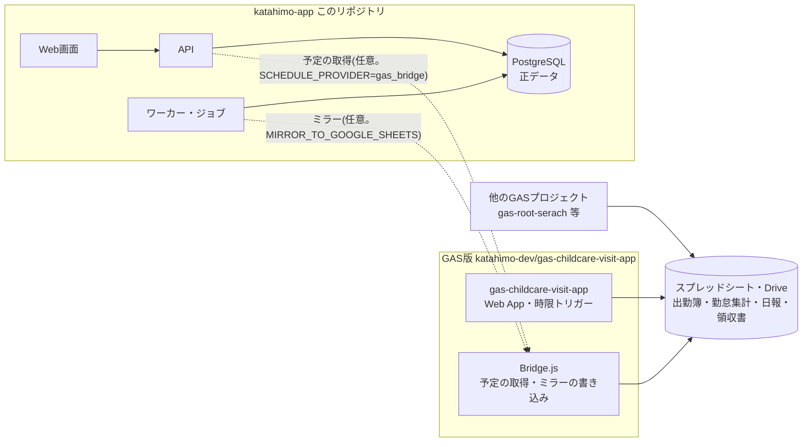
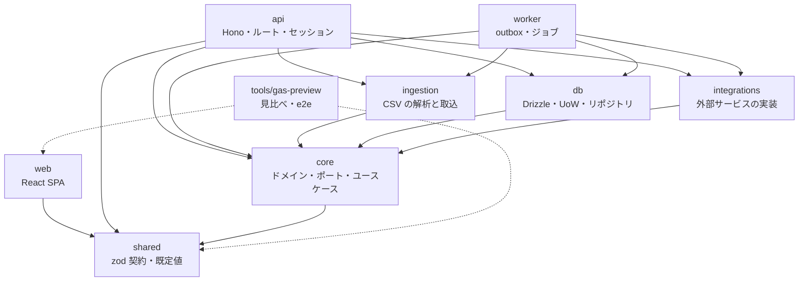
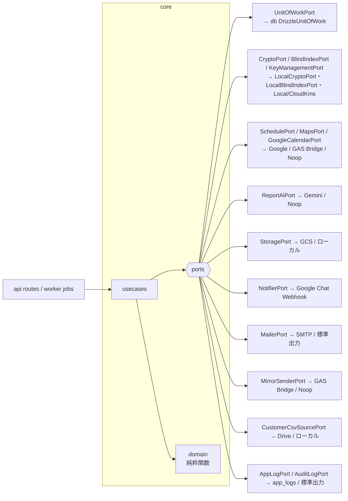
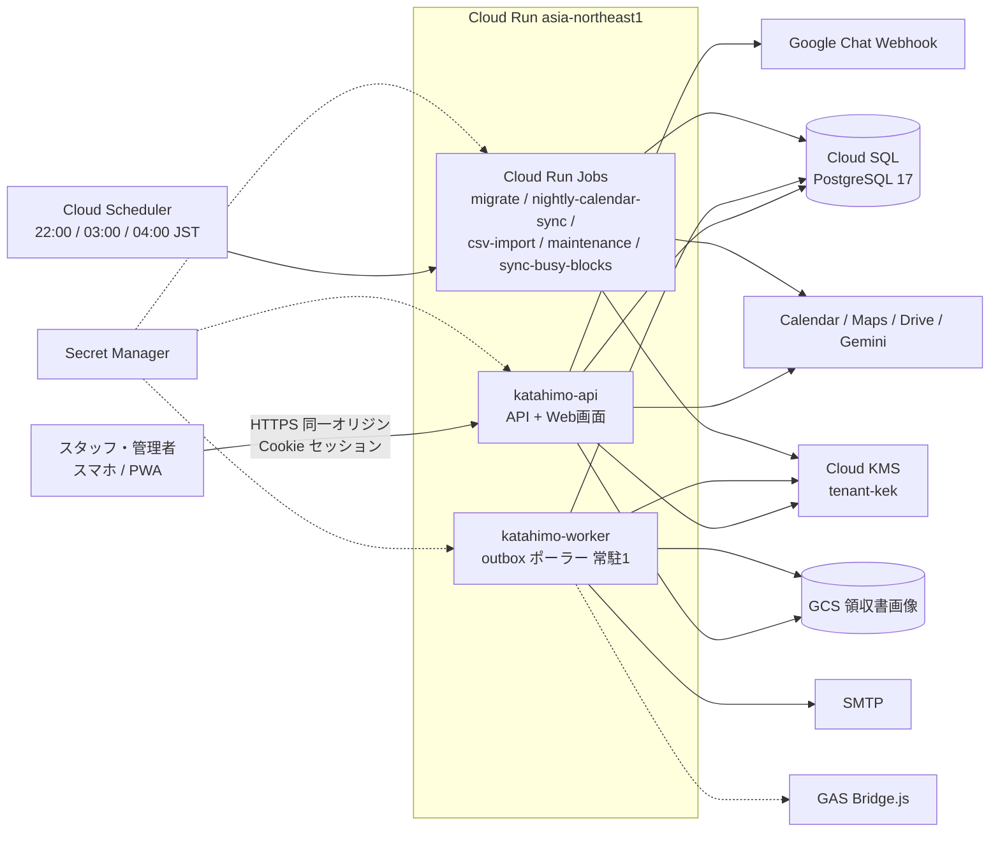
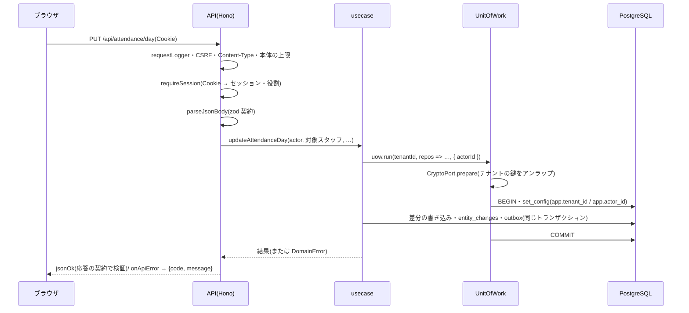

# 01. システム概要

- 目的: katahimo-app が何のためのシステムで、どこまでを受け持ち、どう組み立てられているかを1つにまとめる。
  個々の詳細(画面・DB・API・連携・運用)は 02〜09 に分け、ここからリンクする。
- 対象読者: このリポジトリに初めて触る開発者・運用者・レビューを頼む有識者。

## 1. 目的と範囲

保育訪問(ベビーシッター)事業のスタッフ用 Web アプリ。スタッフはスマホ(PWA)で、今日・明日の予定と訪問先へのルート、
お客様の情報とこれまでの記録、日報・事故報告・ヒヤリハット(AI の下書き)、領収書(写真の読み取り)、出勤簿を扱う。

もとは Google Apps Script(GAS)の Web アプリ `gas-childcare-visit-app`(1法人専用。Google スプレッドシート・Drive・
カレンダーをデータの置き場として直接読み書きする)。katahimo-app はそれを次の方針で作り直したもの。

| 方針 | 内容 |
| --- | --- |
| 画面は同じ | GAS版と同じ見た目・文言・操作の流れ(慣れたスタッフがそのまま使える)。`tools/gas-preview` で同じ場面(124場面)を撮って並べ、差分が 0.05% 以下であることを CI で確かめる |
| 結果は同じ | 予定の分類・ルート・出勤簿の計算・カレンダーからの反映は、GAS版のコードそのものをテストの中で動かして出力の一致を確かめる(gasParity テスト) |
| 中身は作り直し | PostgreSQL を正データにし、複数法人(マルチテナント)を RLS で分離、個人情報の暗号化、Cookie セッション、操作ログ、Cloud Run での運用。GAS・スプレッドシートへの依存は移行期のミラー書き込み(任意)だけに閉じ込める |
| GAS版の穴は塞ぐ | 他人の日報を上書きできた・秘密値を画面に平文で返していた等は直し、違いとして記録する(02 の「GAS版と意図的に変えた点」) |

範囲外(未実装): 管理者向けのスタッフ管理・AIプロンプト編集の**画面**(API だけある。GAS版にも画面は無い)、スタッフの自宅住所・
予定を読むカレンダーを設定する画面(今は SQL で設定する。05)、Google アカウントでのログイン、管理者がスタッフを割り当てる
マッチング(表だけ。10)、請求・決済。

## 2. GAS版との関係

- GAS版のソースは読み取り専用のサブモジュール `legacy/gas-childcare-visit-app`(→ `katahimo-dev/gas-childcare-visit-app`)。
  **仕様の正**であり、このリポジトリからは直さない(直すときは GAS版のリポジトリで直し、参照コミットを上げる)。
- テスト(gasParity)と見比べハーネス(`tools/gas-preview`)が GAS版のコード・画面をそのまま動かす。
- 切替後もしばらくは、GAS版の画面や他の GAS プロジェクトがスプレッドシートを読むため、ワーカーが outbox 経由で
  GAS版の `Bridge.js`(**Ver. 1.1.38 以降**)にミラーを書き込める(既定は off。05「GAS Bridge」)。

### GAS のプロジェクトとトリガーの扱い

切替日の手順は [09_移行計画.md](09_移行計画.md)。

| プロジェクト / トリガー | 新版での扱い |
| --- | --- |
| gas-childcare-visit-app `autoSyncTodayScheduleForAllStaff`(毎日22時台) | **切替日に止める**。新版の `nightly-calendar-sync`(22:00 JST)が代わる |
| gas-childcare-visit-app `checkAndImportLatestCsv`(毎日3時台) | **切替日に止める**。新版の `csv-import`(03:00 JST)が代わる |
| gas-childcare-visit-app `flushLogsToDrive`(10分おき) | GAS版の画面と Bridge を誰も使わなくなるまで**残す**(止める直前に一度手動実行する) |
| gas-childcare-visit-app の Web App(`Bridge.js`) | ミラーか `SCHEDULE_PROVIDER=gas_bridge` を使う間は公開したまま |
| gas-root-serach `autoRunSaveAttendance()` | visit-app で代替済み。残っていれば削除 |
| gas-root-serach `main()`(翌日のルート集計・LINE WORKS 通知) | 新版では**代替していない**。業務上不要と確認できた場合だけ削除 |
| gas-childcare-daily-report `autoRunDailyTransfer()`(勤怠集計 → 個別出勤簿の転記) | 削除 |
| gas-integrated-system | Web App の公開を停止(廃止確認済み) |

## 3. 利用者と役割

| 役割(`staff.role`) | できること | 判定 |
| --- | --- | --- |
| `staff`(一般スタッフ) | 本人の予定・出勤簿・日報・領収書。全てのお客様の情報とこれまでの記録の閲覧(GAS版と同じ) | — |
| `coordinator`(コーディネーター) | 上に加え、**他のスタッフ**の予定・出勤簿・日報・領収書を扱う(画面の「表示するスタッフ」、出勤簿の「まとめて取り込む」) | `canActForOthers(role)` |
| `admin`(管理者) | 上に加え、管理者設定(Gemini・Google Chat)、スタッフ管理(API)、AIプロンプト(API)、顧客CSVの手動取込(API)、勤怠集計の書き直し(API) | `isAdminRole(role)` |
| 運用者(DB の `katahimo_migrator`) | テナントの作成・消去、月の締めの解除、データの直接の調査(07) | アプリの役割ではない |

判定の関数は `packages/shared/src/contracts/roles.ts`(画面とサーバーで共通)。画面の出し分けは見た目だけで、
**サーバーが毎回確かめる**(06「認可」)。

## 4. 構成

### 4.1 パッケージ

TypeScript・pnpm 11 のワークスペース(`packages/*`・`tools/*`)。Node 22 以上。

| パッケージ | 役割 |
| --- | --- |
| `packages/shared` | API の zod 契約(`src/contracts/`。画面とサーバーの両方で検証に使う)、既定値(AI プロンプト・評価の定義・パスワードの規則)、役割の判定 |
| `packages/core` | `domain/`(純粋関数: 出勤簿の列レイアウトと計算・月ロック・カレンダー反映、予定の分類とルート区間、個人情報の正規化、旧パスワードハッシュ、outbox の再試行 等)、`ports/`(外部依存のインターフェース)、`usecases/`。I/O を持たない |
| `packages/db` | Drizzle のスキーマ(`src/schema/`)とマイグレーション(`drizzle/`)、Unit of Work(`src/uow.ts`)、テナント内・テナント横断のリポジトリ、DB エラーの変換(`src/errors.ts`)、接続(Cloud SQL のソケット対応) |
| `packages/integrations` | ポートの実装: Google Calendar / Maps / Drive / Gemini / Chat、GCS、Cloud KMS、SMTP、ローカル用(暗号・KMS・保存先)、noop、GAS Bridge、実装の選択、API とワーカーで共通の環境変数(`runtime-env/sharedEnv.ts`) |
| `packages/ingestion` | RESERVA 顧客CSV の解析と1トランザクションの差分適用、GAS版スタッフ台帳CSV・出勤簿CSV の解析、最新の顧客CSV の自動取込 |
| `packages/api` | Hono の API サーバー(`src/routes/`)、セッション(`src/session.ts`)、HTTP の共通処理(`src/http/`)、組み立て(`src/container.ts`)、運用スクリプト(`src/scripts/`) |
| `packages/worker` | 常駐の outbox ポーラー(`src/main.ts`)と1回だけのジョブ(`src/entrypoints/`) |
| `packages/web` | スタッフ用 Web アプリ(React 19・Vite 7・TanStack Query 5・Tailwind CSS v3・vite-plugin-pwa) |
| `tools/gas-preview` | GAS版と新アプリを同じ場面・同じデータで撮って並べる見比べハーネスと、実際の API・DB での通し確認(e2e) |
| `infra/` | ローカル用 PostgreSQL(`docker-compose.yml`・`initdb/`)、Cloud SQL の初期化 SQL(`cloudsql/`)、Terraform(`gcp/`) |

### 4.2 ポートとアダプター(ヘキサゴナル)

ユースケース(`core/usecases`)は外部のものを**ポート**(`core/ports`)越しにだけ使う。実装(アダプター)は
`db` と `integrations` にあり、`api/src/container.ts`・`worker/src/container.ts` が環境変数から組み立てる。
テストは `core/src/usecases/testDoubles.ts` のインメモリ実装で動く。

| ポート | 本番の実装 | 開発・未設定時 |
| --- | --- | --- |
| `UnitOfWorkPort` とテナント内のリポジトリ | `DrizzleUnitOfWork`(PostgreSQL・RLS) | 同じ |
| `CryptoPort` / `BlindIndexPort` | `LocalCryptoPort`(AES-256-GCM)/ `LocalBlindIndexPort`(HMAC) | 同じ |
| `KeyManagementPort` | `CloudKmsPort`(`KMS_PROVIDER=gcp`) | `LocalKmsPort`(`LOCAL_DEV_KEK`) |
| `SchedulePort` / `MapsPort` | `GoogleSchedulePort` + `GoogleMapsPlatformPort`(`SCHEDULE_PROVIDER=google`) | `gas_bridge` / `noop`(予定は常に0件) |
| `ReportAiPort` | `GeminiAiPort`(テナントのキー → `GEMINI_API_KEY`) | `NoopReportAiPort`(GAS版と同じ「API Key Missing」) |
| `StoragePort` | `GcsStoragePort`(`STORAGE_PROVIDER=gcs`) | ローカルのフォルダ |
| `NotifierPort` | `WebhookNotifierPort`(テナントの設定 → `GCHAT_*_WEBHOOK_URL`) | 未設定なら送らない(WARN) |
| `MailerPort`(ワーカー) | SMTP | 標準出力 |
| `MirrorSenderPort`(ワーカー) | `GasBridgeMirrorSenderPort` | 何もしない |
| `CustomerCsvSourcePort` | Google Drive | `CUSTOMER_CSV_LOCAL_DIR` / 未設定 |
| `AppLogPort` / `AuditLogPort` | `DrizzleAppLogRepository`(`app_logs`)/ 標準出力(Cloud Logging) | 同じ |

### 4.3 実行環境

- **api**: Hono の API と、`packages/web` をビルドした SPA を同じサービス・同じオリジンで配信する(`WEB_DIST_DIR`)。
- **worker**: outbox(スプレッドシートへのミラー・パスワード再設定メール)を処理し続ける常駐のサービス。
- **jobs**: 同じ worker イメージの別コマンド。Cloud Scheduler が時刻に起動する(05「ジョブ」)。
- DB の接続ユーザーは用途ごとに分ける: API `katahimo_app`、ワーカー・ジョブ `katahimo_worker`、マイグレーション・
  テナント作成 `katahimo_migrator`(03「ロール」)。
- 詳しい構成と手順は [07_インフラ・運用.md](07_インフラ・運用.md)。

### 4.4 1回の要求の流れ

## 5. 主な設計判断

| # | 判断 | 理由 | 詳しくは |
| --- | --- | --- | --- |
| 1 | PostgreSQL を正データにし、スプレッドシートはミラー(任意)にする | 同時編集・制約・履歴・権限をDBで守れる。GAS版の「シート丸ごとの書き換え」「行番号で特定」の不具合を無くす | 03 |
| 2 | 複数法人は1つのスキーマに `tenant_id` + FORCE RLS + 複合外部キー | テナントの取り違えを DB が拒否する(設定し忘れれば何も見えない)。法人ごとの DB・スキーマより運用が軽い | 03・06 |
| 3 | 全ての DB の読み書きを Unit of Work 越しにし、リポジトリはテナントIDを受け取らない | テナントの指定がトランザクションごとに1回だけになり、型で取り違えを防ぐ。書き込みと outbox が一緒にコミットされる | 03・08 |
| 4 | 要配慮の自由記述・連絡先・位置は列ごとに暗号化(テナントごとの DEK を KMS の KEK で包む) | DB・バックアップが漏れても読めない。テナントの鍵を消せば暗号学的に削除できる | 06 |
| 5 | 画面と API の形を zod の契約1か所で決め、両側で検証する | 食い違いを開発中・テストで見つける(応答も検証してから返す) | 04 |
| 6 | 出勤簿はシートの行ではなく実体(訪問・事務作業・移動)で持ち、列記号は1ファイルに閉じ込める | GAS版の列記号の画面・API・ミラーとの互換を保ちつつ、DB は正規化する | 02・03 |
| 7 | 外部への書き込み(ミラー・メール)は outbox でワーカーが送る | 書き込みの成否と外部の成否を切り離し、再試行・重複排除できる。応答時間からアカウントの有無が分からない | 05 |
| 8 | 予定・ルートは Google の API を直接呼ぶ(GAS Bridge も選べる) | GAS に頼らずに動く。移行期は GAS 側の計算に任せることもできる | 05 |
| 9 | GAS版の動作はコードを動かして一致を確かめる(gasParity)・画面は撮って比べる(gas-preview) | 読み比べでは見落とす差を機械で見つける | 08 |
| 10 | セッションは httpOnly Cookie(サーバー側に行)、パスワードは argon2id、GAS版のハッシュは初回ログインで移す | トークンをスクリプトから読ませない。既存スタッフが今のパスワードでログインできる | 06 |
| 11 | ID はアプリが UUIDv7 で採番する | 暗号化の AAD に行IDを入れるため INSERT 前に決める。時刻順で索引が偏らない | 03 |
| 12 | 本番は Cloud Run + Cloud SQL(東京)、構成は Terraform | 連携先が Google 系で揃う。常駐はワーカー1つだけで固定費を抑える | 07 |
