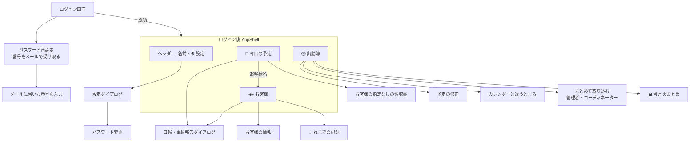

# 02. 機能仕様

- 目的: 画面・タブ・ダイアログごとの動きと業務ルールを、対応する GAS版の関数・API・役割ごとの権限と合わせて決める。
  GAS版と意図的に変えた点もここに集める。
- 対象読者: 画面・業務ロジックを直す開発者、業務担当(仕様の確認)、レビューする人。

画面の見た目・文言は GAS版(`legacy/gas-childcare-visit-app/gas-childcare-visit-app/index.html`)が正。ここでは**振る舞いと
ルール**を書き、文言は代表的なものだけを載せる(一字一句はコードと GAS版を見る)。画面の作り方の決まり(クラス名・
ダイアログ・localStorage のキー・z-index)は [`packages/web/README.md`](../packages/web/README.md)。API の形は
[04_API仕様.md](04_API仕様.md)。

## 1. 画面の全体

- 下タブで3つのタブを切り替える(`app/homeTabs.tsx`)。タブは切り替えても作り直さず隠すだけ(入力途中の値・スクロールが残る)。
  出勤簿タブは初めて開いたときに作る(GAS版 `initPastScheduleTab` と同じ。JS も分けて読み、手が空いたときに先に読む)。
- 顧客データの版数を60秒ごとに確かめ(`GET /api/data-version`、画面が隠れている間は止める)、変わっていれば顧客の
  クエリを読み直す(GAS版 `checkDataVersion`)。
- 日報ダイアログの文言・評価の定義は、ログイン後すぐに `GET /api/ui-config` で読む(GAS版 `getUiConfig`)。
- 失敗は赤いお知らせ(`showErrorToast`。閉じるまで残る)、成功は4秒で消えるお知らせ。通信の失敗は
  「うまくいきませんでした。電波を確認して、もう一度押してください」(GAS版の withFailureHandler と同じ)。
- 401(セッション切れ)はログイン画面に戻り「しばらく使っていなかったので、もう一度ログインしてください」を出す。

## 2. 役割ごとの権限(画面)

| 画面・操作 | staff | coordinator | admin | サーバーの判定 |
| --- | --- | --- | --- | --- |
| 予定・出勤簿の「表示するスタッフ」 | — | ○ | ○ | `targetStaffIdOf` → `resolveTargetStaffId`(一般スタッフは常に本人) |
| 他のスタッフ名義の日報・領収書の保存 | — | ○ | ○ | 同上。日報の上書きは元の担当のまま |
| 他のスタッフの日報の上書き | — | ○ | ○ | `canActForOthers`。一般スタッフは 403(SECURITY ログ) |
| 出勤簿の「まとめて取り込む」 | — | ○ | ○ | 1件ずつ `POST /api/attendance/day/calendar-sync`(対象スタッフの判定は同上) |
| お客様の一覧・情報・これまでの記録 | ○ | ○ | ○ | ログインしていれば全顧客(GAS版と同じ) |
| 設定の「管理者の詳細設定」(Gemini・Google Chat) | — | — | ○ | `requireAdmin` |
| スタッフ管理・AIプロンプト・顧客CSVの手動取込・勤怠集計の書き直し | 画面なし | 画面なし | API のみ | `requireAdmin` |

画面での出し分けは `canActForOthers(user.role)`(表示するスタッフ)・`isAdminRole(user.role)`(詳細設定)。
**本当の判定はサーバー**で、一般スタッフが他人の `staffId` を送っても本人のデータになる(e2e で確かめている)。

## 3. ログイン・パスワード

| 画面 | GAS版 | API | ルール・主な文言 |
| --- | --- | --- | --- |
| ログイン | `verifyLogin` | `POST /api/auth/login` | メール(またはサブメール)とパスワード。法人ID(テナント)は `VITE_DEFAULT_TENANT_SLUG` → URL の `?t=` かサブドメイン → 最後にログインできた法人ID の順で決め、決まらないときだけ「法人ID」欄を出す(`lib/tenant.ts`)。失敗「メールアドレスまたはパスワードが違います」、退職済み「ログイン権限のないユーザーです」、法人が停止中「ご利用の法人は現在利用を停止しています。管理者にお問い合わせください」、失敗が続くと 429「ログインの失敗が続いたため、一時的にログインできません。…(15分ほど)…」 |
| 起動時の確認 | `checkSession(token, true)` | `GET /api/auth/me` | Cookie だけで本人を決める。通信の失敗ならログイン画面ではなく「もう一度読み込む」を出す(ログインしていないと決めるのは 401 のときだけ) |
| パスワード再設定(番号をメールで受け取る) | `requestPasswordReset` | `POST /api/auth/password-reset/request` | 登録の有無にかかわらず同じ応答「登録されているメールアドレスであれば、認証コードを送信しました。…(有効期限30分)」。サブメールで要求したらサブメール宛に送る |
| 番号を入力して新しいパスワード | `resetPasswordWithCode` | `POST /api/auth/password-reset/confirm` | 6桁の数字・有効期限30分・1回限り・1つのコードに5回まで。「無効な認証コードです」「認証コードの有効期限が切れています」「認証コードの入力回数が上限を超えました。…」。成功でそのスタッフの全セッションを失効し、ログイン画面に「パスワードがリセットされました。…」 |
| パスワード変更(設定から) | `changePassword` | `POST /api/auth/change-password` | 現在のパスワードが必要。新しいパスワードは8〜128文字(`PASSWORD_MIN_LENGTH` / `PASSWORD_MAX_LENGTH`)。成功で他の端末のセッションを失効、入力欄を空にする |
| ログアウト(設定から) | (トークンを消す) | `POST /api/auth/logout` | 「ログアウトしますか？」。サーバー側のセッションも失効し、その人の localStorage の値と表示用キャッシュを消す |

セッションの期限: 無操作7日(残りが6日を切ると延長)、ログインから30日で必ず切れる。退職日(テナントの時刻帯の業務日)の当日以降は
ログインできず、既存のセッションも失効する。詳しくは 06「認証」。

## 4. 📅 今日の予定(`features/schedule`)

| 項目 | 内容 |
| --- | --- |
| GAS版 | `getScheduleForDate`(軽量)・`getRouteForStaffOnDate`(ルートつき)・`getActiveStaffNamesForAdmin` |
| API | `GET /api/schedule?date=`、`GET /api/schedule/route?date=[&forceRefresh=1]`、`GET /api/staff`(表示するスタッフの選択肢) |
| 表示 | 「☀️ 今日」「🌙 明日」の切り替え。予定ごとのカード(種別・時刻・お客様名・場所・予約詳細のリンク)、予定と予定の間に移動の行(所要時間・距離・Google マップの経路リンク)、自宅 → 最初・最後 → 自宅の区間 |
| 読み込み | 端末の2時間キャッシュ(`katahimo_schedule_route_v1_<スタッフID>_<日付>`)があればそれを出し、無ければルートつきを読む(「調べています…（10秒ほど）」)。ルートつきに失敗したら赤いお知らせを出し、ルートなしの軽量版だけでも出す(GAS版 `loadPlainScheduleOnRouteFailure_`) |
| 🔄 最新にする | `forceRefresh=1`。サーバーの2時間キャッシュも読まずに計算し直す。スタッフごとに1時間30回まで(429) |
| 日報へ | 「✏️ この訪問の日報を書く」で日報ダイアログを開く(予定のお客様名で顧客を探す)。お客様名からお客様タブへ移る(GAS版 `jumpToCustomerFromSchedule`) |
| 表示するスタッフ | 管理者・コーディネーターだけに出る(`AdminTargetStaffSelect`)。選び直すと読み直す |
| 空・失敗 | 「この日の予定はありません」「明日の予定はありません」。住所の無い訪問先は「住所が登録されていません（事務局へ連絡）」 |

予定の分類とルートのルール(`core/domain/schedule/`、GAS版 `RouteSearch.js` と出力一致):

- 1日の範囲は JST の 0:00〜翌 0:00。範囲に一部でも重なる予定を読む。終日予定は 0:00〜翌0:00(表示は `00:00`〜`00:00`)。
- タイトルのタグ: `[予約確定]` > `[新規]` > `[イベント]` > `[事務]` の優先順で1つに決まる。タグの無い予定は対象外。
- `[予約確定]`: タイトルから全タグを除いた氏名を、空白の違いを無視して顧客の氏名と突き合わせる。担当は説明欄の
  「施設：<スタッフ名>[」、無ければカレンダーの持ち主。説明欄に「オンライン」を含む予約は場所を持たない。予約詳細URLは説明欄の最初のURL。
- `[新規]`・`[事務]`・ゲストのいない `[イベント]` はカレンダーの持ち主の予定。持ち主が「いいえ」と回答した予定は読まない。
- `[事務]` は同じスタッフの時間が重なるもの(ちょうど終了時刻に始まるものは除く)を1件にまとめる(名前は「,」区切り)。
  終日の `[事務]` があるとその日の事務作業は全て1件になる。
- 経路: 位置のある予定だけを時刻順につなぐ(自宅 → 最初、予定間、最後 → 自宅)。住所2(期間つき)が当日を含めば、登録済みの
  緯度経度より住所2を優先する。所要時間は分に四捨五入、距離は km 小数2桁の文字列、算出できない区間は `''`。
- 読めないカレンダーは飛ばして WARN を残す(閲覧のとき)。出勤簿に書く処理では失敗させる(05「予定・ルート」)。

## 5. 👪 お客様(`features/customers`)

| 画面 | GAS版 | API | ルール |
| --- | --- | --- | --- |
| お客様の一覧 | `getData`(`fetchDataFromSheet`) | `GET /api/customers` | アーカイブされていない全顧客と地域の一覧を読み、名前の部分一致(「お客様の名前で探す」)・地域(「すべての地域」)の絞り込みと並び替えは画面で行う(GAS版と同じ)。最近開いたお客様を上に出す(`recent_customers@<法人ID>/<スタッフID>`) |
| カード | — | — | 「✏️ 日報を書く」「👤 お客様の情報」「📖 これまでの記録」 |
| 👤 お客様の情報 | `showCustomerDetail` | `GET /api/customers/:id` | 住所・電話・緊急連絡先・メモ・受給者番号・避難場所・子ども(生年月日・アレルギー・配慮事項)を出す。開くたびに INFO `customer.detail.viewed` を残す(GAS版には無い閲覧の監査)。アレルギーが無ければ「アレルギー: なし」 |
| 📖 これまでの記録 | `getCustomerReports` | `GET /api/reports/history?customerId=&before=` | 日報・事故報告・ヒヤリハットを新しい順に5件ずつ。「さらに前の記録を見る」は前の応答の `nextCursor` を `before` に渡す(同じ時刻の記録があっても重複・抜けが無い) |

顧客データは顧客CSV(RESERVA)の取込でだけ変わる(05「顧客CSV」)。画面から顧客を編集する機能は無い(GAS版と同じ)。

## 6. 日報・事故報告・ヒヤリハット(`features/report`)

日報ダイアログは、お客様タブ・予定タブの「日報を書く」から開く(`useReportModal().openReport({ customerId, customerName })`)。
開いた後にお客様の詳細(住所・子ども)を `GET /api/customers/:id` で読む。

| 操作 | GAS版 | API | ルール |
| --- | --- | --- | --- |
| 日報/事故報告/ヒヤリハットの切り替え | (タブ) | — | 事故報告とヒヤリハットは同じ形式(`reportType`) |
| メモ・🎤 話して入力 | (Web Speech) | — | 入力欄の文言はテナントの `ai_prompts`(無ければ既定)。書きかけは端末に残り、開き直すと復元する(`pending_report_draft@…`)。ダイアログを閉じる・開き直すと音声入力を止める |
| AI に書いてもらう(日報) | `generateReportWithWarnings` | `POST /api/reports/daily/generate` | 氏名を伏せた本文と時間を渡し、社内向け・保護者向けの文と「⚠️ 足りない情報があります」の警告を得る。スタッフごとに1日200回(429「本日のAI生成の利用回数の上限に達しました。…」)。Gemini のキーが無ければ GAS版と同じ「API Key Missing」の応答 |
| AI に書いてもらう(事故・ヒヤリ) | `generateAccidentReport` | `POST /api/reports/accident/generate` | 「何が起きたか」「くわしい状況」「その場でしたこと」「おうちの方への連絡」「病院での診断・手当て」「これからの対策」等の下書き。回数制限は日報と共通 |
| 評価 | (★) | — | 「⚠️ 今日のヒヤッとした度合い（PSI）」等(`defaults/assessments.ts`)。1〜5 または未選択 |
| 保存する | `saveReport` / `saveAccidentReport` | `POST /api/reports/daily` / `POST /api/reports/accident` | 保存で「✅ 保存しました」。同じダイアログで2回目以降の保存は上書き(`reportId` と `rowVersion`)。他の人が先に保存していたら 409「…画面を開きなおしてください」。上書きで顧客・担当は変えられない(409 `customer_mismatch` / `author_mismatch`)。一般スタッフは他人の報告を上書きできない(403)。確定済み(locked)の記録は変えられない。保存すると Google Chat(日報の通知先)に知らせる |
| ✅ 訪問終わりました（事務局に知らせる） | `sendVisitCompleteNotification` | `POST /api/reports/visit-complete` | DB には書かず、Google Chat に知らせるだけ。失敗は GAS版と同じ「お知らせを送れませんでした…」 |
| コピー | — | — | 保護者向けの文をコピーし「コピーしました。LINEを開いて貼りつけてください」 |

開き直す前に届いた AI・読み取り・保存の結果は捨てる(別のお客様の欄に入らないように)。

## 7. 領収書(日報ダイアログの中・お客様の指定なし)

| 操作 | GAS版 | API | ルール |
| --- | --- | --- | --- |
| 📷 撮る / 🖼️ 写真から選ぶ | — | — | 「レシート・領収書（6枚まで）」。画面で長辺1200px・JPEG 品質0.7に縮める(HEIC は JPEG に変換) |
| 金額の読み取り | `extractAmountFromImage` | `POST /api/receipts/ocr` | 「金額を読み取っています…」。金額・店名・日付を埋める(直せる)。スタッフごとに1日300回(429 のときは手入力を案内) |
| この領収書を送る | `uploadReceiptsOnly` | `POST /api/receipts` | 1回6枚まで・1枚1.5MB まで・JPEG/PNG/WebP(中身で判定)。重複(スタッフ・顧客・日時・金額・店名が同じ)は登録せず件数で知らせる。同じ回の中の同じ内容(往復の運賃等)は全て登録する(その内容が既に登録済みなら全て重複)。日時が読めなければ報告の日付+開始時刻、それも無ければ登録時刻。申し送りは1回の束に1つ。送ると Google Chat(領収書の通知先)に知らせる |
| お客様の指定なし | `openStandaloneReceiptModal` | 同上(`customerId` なし) | 未登録のお客様の氏名(`customerNameText`)を残し、通知の「顧客名:」にも使う |
| 端末での重複確認 | (`GAS_RECEIPT_KEYS_V1_<スタッフ名>`) | — | この端末から送った内容を覚えておき、送る前に知らせる(GAS版と同じキー) |

## 8. 🕒 出勤簿(`features/attendance`)

### 8.1 表示

| 画面 | GAS版 | API | ルール |
| --- | --- | --- | --- |
| 週の表示(📝 一覧で見る / 📋 表で見る) | `getWeeklyScheduleForStaff` | `GET /api/attendance/week?start=&end=` | 出勤簿の記録を週の予定にした閲覧用(最大31日)。左右のスワイプ・矢印で週を移る(「◀ 前の週」「次の週 ▶」「今日へ」)。2時間キャッシュ(`pastSchedWeek_<スタッフID>_<週の日曜>`)、保存・取り込みで消す。表示の好みは `cal_week_view_mode` |
| 日の表示 | `getPastScheduleForDate` | `GET /api/attendance/day?date=` | 25列の `rowData`・数式列に当たる派生値(`derived`)・手で直した列(`changedFields`、強調表示)・`rowVersion`・編集できる期間(`editable`)。記録の無い日は空の行として開ける |
| 予定の修正(✏️ ・➕) | `updatePastSchedule` | `PUT /api/attendance/day` | 訪問#1〜#3・作業1〜2の名前・開始・終了、移動と距離・買い物代行・備考。「この予定の内容を消します。よろしいですか？」で枠を空にできる。変わった列だけを送る |
| 天候 | (入力規則) | 同上 | 晴れ・曇り・雨・雪(`optionsI` / `optionsR`)。「雪」は移動時間を1.3倍にする |
| 🔄 最新にする | — | 同上の読み直し | 「最新にしました」 |
| 表示するスタッフ | `getActiveStaffNamesForAdmin` | `GET /api/staff` | 管理者・コーディネーターだけ |

### 8.2 修正のルール(`core/domain/attendance/`)

- **月ロック**(`monthLock.ts`): 手入力で直せるのは「今日(テナントの時刻帯)が属する月」の日付だけ。前月以前は
  「修正期限切れです。当月(MM/01)より前の記録は変更できません。」、来月以降は「修正できません。来月以降(MM/末日より後)の
  記録はまだ修正できません。」(400 `locked`)。管理者も同じ。カレンダーからの反映・既存出勤簿の取込には掛からない(GAS版と同じ)。
- **締めた月**(`attendance_periods.status='locked'`): DB のトリガーがどの書き込みも拒否する(400 `locked`)。締めの解除は運用者だけ(07)。
- 値の形式: 時刻は `HH:mm`、距離は小数2桁に揃える(`6` → `6.00`)、買い物代行は0以上の整数(「買い物代行をした回数は、0以上の数で入力してください」)。
  誤りは 400(`fields` に `rowData.<列>`)。24:00 は翌日の 0:00 として持ち、表示は `00:00`(GAS版もシートを `HH:mm` で読むため)。
- 訪問の時間帯の重なりは拒否しない(GAS版の手入力・カレンダー反映と同じ)。
- 送られた列だけを今の値と比べ、変わった列だけを書く。変わらなければ「変更はありませんでした。」、変われば「修正しました。」。
  手で変えた列は強調表示(`changedFields`)になる。他の人が先に保存していたら 409。
- 訪問の4件目以降は保存するが出勤簿には出さない(WARN `attendance.day.hidden_visits`)。

### 8.3 数式列の計算(`attendanceCalc.ts`、GAS版 `AttendanceCalc.js` と同じ式)

| 値 | 計算 |
| --- | --- |
| 移動開始・終了・待機 | 前の訪問の終業 + 計画の移動時間 = 移動終了、次の始業 − 移動終了 = 待機(0 未満は0) |
| 天候補正後の移動時間 | 天候が「雪」なら計画の移動時間 × 1.3 |
| 労働時間(所定内)・残業(所定外) | 訪問3件 + 作業2件の各時間帯を 10:00〜17:00 の内と外に分ける。作業の名前に「mtg」を含む時間帯は全体を所定内 |
| 働いた時間 | 所定内 + 所定外(17時以降だけの日に0分と出ないように GAS版で足された値) |
| 総移動時間・総距離 | 天候補正後の移動時間の合計、#1→#2・#2→#3・出勤・退勤の距離の合計 |
| 基準距離超過回数 | 各距離の 15km を超えた分を 5km ごとに1回 |
| 訪問等回数 | #2→#3 の距離があれば3、#1→#2 があれば2、出勤・退勤のどちらかがあれば1 |

### 8.4 カレンダーからの反映

| 画面 | GAS版 | API |
| --- | --- | --- |
| カレンダーと違うところ(見比べ) | `previewCalendarSyncForStaffOnDate` | `GET /api/attendance/day/calendar-sync/preview?date=` |
| 取り込む | `applyCalendarSyncForStaffOnDate` / `syncPastScheduleFromCalendar` | `POST /api/attendance/day/calendar-sync` |
| まとめて取り込む(管理者・コーディネーター) | (「一括反映」`runCalendarSyncQueue`) | 画面がスタッフ×日ごとに上の API を順に呼び、成功・失敗を数える。失敗分だけやり直せる |

ルール(`calendarSync.ts`、GAS版 `buildTimesheetRowDataFromAppointments_` / `mergeOverlappingOfficeWork` / `buildCalendarSyncPlan_` と出力一致):

- 予定は毎回最新を取る(キャッシュを使わない)。読めないカレンダーがあれば 502(部分的な結果で記録しない)。
- カレンダーにある枠(訪問#1〜#3・作業1〜2)はカレンダーの内容で上書き。出勤簿にだけある枠は、カレンダー由来の枠と
  時間が重なる場合だけ消し、重ならなければ残す。退勤距離は最後に埋まった訪問と一緒に反映する。天候・買い物代行・備考には触れない。
- 手で直した印(強調表示)は増やしも消しもしない。枠が空になって実体が消えても印は枠に残し、次にその枠に入る値に引き継ぐ
  (GAS版のセルの背景色と同じ)。
- 同じカレンダーの内容なら2回目以降は何も書かない(`changedCount: 0`)。予定も出勤簿の行も無い日は何も作らない。
- 画面は見比べの結果(「「取り込む」を押すと、下の項目だけが書きかわります。」)を見せるが、サーバーは同じ計算をやり直してから書く。

### 8.5 📊 今月のまとめ(出勤簿・領収書)

`GET /api/attendance/month?month=YYYY-MM`(GAS版 `getAttendanceMonth` + `getReceiptsForMonth_`)。月の全日の行・月合計
(労働時間・残業・働いた時間・移動・距離・超過回数・訪問等回数・買い物代行)と、領収書の日ごとの金額と合計(領収書日時の
JST の暦日。読めない金額は0円)。2時間キャッシュ(`attendanceMonthly_<スタッフID>_<YYYY-MM>`)。

## 9. ⚙ 設定

| 画面 | GAS版 | API | ルール |
| --- | --- | --- | --- |
| 文字の大きさ | (localStorage) | — | ふつう・大きい・とても大きい(`app_text_size`)。「保存して閉じる」→「設定を保存しました」 |
| パスワード変更・ログアウト | 3章 | 3章 | |
| 版数 | — | — | `Ver. <packages/web/package.json の version>` |
| 管理者の詳細設定(管理者だけ) | `getGeminiApiKeyForAdmin` ほか | `GET /api/settings/admin` | APIキー・Webhook URL は伏せ字と設定済みの印だけが返る(GAS版は平文) |
| Gemini APIキー | `saveGeminiApiKeyForAdmin` | `POST /api/settings/admin/gemini-key` | 伏せ字のままなら変更なし、伏せ字の一部だけ書き換えた値は 400 |
| Gemini のモデル・🔄 最新モデル一覧を取得 | `saveGeminiModelSettingsForAdmin` / `listAvailableGeminiModelsForAdmin` | `POST /api/settings/admin/gemini-models`・`/gemini-models/available` | 既定は日報 `gemini-2.5-flash`・読み取り `gemini-2.5-flash-lite` |
| Google Chat の Webhook | `saveGoogleChatWebhookSettingsForAdmin` | `POST /api/settings/admin/gchat-webhooks` | `https://chat.googleapis.com/v1/spaces/<space>/messages?…` だけ。領収書の通知先は「空のまま保存はできません」 |

同じ値での保存は「変更ありません」で、ログも残さない(GAS版と同じ)。読み込み中に保存したときの案内は
「Gemini APIキーの読み込みが完了してから保存してください」の1種類(GAS版は3種類)。

## 10. 画面の無い管理者の機能(API)

| 機能 | GAS版での作業 | API | 備考 |
| --- | --- | --- | --- |
| スタッフの一覧・登録・変更(退職日・役割) | スタッフ台帳シートの直接編集 | `GET/POST /api/admin/staff`、`PATCH /api/admin/staff/:id` | 自分の管理者権限の解除・退職日の設定は 400。退職日を入れるとセッションを全て失効 |
| AIプロンプト・入力欄の文言 | 「ＡＩプロンプト」シート | `GET/PUT /api/settings/admin/prompts` | 既定値と同じ・空・null なら上書きを消す |
| 顧客CSVの手動取込 | `forceImportCsv` | `POST /api/admin/customers/import` | 消えた顧客が20%を超えたら適用しない(409 `review_required`) |
| 勤怠集計シートの行の書き直し | `refreshAttendanceForStaffOnDate` | `POST /api/attendance/day/aggregate/refresh` | ミラーを outbox に積む |

スタッフ台帳・出勤簿・顧客CSV の一括取込とテナントの作成は運用スクリプト(07「運用スクリプト」)。

## 11. GAS版と意図的に変えた点

画面の細かい違い(フォーカス・読み上げ・PWA の更新の知らせ・端末の時刻帯に依存しない日付 等)は
[`packages/web/README.md`](../packages/web/README.md)「GAS版と意図的に変えているところ」、見比べでの既知の差は
[`tools/gas-preview/README.md`](../tools/gas-preview/README.md)「分かっている違い」。業務・セキュリティに関わるものは次のとおり。

| 項目 | GAS版 | 新版 | 理由 |
| --- | --- | --- | --- |
| 本人の特定 | トークンを localStorage に置き、スタッフ名で特定 | httpOnly Cookie のセッション、スタッフIDで特定 | スクリプトから盗めない・同姓同名で取り違えない |
| 他人の日報の上書き | 行番号さえ分かればできた | 一般スタッフは 403。顧客・担当の違う上書きは 409 | 記録の改ざん・取り違えを防ぐ |
| 秘密値の表示 | APIキー・Webhook URL を平文で返す | 伏せ字だけを返す | 画面から漏れても使えない |
| 顧客CSVの取込 | 画面を開くたびにクライアントから呼び、シートを丸ごと置き換え | 定期ジョブと管理者操作だけ。RESERVA の顧客IDで差分適用し、消えた顧客が20%を超えたら止める | 多数の端末から重い処理が走らない・欠けたCSVで全消去しない |
| オンライン予約の住所 | 顧客そのものの住所を消していた(同じ日の対面予約の住所も消えた) | その予定の場所だけを空にする | GAS版の不具合 |
| 同名のスタッフ | 台帳で先の1人にしか予定が出ない | 全員に出る | 同上 |
| 軽量版の予定 | `[新規]` 等の場所を無駄にジオコーディング | 地図 API を一切呼ばない | 費用 |
| 顧客の緯度・経度の読み取り | 半角カンマで区切り、それぞれ `parseFloat` | 同じ読み方で、全角カンマ・空白の区切りも読む。片方が空なら緯度経度なし(0 にしない。住所で調べる)。画面の「緯度・経度」は GAS版と同じく取込元の表記のまま | 取込元の表記の揺れで場所を落とさない・0 の座標でルートを誤らない |
| 経路の計算 | DirectionFinder | Routes API(`TRAFFIC_UNAWARE`)。値が数分・数百m違うことがある | Directions API は新規に有効化できない |
| 事故報告の記録日時 | 訪問日を送る | サーバーの保存時刻(API の契約に訪問日が無い) | — |
| お客様の詳細の閲覧 | 記録しない | INFO `customer.detail.viewed` | 要配慮情報の閲覧の監査 |
| 領収書の日時 | シートが日時として読む | 表記を問わず読み、読めなければ報告の日付+開始時刻 | 同じ結果にするため |
| アレルギー | 取込で常に空、シートの手入力だけ | RESERVA の「世帯全員の情報」に明示的に書かれた記述を保守的に抽出(`extractAllergy`) | 取込で失われないように |
| パスワードの長さ | 制限なし | 8〜128文字 | 推測されにくく、argon2 への過大な入力を防ぐ |
