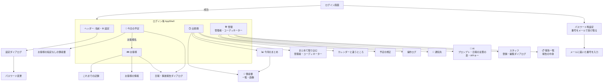

# 02. 機能仕様

- 目的: 画面・タブ・ダイアログごとの動きと業務ルールを、対応する GAS版の関数・API・役割ごとの権限と合わせて決める。
  GAS版と意図的に変えた点もここに集める。
- 対象読者: 画面・業務ロジックを直す開発者、業務担当(仕様の確認)、レビューする人。

画面は GAS版(`legacy/gas-childcare-visit-app/gas-childcare-visit-app/index.html`)をもとに作ったもので、文言と振る舞いは
このアプリのコードが正。業務ロジック・計算結果は引き続き GAS版を基準にする(gasParity のテストで確かめる)。ここでは
**振る舞いとルール**を書き、文言は代表的なものだけを載せる(一字一句は `packages/web` のコードを見る)。画面の作り方の決まり(クラス名・
ダイアログ・localStorage のキー・z-index)は [`packages/web/README.md`](../packages/web/README.md)。API の形は
[04_API仕様.md](04_API仕様.md)。

## 1. 画面の全体

- 下タブで3つのタブ(管理者・コーディネーターは「🛠 管理」を加えた4つ)を切り替える(`app/homeTabs.tsx`)。タブは切り替えても作り直さず
  隠すだけ(入力途中の値・スクロールが残る)。出勤簿タブは初めて開いたときに作る(GAS版 `initPastScheduleTab` と同じ。
  JS も分けて読み、手が空いたときに先に読む)。管理タブも JS を分け、開いたときに読む。
- 顧客データの版数を60秒ごとに確かめ(`GET /api/data-version`、画面が隠れている間は止める)、変わっていれば顧客の
  クエリを読み直す(GAS版 `checkDataVersion`)。
- 日報ダイアログの文言・評価の定義は、ログイン後すぐに `GET /api/ui-config` で読む(GAS版 `getUiConfig`)。
- 失敗は赤いお知らせ(`showErrorToast`。閉じるまで残る)、成功は4秒で消えるお知らせ。通信の失敗は
  「うまくいきませんでした。電波を確認して、もう一度押してください」(GAS版の withFailureHandler と同じ)。
- 401(セッション切れ)はログイン画面に戻り「しばらく使っていなかったので、もう一度ログインしてください」を出す。

## 2. 役割ごとの権限(画面)

| 画面・操作 | staff | coordinator | admin | サーバーの判定 |
| --- | --- | --- | --- | --- |
| 予定・出勤簿の「表示するスタッフ」 | — | ○ | ○ | `targetStaffIdOf` → `resolveTargetStaffId`(一般スタッフは常に本人) |
| 他のスタッフ名義の日報・領収書の保存 | — | ○ | ○ | 同上。日報の上書きは元の担当のまま |
| 他のスタッフの日報の上書き | — | ○ | ○ | `canActForOthers`。一般スタッフは 403(SECURITY ログ) |
| 領収書の一覧・画像(他のスタッフ・全員分) | 本人の分だけ | ○ | ○ | `targetStaffIdOf` + usecase の再確認。一般スタッフの全員分・他人の画像は 403(WARN) |
| 領収書の一覧の CSV | — | ○ | ○ | `canActForOthers`(一般スタッフは 403) |
| 出勤簿の「まとめて取り込む」 | — | ○ | ○ | 1件ずつ `POST /api/attendance/day/calendar-sync`(対象スタッフの判定は同上) |
| お客様の一覧・情報・これまでの記録 | ○ | ○ | ○ | ログインしていれば全顧客(GAS版と同じ) |
| 🛠 管理タブの「報告一覧」(全員分の日報・事故報告の一覧・中身・CSV) | 本人の記録だけ(API のみ。画面なし) | ○ | ○ | `GET /api/reports` は一般スタッフを本人に固定、CSV は `requireCoordinator` |
| 🛠 管理タブのスタッフ・AI(プロンプト・日報AIの調整・Gemini)・通知先(Google Chat)・操作ログ | — | — | ○ | `requireAdmin` |
| ご家庭の教育思考★(お客様の情報・日報のダイアログ) | ○ | ○ | ○ | ログインしていれば全顧客(`GET/PUT /api/customers/:id/report-profile`) |
| お客様タブの「🔄 お客様の情報を今すぐ取り込む」(顧客CSVの取込。`force: false` で送る) | — | ○ | ○ | `requireCoordinator`(拒否は WARN `customer_csv.import.access_denied`)。画面は `canActForOthers` |
| 顧客CSVの強制の取込(`force: true`。API を直接呼ぶとき、省くと `true`) | 画面なし | 403 | API のみ | 管理者だけ(コーディネーターは 403・理由 `force_not_admin`) |
| 勤怠集計の書き直し | 画面なし | 画面なし | API のみ | `requireAdmin` |

画面での出し分けは `canActForOthers(user.role)`(表示するスタッフ・管理タブと報告一覧)・`isAdminRole(user.role)`(管理タブの
スタッフ・AI・通知先・操作ログ)。
**本当の判定はサーバー**で、一般スタッフが他人の `staffId` を送っても本人のデータになる(e2e で確かめている)。

## 3. ログイン・パスワード

| 画面 | GAS版 | API | ルール・主な文言 |
| --- | --- | --- | --- |
| ログイン | `verifyLogin` | `POST /api/auth/login` | メール(またはサブメール)とパスワード。法人ID(テナント)は `VITE_DEFAULT_TENANT_SLUG` → URL の `?t=` かサブドメイン → 最後にログインできた法人ID の順で決め、決まらないときだけ「法人ID」欄を出す(`lib/tenant.ts`)。公開デモ(下の「公開デモの表示」)は web のビルドではなく API の設定(`GET /api/demo/config`)で出し分ける。失敗「メールアドレスまたはパスワードが違います」、退職済み「ログイン権限のないユーザーです」、法人が停止中「ご利用の法人は現在利用を停止しています。管理者にお問い合わせください」、失敗が続くと 429「ログインの失敗が続いたため、一時的にログインできません。…(15分ほど)…」 |
| 起動時の確認 | `checkSession(token, true)` | `GET /api/auth/me` | Cookie だけで本人を決める。通信の失敗ならログイン画面ではなく「もう一度読み込む」を出す(ログインしていないと決めるのは 401 のときだけ) |
| パスワード再設定(番号をメールで受け取る) | `requestPasswordReset` | `POST /api/auth/password-reset/request` | 登録の有無にかかわらず同じ応答「登録されているメールアドレスであれば、認証コードを送信しました。…(有効期限30分)」。サブメールで要求したらサブメール宛に送る |
| 番号が届いている方はこちら | — | — | 再設定の画面から、番号を送り直さずに番号の入力へ進む(管理者が送った「パスワード設定の案内」の番号を使う。メールアドレスの入力が必要) |
| 番号を入力して新しいパスワード | `resetPasswordWithCode` | `POST /api/auth/password-reset/confirm` | 8桁の数字(GAS版は6桁。移行のあいだはサーバーが6桁も受け付ける)・有効期限30分・1回限り・1つのコードに5回まで。番号の欄は全角の数字を半角にし、空白・ハイフンを除いて8桁までにそろえる(`features/auth/resetCode.ts`。日本語入力の変換中はそろえず、変換の確定と送信のときにそろえる)。桁が違えば送らずに「メールに届いた8けたの番号を入力してください」。「無効な認証コードです」「認証コードの有効期限が切れています」「認証コードの入力回数が上限を超えました。…」。成功でそのスタッフの全セッションを失効し、この端末の「この端末」の印を新しいパスワードで作り直し(アカウントがロック中でもこの端末からはログインできる)、ログイン画面に「パスワードがリセットされました。…」 |
| パスワード変更(設定から) | `changePassword` | `POST /api/auth/change-password` | 現在のパスワードが必要。新しいパスワードは8〜128文字(`PASSWORD_MIN_LENGTH` / `PASSWORD_MAX_LENGTH`)。成功で他の端末のセッションを失効、入力欄を空にする。現在のパスワードの誤りが15分に5回を超えると、15分は 429「現在のパスワードの誤りが続いたため、一時的にパスワードを変更できません。…」 |
| ログアウト(設定から) | (トークンを消す) | `POST /api/auth/logout` | 「ログアウトしますか？」。サーバー側のセッションも失効し、その人の localStorage の値と表示用キャッシュを消す |

### 3.1 公開デモの表示

宣伝用の公開デモ(`DEMO_TENANT_SLUG` を設定した API。運用は 07 3.9)の画面。デモかどうかは web のビルドの設定ではなく、ログイン前は `GET /api/demo/config`(04 2.12。
読めなかったときはデモではない扱い)、ログイン後はセッションの `user.demoTenant`(`POST /api/auth/login`・`GET /api/auth/me`)で決める(本番とデモで同じビルド)。
文言は `lib/demo.ts` にまとめ、保存の日数(`dataRetentionDays`)・月数(`logRetentionMonths`)・AI の回数(`aiUsesPerSession`)は API の値を入れる。
日数・月数が null(本番の環境に暫定で置いたデモ用テナントで未設定。04 2.12)か設定を読めなかったときは期間を書かず、日数が無ければ
「毎晩作り直します」「その日に」とも書かない(作り直しのジョブが無い環境で、守っていないことを約束しない)。AI の回数を読めなければ「上限があります」と書く。
デモの制限(パスワードの変更・顧客CSVの取込などを断る)は API が掛ける(04 1.6)。ここは表示だけ。

| 画面 | 出す条件 | 内容 |
| --- | --- | --- |
| ログイン画面の注意書き | `enabled` かつ入る法人ID(既定・`?t=`・最後にログインできた法人ID・入力)がデモ用テナント(デモ専用の環境でも、ほかの法人IDに入るときは出さない) | ログインボタンの上に3行(ログインでも IPアドレス等を記録するため、ログインの前に出す): 「これは公開デモです。お客様・スタッフなどのデータはすべて架空のものです。」/「入力した内容（30日間）と、操作ログ・接続情報（IPアドレス等。3か月間）を保存し、サービスの改善と不正利用の調査に使います。」(日数・月数は API の値。日数が null なら「入力した内容と、…」、月数が null なら「操作ログ・接続情報（IPアドレス等）を…」と期間を書かない)/「実在の人物の名前・連絡先は入力しないでください。ログインすると、これらに同意したものとします。」。このとき(= 法人IDがデモ用テナントのときだけ)「パスワードを忘れたとき」は出さない |
| 会社ID(法人ID) | `publicLogin` で法人IDが他で決まらないとき | デモ用テナントを既定にして欄を出さない(ビルドの既定値・`?t=`・最後にログインできた法人IDが先。デモの設定を読んでいる間は欄を出さない) |
| デモ用アカウント | `publicLogin` かつ入っている法人IDがデモ用テナント | 管理者・コーディネーター・スタッフのボタン(「デモ用アカウント(パスワード: …)」)。押すとメールアドレスとパスワードを入れる(アカウント・パスワードは API が返す) |
| ログイン直後の注釈 | デモ用テナントへ、ログインの画面からログインした直後(ページの読み込み直しでは出さない。共有のアカウントはログインのたびに別の人かもしれないため、「見た」ことは覚えない) | ダイアログ「デモ環境をお使いになる前に」(`DemoTermsModal`)。見出し: 共有のアカウントです(その日の入力はほかの閲覧者にも見える。日数が null なら「その日に」を付けない)/入力した内容・接続情報の保存(データは架空で毎晩作り直す。作り直したあとも、入力した内容は運営者が○日間、操作ログ・接続情報は○か月間保存し、サービスの改善と不正利用の調査に使う。日数が null なら「データは架空のものです。」「入力した内容と、操作ログ・接続情報（IPアドレス等）は運営者が保存し、サービスの改善と不正利用の調査に使います。」(月数があれば「（IPアドレス等。○か月間）」))/デモではできない操作(パスワードの変更・再設定、共有のデモ用アカウントの変更・削除、スタッフのExcelの取込・パスワード設定の案内のメール、お客様の情報の取込（CSV）、Google Chat の通知先の保存、操作ログの閲覧)/AI について(日報・事故報告をAIに書いてもらうと今日の出来事メモの内容を Google Gemini に送る。AIを使えるのは1回のログインにつき○回まで)/お願い(「実在の人物の名前・連絡先は入力しないでください。」)。ボタン「同意して始める」と「同意しない（ログアウト）」(設定のログアウトと同じく、この端末のその人の値を消してログイン画面に戻る)。Escape・外側では閉じない |
| 「デモ環境」の帯 | デモ用テナントにログイン中(画面の上) | 「デモ環境です。データは架空のもので、毎晩作り直します。入力した内容は保存され、ほかの閲覧者にも見えます。」(日数が null なら「デモ環境です。データは架空のものです。入力した内容は保存され、ほかの閲覧者にも見えます。」)+「注意事項を見る」。押すと上の注釈を開き直す(ボタンは「閉じる」だけ。「同意しない」は出さない) |
| 今日の出来事メモの注意 | デモ用テナントにログイン中(日報・事故報告のダイアログ) | メモ欄のすぐ下に「⚠️ 実在の人物の名前・連絡先は入力しないでください」 |
| 隠す操作 | `user.demoTenant` | 設定の「パスワード変更」、お客様タブの「🔄 お客様の情報を今すぐ取り込む」(API が断るため) |

セッションの期限: 無操作7日(残りが6日を切ると延長)、ログインから30日で必ず切れる。退職日(テナントの時刻帯の業務日)の当日以降は
ログインできず、既存のセッションも失効する。詳しくは 06「認証」。

## 4. 📅 今日の予定(`features/schedule`)

| 項目 | 内容 |
| --- | --- |
| GAS版 | `getScheduleForDate`(軽量)・`getRouteForStaffOnDate`(ルートつき)・`getActiveStaffNamesForAdmin` |
| API | `GET /api/schedule?date=`、`GET /api/schedule/route?date=[&forceRefresh=1]`、`GET /api/staff`(表示するスタッフの選択肢) |
| 表示 | 「☀️ 今日」「🌙 明日」の切り替え。予定ごとのカード(種別・時刻・お客様名・場所と地図のリンク)、予定と予定の間に移動の行(所要時間・距離・Google マップの経路リンク)、自宅 → 最初・最後 → 自宅の区間 |
| 読み込み | 開いたとき・日付やスタッフを切り替えたときは**必ず**ルートつきを読む。予定タブに戻ったとき・画面に戻ったとき(visibilitychange)・通信が戻ったときは、予定タブが前に出ていて前に調べて(失敗も含む)から10分以上たっていれば読む。予定タブを開いたまま画面を見ているあいだも10分ごとに読み直す(画面が隠れている間は止める)。すぐ確かめたいときは「🔄 最新にする」(いつでも調べ直す)。サーバーは予定をカレンダーから読む(イベント一覧は60秒の短期キャッシュのため、担当変更の反映は最大60秒遅れる。05 4.4)。端末に前回の結果(`katahimo_schedule_route_v1_<スタッフID>_<日付>`、24時間)があれば、最新が届くまでそれを「9月29日（火） 10:05 時点（最新を確認中…）」(今日の分でも日付を出す)を添えてすぐ出す。届いたら差し替えて端末の値も上書きし、予定の中身(種別・時刻・お客様・住所)が変わっていれば「最新の予定に更新しました」を短く出す(同じなら・所要時間や距離だけが変わったなら時点の表示だけ新しくする)。前回の結果が無ければ「調べています…（10秒ほど）」 |
| 読み込みの失敗 | 前回の結果を出していればそのまま残し、「M月D日（曜） HH:MM 時点（最新を読み込めませんでした）」と、赤いお知らせ「〈理由〉。M月D日（曜） HH:MM 時点の表示のままです」を出す。何も出していなければ赤いお知らせを出し、ルートなしの軽量版だけでも出す(GAS版 `loadPlainScheduleOnRouteFailure_`。ルートなしを出している間にまた読み込んでも一覧は消さない)。お知らせは予定タブが前に出ているときだけ出す。切り替えた前の日付・スタッフの応答では何も出さない |
| 一部のカレンダーを読めなかった | サーバーは読めた分だけの予定に `partial: true` を付けて返す。欠けていない前回の結果を出していれば置き換えず(端末の値も上書きしない)、赤いお知らせ「一部のカレンダーを読み込めませんでした。M月D日（曜） HH:MM 時点の表示のままです」。前回の結果が無い・前回の結果も一部欠けていたものなら新しい方を出し、「M月D日（曜） HH:MM 時点（一部のカレンダーを読み込めませんでした）」と「一部のカレンダーを読み込めなかったため、予定が欠けているかもしれません」(端末には書かない)。ルートなしの予定に切り替えたときも、その予定が一部欠けていれば同じお知らせを出す |
| 🔄 最新にする | `forceRefresh=1`。サーバーのカレンダーのイベント一覧・地図の結果(区間・住所ごと)のキャッシュも読まずに計算し直す。スタッフごとに1時間30回まで(429)。失敗したら自動の読み込みと同じ文言のお知らせだけ出して今の表示を残す。画面を離れたら(ログアウトを含む)要求を取り消し、あとで届いても端末に書かない |
| 日付をまたいだとき | 開いたまま日付をまたいだら(画面に戻ったとき・開いている間の1分おきに確かめる。`lib/useTodayJst`)、選んでいる「☀️ 今日」「🌙 明日」を今の日付で読み直し、「日付が変わったので、予定を読み込み直しました」を出す。🔄 を押したときに日付がずれていれば、前の日を計算し直さずに今の日付で読む |
| 日報へ | 「✏️ この訪問の日報を書く」で日報ダイアログを開く(予定のお客様名で顧客を探す)。お客様名からお客様タブへ移る(GAS版 `jumpToCustomerFromSchedule`) |
| 表示するスタッフ | 管理者・コーディネーターだけに出る(`AdminTargetStaffSelect`)。選び直すと読み直す |
| 空・失敗 | 「この日の予定はありません」「明日の予定はありません」。住所の無い訪問先は「住所が登録されていません（事務局へ連絡）」 |
| 通知から開く | 翌日の予定のお知らせ(9.1)を押すと `/?schedule=YYYY-MM-DD` を開き、予定タブでその日を出す(明日なら「🌙 明日」、翌朝に押したなら「☀️ 今日」)。URL の `schedule` はすぐ取り除く。アプリが開いていれば、その画面を前に出して予定タブに切り替える |

予定の分類とルートのルール(`core/domain/schedule/`、GAS版 `RouteSearch.js` と出力一致):

- 1日の範囲は JST の 0:00〜翌 0:00。範囲に一部でも重なる予定を読む。終日予定は 0:00〜翌0:00(表示は `00:00`〜`00:00`)。
- タイトルのタグ: `[予約確定]` > `[新規]` > `[イベント]` > `[事務]` の優先順で1つに決まる。タグの無い予定は対象外。
- `[予約確定]`: タイトルから全タグを除いた氏名を、空白の違いを無視して顧客の氏名と突き合わせる。担当は説明欄の
  「施設：<スタッフ名>[」、無ければカレンダーの持ち主。説明欄に「オンライン」を含む予約は場所を持たない。予約詳細URLは説明欄の最初のURL。
- `[新規]`・`[事務]`・ゲストのいない `[イベント]` はカレンダーの持ち主の予定。持ち主が「いいえ」と回答した予定は読まない。
- `[事務]` は同じスタッフの時間が重なるもの(ちょうど終了時刻に始まるものは除く)を1件にまとめる(名前は「,」区切り)。
  終日の `[事務]` があるとその日の事務作業は全て1件になる。
- 経路: 位置のある予定だけを時刻順につなぐ(自宅 → 最初、予定間、最後 → 自宅)。住所2(期間つき)が当日を含めば、登録済みの
  緯度経度より住所2を優先する。所要時間は分に四捨五入、距離は km 小数2桁の文字列、算出できない区間は `''`。
- 読めないカレンダーは飛ばして WARN を残す(閲覧のとき)。出勤簿に書く処理では失敗させる(05「予定・ルート」)。
- 読むカレンダー(`SCHEDULE_PROVIDER=google` のとき。`gas_bridge` は GAS版が全カレンダーを読む): 予定タブ(🔄 を含む)は、見ているスタッフ
  自身の予定のカレンダーと共有カレンダー全部(持ち主名にかかわらない)を読み、他のスタッフの予定のカレンダーは読まない。翌日の予定のお知らせ(9.1)と
  出勤簿への反映(8.4・夜間)はテナントの全カレンダーを読む(05 4.2)。担当者の判定の規則はどちらも同じで、担当変更(RESERVA)で予定は新しい担当者の
  カレンダーへ移るため、通常の予定はどちらでも同じに出る。例外として、**他のスタッフのカレンダーに手作業で作った「施設：<見ているスタッフ>」の予定、
  見ているスタッフがゲストだがそのスタッフのカレンダーに無い会議、同姓同名の他のスタッフのカレンダーの予定は、予定タブには出ないが、出勤簿には夜間の
  同期で入る**。逆に、**同じ予定(iCalUID)が他のスタッフのカレンダーにもあると、出勤簿では先に読むそのスタッフが持ち主になり、[新規]・[事務]・
  ゲストのいない [イベント] が予定タブにだけ出て出勤簿には入らないことがある**。

## 5. 👪 お客様(`features/customers`)

| 画面 | GAS版 | API | ルール |
| --- | --- | --- | --- |
| お客様の一覧 | `getData`(`fetchDataFromSheet`) | `GET /api/customers` | アーカイブされていない全顧客と地域の一覧を読み、名前の部分一致(「お客様の名前で探す」)・地域(「すべての地域」)の絞り込みと並び替えは画面で行う(GAS版と同じ)。最近開いたお客様を上に出す(`recent_customers@<法人ID>/<スタッフID>`) |
| カード | — | — | 「✏️ 日報を書く」「👤 お客様の情報」「📖 これまでの記録」 |
| 🔄 お客様の情報を今すぐ取り込む | `forceImportCsv`(画面なし) | `POST /api/admin/customers/import`(`force: false`) | コーディネーター・管理者だけに(公開デモのテナントでは出さない。API が断るため)、「🧾 お客様に関係ない領収書を登録」の下に出す(`CustomerCsvImportButton`)。RESERVA で登録したばかりのお客様の日報を、10分ごとのジョブを待たずに書くためのボタン。実行中は「取り込んでいます…」(押せない)。結果は下に1行: 取り込めたら「取り込みました(新しいお客様 N件・変更 M件)」(一覧から外れた顧客があれば「・一覧から外れた K件」)、取込済みなら「最新のお客様の情報は取り込み済みです」、取込元が未設定・CSV が無いときはサーバーのメッセージ。409(消える顧客が多すぎる・他の取込が実行中)・502・429 は普通のエラーのトースト(サーバーのメッセージ)。取り込めたら保存してあるデータの版を新しい版にし、既存の版の見張りが一覧を読み直す(「新しい情報があります。最新にしています…」。定期ジョブで変わったときと同じ)。他のスタッフは既存の60秒ごとの版の確認で1分以内に新しいお客様が見える |
| 👤 お客様の情報 | `showCustomerDetail` | `GET /api/customers/:id` | 住所・電話・緊急連絡先・メモ・受給者番号・避難場所・子ども(生年月日・アレルギー・配慮事項)を出す。開くたびに INFO `customer.detail.viewed` を残す(GAS版には無い閲覧の監査)。アレルギーが無ければ「アレルギー: なし」。「ご家庭の教育への関心(教育思考★)」を見て変えられる(6.1。スタッフ全員。入力は下の日報のダイアログと同じ★、最後に変えた人) |
| 📖 これまでの記録 | `getCustomerReports` | `GET /api/reports/history?customerId=&before=` | 日報・事故報告・ヒヤリハットを新しい順に5件ずつ。「さらに前の記録を見る」は前の応答の `nextCursor` を `before` に渡す(同じ時刻の記録があっても重複・抜けが無い) |

顧客データは顧客CSV(RESERVA)の取込(10分ごとのジョブと、上のボタン)と、外部システムからの受け取りの API(`POST /api/integrations/customers`。作成・更新だけ)でだけ変わる(05「顧客CSV」・11章)。画面から顧客を編集する機能は無い(GAS版と同じ)。

## 6. 日報・事故報告・ヒヤリハット(`features/report`)

日報ダイアログは、お客様タブ・予定タブの「日報を書く」から開く(`useReportModal().openReport({ customerId, customerName })`)。
開いた後にお客様の詳細(住所・子ども)を `GET /api/customers/:id` で読む。

| 操作 | GAS版 | API | ルール |
| --- | --- | --- | --- |
| 日報/事故報告/ヒヤリハットの切り替え | (タブ) | — | 事故報告とヒヤリハットは同じ形式(`reportType`) |
| メモ・🎤 話して入力 | (Web Speech) | — | 入力欄の文言はテナントの `ai_prompts`(無ければ既定)。書きかけは端末に残り、開き直すと復元する(`pending_report_draft@…`)。復元したときの赤いお知らせの「破棄する」で、確かめてから書きかけを消して空の入力に戻せる(GAS版には無い。間違えたお客様で書き始めた書きかけを消せるように)。ダイアログを閉じる・開き直すと音声入力を止める。公開デモのテナントでは欄のすぐ下に「⚠️ 実在の人物の名前・連絡先は入力しないでください」を出す(メモは保存され、AI にも送るため。3.1 の「公開デモの表示」) |
| 日報のお子様・ご家庭の教育思考★ | — | `GET/PUT /api/customers/:id/report-profile` | 日報モードで、メモの上に「日報のお子様」(世帯のお子様が1人なら最初から選ぶ。何人もいればスタッフが選ぶ。「選ばない」は年齢に合わせた言葉を使わない。API でお子様を省略したときもサーバーが同じ決め方で、アーカイブされていないお子様がちょうど1人ならその子にする)と「ご家庭の教育への関心(教育思考★)」を出す(6.1)。教育思考★は PSI と同じ★1〜5。未設定の家庭は★2(標準)を選んだ状態で見せる(日報も★2 で書くため、未設定と★2 を分ける「☆0」は置かない。未設定のときに★2 を押しても保存しない)。★の下に選んだ段階の呼称(例「★3 やや関心あり」)と教育語の使い方、「❓ 説明」で★1〜5の呼称・想定顧客像・教育語の使い方の表を出す(文言はテナントの日報AIの調整の教育思考★、無ければお客様の教育思考レベル定義の既定。`GET /api/ui-config` の `educationLevels`)。押すとその場で保存し(同じ★は保存しない)、他の人が先に変えていれば理由を出して読み直す |
| AI に書いてもらう(日報) | `generateReportWithWarnings` | `POST /api/reports/daily/generate` | 入力メモの本文と時間に、お客様・日報のお子様・PSI・訪問日を添えて渡し(GAS版と同じく氏名の置き換えはしない。入力では氏名を書かず「お子様」等で書く運用)、社内向け・保護者向けの文と「⚠️ 足りない情報があります」の警告を得る。日報AIの3軸で言葉を絞り込み(6.1)、AI が使った教育キーワードを保護者に送る文の上に並べる。PSI 1 は「🚨 PSI 1(危険・緊急)…すぐに管理者へ電話で連絡してください」の帯を出し、警告に「管理者へ連絡」を必ず入れる。スタッフごとに1日200回(429「本日のAI生成の利用回数の上限に達しました。…」)。Gemini のキーが無ければ GAS版と同じ「API Key Missing」の応答。モデルは自動で選び(管理者が選ぶ設定は無い)、API エラーなら自動でモデルを変えて試し直す(Gemini Flash 系 → Flash-Lite 系の順、系統の中は `-latest` が先頭。`GET /api/reports/generate/models`、05 6章)。待っているあいだはボタンに「gemini-2.5-flash で書いています（2/6）」と書けなかったモデルを出し、「⏹ 止めて手で書く」で止められる。全部のモデルで書けない・止めた・通信や回数制限で失敗したときは、試したモデルと理由を赤い枠で出して結果欄(事務局に送る文・保護者に送る文)と「保存する」を開き、手で書いて保存できる(GAS版と同じく、AI の失敗で送れなくならない) |
| AI に書いてもらう(事故・ヒヤリ) | `generateAccidentReport` | `POST /api/reports/accident/generate` | 「何が起きたか」「くわしい状況」「その場でしたこと」「おうちの方への連絡」「病院での診断・手当て」「これからの対策」等の下書き。回数制限は日報と共通。モデルの選び方・切り替え・待っている間の表示・「⏹ 止めて手で書く」・書けなかったときに手で書けることは日報と同じ(同じモデルの順番) |
| 評価 | (★) | — | 「⚠️ 今日のヒヤッとした度合い（PSI）」等(`defaults/assessments.ts`。PSI の定義・判定基準はテナントが日報AIの調整の PSI を入れていればその文言)。1〜5 または未選択。AI に書いてもらう前に付けられるよう、メモの上に置く(PSI は日報AIの言葉選びの材料)。PSI 2 以下を選ぶと「保存すると管理者に知らせます」(1 は管理者への電話連絡も)を出す |
| 保存する | `saveReport` / `saveAccidentReport` | `POST /api/reports/daily` / `POST /api/reports/accident` | 保存で「✅ 保存しました」。同じダイアログで2回目以降の保存は上書き(`reportId` と `rowVersion`)。他の人が先に保存していたら 409「…画面を開きなおしてください」。上書きで顧客・担当は変えられない(409 `customer_mismatch` / `author_mismatch`)。一般スタッフは他人の報告を上書きできない(403)。確定済み(locked)の記録は変えられない。保存すると Google Chat(日報の通知先)に知らせる。日報のお子様と、下書きを作った AI 生成の記録(同じスタッフ・同じお客様のものだけ。上書きしても前の生成は結び付いたまま)を一緒に保存する。PSI 2 以下で保存すると管理者に知らせる(6.1)。お知らせは「保存しました（PSI 1のため管理者に知らせました）」 |
| ✅ 訪問終わりました（事務局に知らせる） | `sendVisitCompleteNotification` | `POST /api/reports/visit-complete` | DB には書かず、Google Chat に知らせるだけ。失敗は GAS版と同じ「お知らせを送れませんでした…」 |
| コピー | — | — | 保護者向けの文をコピーし「コピーしました。LINEを開いて貼りつけてください」 |

開き直す前に届いた AI・読み取り・保存の結果は捨てる(別のお客様の欄に入らないように)。

### 6.1 日報AI(年齢帯 × 教育思考★ × PSI)

保護者に送る日報で、AI が使う教育の言葉(教育キーワード)を、お子様の年齢・ご家庭の教育への関心・保護者の
ストレス度で絞り込む。規則はお客様の「日報キーワード表現マスター」の使い方(シート00)・参照フロー(シート07)と
プロンプト変更案のとおりで、組み立ては `core/domain/reports/promptAssembly.ts`(純関数。候補の並びは決定的)。

| 手順 | 材料 | 規則 |
| --- | --- | --- |
| STEP1 年齢帯 | 日報のお子様の生年月日と訪問日から数えた満月齢 | 年齢帯(シート02)の月齢範囲 `[下限, 上限)` に入る帯の行動・単語・発達のトピック・場面例・相性の良いキーワードID をプロンプトに添える。お子様を選ばない・生年月日が無いときは年齢帯の言葉を渡さない |
| STEP2 PSI | 生成の前に付けた PSI(`care_records.risk_rating` と同じ段階。5=安心・良好〜1=危険・緊急) | **PSIは教育スコアに優先する。** 5・4 = ★のとおり / 3 = ★を1〜2段下げて★3以下にし(★5・★4 → ★3、★3 → ★2、★2 → ★1)、用語名(専門語)を出さない / 2 = 教育語を使わず温かみ表現(シート05 の◎で推奨PSI に入るもの)で寄り添う / 1 = 2 と同じうえ、安全対応を最優先し管理者へ連絡(AI の答えに関わらず警告に「管理者へ連絡してください(PSI 1: 危険・緊急…)」を入れる) |
| STEP3 絞り込み | キーワード(シート01) | 使用可否 = (対象月齢 ∈ [年齢下限, 年齢上限]。両端を含む) かつ (★ ∈ 教育思考レベル適用★) かつ (PSI ≧ PSI下限)。月齢が分からないときは月齢では絞らず(対象年齢の列を載せ、AI がメモから推定する)。並びは年齢帯の相性の良いキーワードID の順 → 表の並び順 → ID、10語まで |
| STEP4 言い換え | 教育思考★の定義(シート03) | 1通あたり教育語は★の定義の数まで(2語を超えない)。用語名の扱い(出さない / 控えめ / 説明とセット)を添え、用語名を出すときは親向け説明とセット |
| STEP5 文体 | 見ていた人スタンス(シート06)・避ける表現(シート05 の✕) | 「✕ → ◎」の一覧と避ける表現を毎回添える(避ける表現は PSI に関わらず全ての日報) |

- **未入力の扱い**(プロンプト変更案の注記): 教育思考★が未設定の家庭は★2、PSI を付けていない訪問は PSI 4(通常運用)として
  絞り込み、プロンプトの基本情報には「未入力」と書く(同じ既定値を AI にも伝える)。管理者への連絡は PSI 1 を付けたときだけ。
- **既定のプロンプト**(AIプロンプト「保育日報のAI生成プロンプト」)はお客様のプロンプト変更案の全文。末尾の【日報キーワード表】には
  絞り込んだ候補だけを「ID｜カテゴリ｜キーワード｜対象年齢(月齢)｜適用★｜PSI下限｜親向け説明｜日報フレーズ例」の形で入れる
  (変更案は表を丸ごと貼る案だったが、3軸で先に絞ると AI に渡す量が減り、候補を記録と突き合わせられる)。
  キーワードの表が空のテナントでは、キーワードの規則・表の行(`{#keywords}` 〜 `{/keywords}`)と補足(★の書き方・年齢帯・
  温かみ表現・避ける表現・見ていた人スタンス)は消え、変更案の残り(基本情報・必須情報チェック・出力内容の方針・出力フォーマット)
  だけになる。会社名・社是の1文はテナントごとに違うため AIプロンプト「日報AIの会社の方針」(`{companyPolicy}`。既定は空で行ごと消える)に分けた。
- 差し込み(`{timeInfo}` 等)は1回の走査で全ての箇所を置き換える(GAS版の `String.replace` は最初の1箇所だけで、変更案の
  「保育サポート {timeInfo}」が置き換わらなかった)。差し込んだメモの中の `{…}`・`$&` はそのまま残る。
- **生成の記録**(`report_ai_generations`): 生成ごとに、送ったプロンプトの全文・入力メモ・時間・月齢・★(調整の前後)・PSI・
  管理者への連絡の要否・候補と AI が使った語(候補に見せた語だけ。候補外・表に無い答えは答えのまま別に残し、使った語には数えない。日報の画面の「使った教育キーワード」は候補の語だけ緑で、候補外・表に無い答えは灰色に「（候補外）」「（表に無い）」を付ける)・AI の答え(失敗なら失敗の種類)・使ったプロンプトの版
  (既定の文面ならその SHA-256 とアプリの版)・モデルを残す。記録に失敗しても生成の結果は返す(ERROR
  `ai.daily_report.generation_log_failed`)。保存すると日報に結び付け、日報の保存期限まで残す(結び付かなかった生成は365日)。
- **モデルの比較**(運用。画面は無い): 審査用のテナントで、生成の記録と同じプロンプト(`--rebuild` なら記録のメモと今のプロンプト・
  マスター・家庭の★から生成と同じ関数で組み立て直したもの)をいくつかの Gemini のモデルに送り直し、当時の出力・各モデルの答え
  (警告・社内向け・保護者向け・使った語の扱い・所要時間・トークン数・JSON の形)・スタッフが保存した文を並べた HTML を1つ書き出す
  (`pnpm ai:compare`。読むだけで生成の記録も日報も書かない。`AI_COMPARE_TENANTS` に書いたテナントだけ。手順は
  [07_インフラ・運用.md](07_インフラ・運用.md) 8.7)。
- **PSI の知らせ**: PSI 2(注意)・1(危険・緊急)の日報を保存すると(新しい日報か、前の保存から PSI が変わったとき。同じ PSI の
  まま文面を直して保存し直しても知らせない)、在籍している管理者の全ての端末に Web Push
  (「🚨 PSI 1(危険・緊急)の日報」。本文はスタッフ名・お客様名・訪問日だけ。記録と PSI ごとに1回)を送り、
  日報の Google Chat に「【PSI緊急】/【PSI注意】…」を送り、操作ログに WARN `report.psi_alert` を残し、保存の案内に「管理者に知らせました」と出す。報告一覧では印
  「⚠ PSI 2」を付ける。

## 7. 領収書(日報ダイアログの中・お客様の指定なし・一覧)

| 操作 | GAS版 | API | ルール |
| --- | --- | --- | --- |
| 📷 撮る / 🖼️ 写真から選ぶ | — | — | 「レシート・領収書（6枚まで）」。画面で長辺1200px・JPEG 品質0.7に縮める(HEIC は JPEG に変換) |
| 金額の読み取り | `extractAmountFromImage` | `POST /api/receipts/ocr` | 「金額を読み取っています…」。金額・店名・日付を埋める(直せる)。モデルは Gemini Flash-Lite 系から自動で選び、混み合い・時間切れ(1回30秒)などのときはサーバーの中で次のモデルを試す(最大3つ。画面は変わらない。05 6章)。スタッフごとに1日300回(429 のときは手入力を案内) |
| この領収書を送る | `uploadReceiptsOnly` | `POST /api/receipts` | 1回6枚まで・1枚1.5MB まで・JPEG/PNG/WebP(中身で判定)。重複(スタッフ・顧客・日時・金額・店名が同じ)は登録せず件数で知らせる。同じ回の中の同じ内容(往復の運賃等)は全て登録する(その内容が既に登録済みなら全て重複)。日時が読めなければ報告の日付+開始時刻、それも無ければ登録時刻。申し送りは1回の束に1つ。領収書の日時の月(テナントのタイムゾーン)の、名義のスタッフの出勤簿が締め済みなら1枚も登録せず「YYYY年M月の出勤簿は締め済みのため、この月の日付の領収書は登録できません。…」(400 `locked`。続きは一般スタッフには「領収書の日付を確かめるか、管理者に連絡してください。」、管理者・コーディネーターには日付の確認と締めの解除の依頼先(運用担当者)を案内する。取消と同じく締めた月の集計を後から変えさせない。GAS版はどの日付でも登録した。11章)。送ると Google Chat(領収書の通知先)に知らせる |
| お客様の指定なし | `openStandaloneReceiptModal` | 同上(`customerId` なし) | 未登録のお客様の氏名(`customerNameText`)を残し、通知の「顧客名:」にも使う。レシートの日付を空にした写真は送る時点の日時(日本時間)にする(日付・時刻の欄は隠れていて、ページを開いた日・前の日報の値・既定の 09:00 が残っているため使わない。日報から送るときは日報の日付+始めた時間)。通信の失敗のあと送り直すときは最初に送ろうとした日時のまま(重複の判定が変わらない) |
| 会社負担(お客様に請求しない) | — | 同上(`images[].companyPaid`) | 写真ごとのチェック(既定は外れている)。研修等の同行・会社の都合で出た駐車場代などに付ける。スタッフへの支払いは変わらない(月の合計に入る)が、お客様への請求からは外す(一覧の印・CSV / Excel の「区分」・今月のまとめの内訳で分かる)。送った後は変えられない(直すときは取消して送り直す)。重複の判定には入れない。Google Chat の通知では行の末尾に「会社負担(お客様に請求しない)」と書く |
| 端末での重複確認 | (`GAS_RECEIPT_KEYS_V1_<スタッフ名>`) | — | この端末から送った内容を覚えておき、送る前に知らせる(GAS版と同じキー)。この端末で取消した領収書の分は忘れる(取消して送り直せるように) |

### 7.1 🧾 領収書の一覧・画像(`features/attendance` の `ReceiptListModal`)

出勤簿タブの「🧾 領収書」と、今月のまとめの「🧾 領収書の一覧・画像を見る」(その月で開く)から開く。GAS版では管理者が
「領収書一覧」シートと Drive のフォルダで見ていたもの(ミラーを止めてもアプリの中で見られるようにするため)。

| 操作 | GAS版 | API | ルール |
| --- | --- | --- | --- |
| 月を選ぶ・表示するスタッフ | (シートを開く) | `GET /api/receipts?month=&staffId?&allStaff?` | 一般スタッフは本人の分だけ(スタッフの選択は出ない)。管理者・コーディネーターは「表示するスタッフ」(開いたときは出勤簿タブで選んでいるスタッフ)と「全員」を選べる。領収書日時の月(日本時間)で、新しい順に50件ずつ、「もっと見る」で続き。上に月全体の「N件 合計 X円(うち金額なしM件)」 |
| 一覧の行 | 「領収書一覧」シートの行 | 同上 | 日時「9/10(木) 12:00」・金額(無ければ「金額なし」)・店名・お客様(未登録は入力した氏名、無ければ「お客様の指定なし」)・申し送り(同じ回に送った領収書には同じ申し送りが出る)。全員のときはスタッフ名も出す。小さい画像は見えたところから読み、読めなければ「画像なし」 |
| 行を押す | Drive の画像を開く | `GET /api/receipts/:id/image` | 画像を大きく出す。画像はアプリの API からだけ読める(URL を他の人に送っても、ログインして見てよい人でなければ開けない) |
| ⬇ CSVで保存 | シートをダウンロード | `GET /api/receipts/csv` | 管理者・コーディネーターだけ。選んだ月・スタッフ(または全員)の取消していない全件(BOM つき UTF-8。「区分」の列に「お客様請求」か「会社負担」)。断られたとき(回数の上限等)は理由を赤いお知らせで出し、ファイルにしない |
| 会社負担の印・合計の内訳 | — | 同上 | 会社負担の行に「会社負担」の印。上の合計の下に、会社負担があれば「うち会社負担 X円 ／ お客様請求 Y円」、取消済みがあれば「取消 N件(合計に入れていません)」 |
| 取消 | — | `POST /api/receipts/:id/cancel` | 取消せる行にだけ「取消」を出す(可否はサーバーが行ごとに `cancellable` で返す。下の表)。押すと確かめのダイアログで取消の理由(任意・1行・100文字まで)を入れて「取消す」。行は消えずに灰色で「取消」の印・取消した日時と人・理由を出して残り、合計・件数・CSV・Excel・今月のまとめには入らない。直すときは取消してから登録し直す(編集の機能は無い)。取消すと Google Chat(領収書の通知先)に「【領収書取消】」を知らせる。他の人が先に取消した・変えたとき(409)・取消せる期間を過ぎたとき(400)は理由を出して一覧と今月のまとめを読み直す。「取消す」を続けて押しても1回だけ送る |

他のスタッフ・全員分の一覧を開いたこと(「もっと見る」の続きも1ページごと)、CSV を保存したことは操作ログに残る(本人の分の閲覧は残さない)。取消は INFO `receipt.cancelled`、断った取消は WARN `receipt.cancel_denied`(他人の領収書)・`receipt.cancel_refused`(期間の外・締め済み)。

領収書は会計の記録なので、アプリには消す操作が無い(DB のアプリのロールにも削除の権限が無い)。取消は論理削除(取消の日時・取消した人・理由を入れる)。

**取消せる期間**(`core/domain/reports/receiptCancel.ts`)。日付はどれもテナントのタイムゾーン(日本時間)の暦日。基準の日 D は
**領収書日時の日付**(日報から送った領収書は OCR で読めた日時、読めなければ報告の日付+開始時刻。月の集計もこの日で月を分けるため、
取消も同じ日で月末の締めに合わせる)。

| 取消す人 | 取消せる領収書 | 取消せる日 |
| --- | --- | --- |
| スタッフ | 本人の分 | 今日が D+2日まで、D と同じ月、今日が月の最終日でない(月末で締めるので月をまたいでは取消せない。最終日の深夜に消されると集計が合わなくなるため最終日も不可)。例: 31日の月の29日の領収書は29日・30日だけ、最終日の領収書は取消せない |
| コーディネーター | 本人・他のスタッフの分 | スタッフと同じ |
| 管理者 | 本人・他のスタッフの分 | D が今日と同じ月なら、D+2日を過ぎても・月の最終日でも取消せる(月末に集計するため)。D が前の月以前でも、その月の出勤簿を締めるまでは取消せる(前の月の日付で登録された領収書を、締める前に直せるように) |

D が来月以降(先の日付で登録した領収書)なら、その月になるまで誰も取消せない。どの人も、D の月のその領収書のスタッフの出勤簿が締め済み
(`attendance_periods`)なら取消せない(今月の締めではなく領収書の月の締めを見る)。期間の外は 400(`locked`)、取消済み・版の違いは 409。

同じ回に送った同じ内容の写真(往復の運賃等)は全て登録され、重複の判定の代表はそのうち1枚。代表を取消すと残りの1枚が代表を
引き継ぐので、同じ内容を送り直すと、取消していない同じ写真が残っている間は重複として登録せず、全て取消した後は登録できる。

## 8. 🕒 出勤簿(`features/attendance`)

### 8.1 表示

| 画面 | GAS版 | API | ルール |
| --- | --- | --- | --- |
| 週の表示(📝 一覧で見る / 📋 表で見る) | `getWeeklyScheduleForStaff` | `GET /api/attendance/week?start=&end=` | 出勤簿の記録を週の予定にした閲覧用(最大31日)。左右のスワイプ・矢印で週を移る(「◀ 前の週」「次の週 ▶」「今日へ」)。2時間キャッシュ(`pastSchedWeek_<スタッフID>_<週の日曜>`)、保存・取り込みで消す。表示の好みは `cal_week_view_mode` |
| 日の表示 | `getPastScheduleForDate` | `GET /api/attendance/day?date=` | 25列の `rowData`・数式列に当たる派生値(`derived`)・手で直した列(`changedFields`、強調表示)・`rowVersion`・編集できる期間(`editable`)。記録の無い日は空の行として開ける |
| 予定の修正(✏️ ・➕) | `updatePastSchedule` | `PUT /api/attendance/day` | 訪問#1〜#3・作業1〜2の名前・開始・終了、移動と距離・買い物代行・備考。「この予定の内容を消します。よろしいですか？」で枠を空にできる。変わった列だけを送る |
| 雪 | (入力規則の天候 晴れ・曇り・雨・雪) | 同上 | 「移動と距離」の「1件目 → 2件目」「2件目 → 3件目」に「❄️ 雪（移動時間を1.3倍にする）」のチェック。付けるとその区間の天候の列(I / R)に「雪」、外すと空を入れ、その区間の移動時間を1.3倍にする。天候で計算が変わるのは雪だけのため、晴れ・曇り・雨は選ばせない(以前に入った値はそのまま残り、チェックなしとして出る。API は4つとも受け付ける。`optionsI` / `optionsR` は画面では使わない)。家 → 1件目・最後の訪問 → 家には時間の欄が無いので出さない |
| 🔄 最新にする | — | 同上の読み直し | 「最新にしました」 |
| 日付をまたいだとき | `refreshWeekViewIfDateChanged_` | — | 開いたまま日付をまたいだとき、前の「今日」のまま週で見ていた(週・選んだ日とも動かしていない)ら今日の週・今日にする。1日表示(記録を直す画面)の間は動かさず、週に戻ったときに合わせる。自分で別の日・週を開いていたらそのまま |
| 表示するスタッフ | `getActiveStaffNamesForAdmin` | `GET /api/staff` | 管理者・コーディネーターだけ |

### 8.2 修正のルール(`core/domain/attendance/`)

- **月ロック**(`monthLock.ts`): 手入力で直せるのは「今日(テナントの時刻帯)が属する月」の日付だけ。前月以前は
  「修正期限切れです。当月(MM/01)より前の記録は変更できません。」、来月以降は「修正できません。来月以降(MM/末日より後)の
  記録はまだ修正できません。」(400 `locked`)。管理者も同じ。カレンダーからの反映・既存出勤簿の取込には掛からない(GAS版と同じ)。
- **締めた月**(`attendance_periods.status='locked'`): DB のトリガーがどの書き込みも拒否する(400 `locked`)。締めの解除は運用者だけ(07)。
- 値の形式: 時刻は `HH:mm`、距離は小数2桁に揃える(`6` → `6.00`)、買い物代行は0以上の整数(「買い物代行をした回数は、0以上の数で入力してください」)。
  誤りは 400(`fields` に `rowData.<列>`)。24:00 は翌日の 0:00 として持ち、表示は `00:00`(GAS版もシートを `HH:mm` で読むため)。
- 訪問の時間帯の重なりは拒否しない(GAS版の手入力・カレンダー反映と同じ)。
- 送られた列だけを今の値と比べ、変わった列だけを書く。変わらなければ「変更はありませんでした。」、変われば「修正しました。」。
  手で変えた列は強調表示(`changedFields`)になる。他の人が先に保存していたら 409。
- 訪問の4件目以降は保存するが出勤簿には出さない(WARN `attendance.day.hidden_visits`)。

### 8.3 数式列の計算(`attendanceCalc.ts`、GAS版 `AttendanceCalc.js` と同じ式)

| 値 | 計算 |
| --- | --- |
| 移動開始・終了・待機 | 前の訪問の終業 + 計画の移動時間 = 移動終了、次の始業 − 移動終了 = 待機(0 未満は0) |
| 天候補正後の移動時間 | 天候が「雪」なら計画の移動時間 × 1.3(I列は #1→#2 の H列、R列は #2→#3 の Q列に掛かる)。晴れ・曇り・雨・空は計画の移動時間のまま。移動終了時刻・待機時間・労働時間は雪でも変わらない(テンプレートと同じ) |
| 労働時間(所定内)・残業(所定外) | 訪問3件 + 作業2件の各時間帯を 10:00〜17:00 の内と外に分ける。作業の名前に「mtg」を含む時間帯は全体を所定内 |
| 働いた時間 | 所定内 + 所定外(17時以降だけの日に0分と出ないように GAS版で足された値) |
| 総移動時間・総距離 | 天候補正後の移動時間の合計、#1→#2・#2→#3・出勤・退勤の距離の合計 |
| 基準距離超過回数 | 各距離の 15km を超えた分を 5km ごとに1回 |
| 訪問等回数 | #2→#3 の距離があれば3、#1→#2 があれば2、出勤・退勤のどちらかがあれば1 |

### 8.4 カレンダーからの反映

| 画面 | GAS版 | API |
| --- | --- | --- |
| カレンダーと違うところ(見比べ) | `previewCalendarSyncForStaffOnDate` | `GET /api/attendance/day/calendar-sync/preview?date=` |
| 取り込む | `applyCalendarSyncForStaffOnDate` / `syncPastScheduleFromCalendar` | `POST /api/attendance/day/calendar-sync` |
| まとめて取り込む(管理者・コーディネーター) | (「一括反映」`runCalendarSyncQueue`) | 画面がスタッフ×日ごとに上の API を順に呼び、成功・失敗を数える。失敗分だけやり直せる |

ルール(`calendarSync.ts`、GAS版 `buildTimesheetRowDataFromAppointments_` / `mergeOverlappingOfficeWork` / `buildCalendarSyncPlan_` と出力一致):

- 予定は毎回最新を取る(キャッシュを使わない)。テナントの全カレンダーを読む(予定タブのように見ているスタッフのカレンダーに絞らない。4章)。
  読めないカレンダーがあれば 502(部分的な結果で記録しない)。
- カレンダーにある枠(訪問#1〜#3・作業1〜2)はカレンダーの内容で上書き。出勤簿にだけある枠は、カレンダー由来の枠と
  時間が重なる場合だけ消し、重ならなければ残す。退勤距離は最後に埋まった訪問と一緒に反映する。天候・買い物代行・備考には触れない。
- 手で直した印(強調表示)は増やしも消しもしない。枠が空になって実体が消えても印は枠に残し、次にその枠に入る値に引き継ぐ
  (GAS版のセルの背景色と同じ)。
- 同じカレンダーの内容なら2回目以降は何も書かない(`changedCount: 0`)。予定も出勤簿の行も無い日は何も作らない。
- 画面は見比べの結果(「「取り込む」を押すと、下の項目だけが書きかわります。」)を見せるが、サーバーは同じ計算をやり直してから書く。
- 移動(出勤・訪問の間・退勤)には、移動を作ったときのスタッフの移動手段(`staff.travel_mode`。未設定は車)を
  `travel_legs.transport_mode` に持つ(手入力で移動を足したときも同じ)。前からある移動の手段は書き換えない。距離・時間の値と計算は
  変えない(出勤簿の列・GAS版と同じ)。移動手段ごとの手当の計算はまだ無い。

### 8.5 📊 今月のまとめ(出勤簿・領収書)

`GET /api/attendance/month?month=YYYY-MM`(GAS版 `getAttendanceMonth` + `getReceiptsForMonth_`)。月の全日の行・月合計
(労働時間・残業・働いた時間・移動・距離・超過回数・訪問等回数・買い物代行)と、領収書の日ごとの金額と合計(領収書日時の
JST の暦日。読めない金額は0円。取消済みの領収書は入れない)。合計・日ごとの金額は会社負担を含む(スタッフへの支払いの額)。会社負担が
あれば合計の下に「うち会社負担 X円 ／ お客様請求 Y円」、日ごとの行に「うち会社負担 X円」を出す。領収書を取消すと今月のまとめは
読み直す。2時間キャッシュ(`attendanceMonthly_<スタッフID>_<YYYY-MM>`)。領収書の欄の「🧾 領収書の一覧・画像を見る」で、その月の領収書の一覧(7.1)を開く。
月の欄は閉じても残すが、自分で選び直していない(開いたときに自動で入れた月のまま)なら、開くたびに今月にする(開いたまま月をまたいでも前の月を出さない)。

### 8.6 Excelで保存(出勤簿の書き出し)

今月のまとめの「⬇ Excelで保存」「⬇ <年度>年度分」、管理者だけ「⬇ 全員分をExcelで保存」。GAS版の個別出勤簿
(`<スタッフ名>_出勤簿_<年度>年度` のスプレッドシート。月末に集めていた)の置き換え。サーバーが .xlsx を作り、画面は保存する
(断られたときは理由を赤いお知らせで出し、ファイルにしない)。

| ボタン | API | 中身 |
| --- | --- | --- |
| ⬇ Excelで保存 | `GET /api/attendance/export?month=` | 選んだ月・表示しているスタッフ(一般スタッフは本人)の1シート(「2026年9月」)。ファイル名「出勤簿_2026年9月_<スタッフ名>.xlsx」 |
| ⬇ <年度>年度分 | `GET /api/attendance/export?fiscalYear=` | 選んだ月の年度(4月〜翌3月)の12シート(「4月」〜「3月」)。ファイル名「<スタッフ名>_出勤簿_<年度>年度.xlsx」(GAS版と同じ名前) |
| ⬇ 全員分をExcelで保存(管理者だけ) | `GET /api/attendance/export/all?month=` | その月に在籍している全員(月の初日に退職日を迎えていない人)を1つのファイルに1人1シート(シート名はスタッフの名前。Excel の決まりに合わせて31文字まで(UTF-16 の単位。「𠮷」等は2文字分で、文字の途中では切らない)・使えない文字は `_`・同じ名前は「(2)」)。**100人まで**(その月に在籍している管理者・コーディネーターも1人に数える。超えると 400「一度に書き出せるのは100人までです。」で、ファイルは作らない) |

シート(`core/domain/attendance/sheetTemplate.ts` の列の定義 + `api/src/export/attendanceWorkbook.ts`):

- 1〜2行目: 年・月・ID(ログイン用メール)・氏名と、色の凡例(カレンダーの予定から入る列・画面で手入力する列・計算式)。
- 3行目の見出しと列の並び(A〜AO)は、お客様の「出勤簿テンプレート」と同じ。4行目から1日1行(その月の日数だけ)。
  入力の列(訪問先・始業・終業・計画移動時間・気象状況・事務作業・距離・買物代行・備考)は出勤簿の値(今月のまとめと同じ読み方)、
  時刻は Excel の時刻の値(`h:mm`)。
- 計算の列(移動開始・移動終了・移動時間・待機時間・労働時間数・残業時間・移動時間の合計・総移動距離・基準距離超過回数・訪問等回数)は
  **テンプレートと同じ Excel の計算式**のまま書き、Excel が開いたときに計算する(`fullCalcOnLoad`)。式のセルには結果の値
  (8.3 のアプリの計算の値。空のセルは Excel と同じく0として計算)も書いておき、Excel の保護ビュー(メールの添付・ダウンロードを
  開いたとき)やプレビュー・式を計算しない表示でも計算の列・合計が空にならない。式の結果と書いておく値は 8.3 の計算と同じになる
  (テストで全ての式のセルを確かめる)。分の小数の列(移動時間・待機時間・残業時間・働いた時間)の表示はテンプレートと同じ `#,##0.00`。テンプレートに無い「働いた時間(分)」(= 労働時間数 + 残業時間)と「領収書(円)」(その日の領収書の金額の合計、
  下の明細への `SUMIFS`)を右に足す。記録の無い日の計算の列の 0 は表示しない(値は 0)。
- 合計の行(`SUM`。テンプレートの35行目と同じく距離の入力の列(#1・#2・出勤・退勤の距離)も合計する)、その下に「月の集計」(働いた時間・労働時間数・残業・移動時間(分と「時間:分」)・総移動距離・超過回数・訪問等回数・
  買物代行・領収書の枚数・領収書月集計(円) = 明細の金額の `SUM`(会社負担を含むスタッフへの支払いの額)・うち会社負担(円)・
  お客様請求分(円) = 明細の区分の列への `SUMIFS`)、「領収書の明細」(日付・時刻・お客様・店名・金額・区分(「お客様請求」か
  「会社負担」)・申し送り。領収書日時のテナントの暦日で月に入れる=今月のまとめと同じ。取消済みの領収書は出さない。金額の無い
  領収書は明細に出すが合計に入れない。申し送りはまとめて登録した束のその月の最初の1件に出す)。日の行の「領収書(円)」は会社負担を
  含むその日の合計。
- 先頭の2列と見出しの3行を固定、印刷は A4 横・幅に合わせる・見出しを毎ページに。
- 書き出しは毎回操作ログに残す(INFO `attendance.export.downloaded`、全員分は SECURITY `attendance.export_all.downloaded`)。回数は1人1時間30回まで
  (`attendance_export_staff`、429)。全員分は1つのサーバーで同時に1つだけ作る(重なったら 429「ほかの全員分の書き出しを作っています…」)。

## 9. ⚙ 設定

| 画面 | GAS版 | API | ルール |
| --- | --- | --- | --- |
| 文字の大きさ | (localStorage) | — | ふつう・大きい・とても大きい(`app_text_size`)。「保存して閉じる」→「設定を保存しました」 |
| パスワード変更・ログアウト | 3章 | 3章 | |
| 版数 | — | — | `Ver. <packages/web/package.json の version>` |
| 管理者向けの案内(管理者だけ) | 「詳細設定(管理者のみ)」 | — | GAS版の詳細設定(Gemini の APIキー、Google Chat の Webhook)は「🛠 管理」タブの「🤖 AI → APIキー」と「🔔 通知先」に移した(10.3・10.5。モデルは自動で選ぶので設定は無い)。設定には「…で設定します」の1行だけを出す |

「保存して閉じる」はお知らせを出して閉じるだけ(文字の大きさ・通知は選んだときに反映済み)。

### 9.1 通知(翌日の予定のお知らせ)

全てのスタッフが自分の端末ごとに設定する(`features/notifications`)。GAS版には画面が無い(gas-root-serach の夜間の LINE WORKS の DM が
代わりだった)。サーバーに VAPID の設定が無いときは欄を出さない。

| 画面 | API | ルール |
| --- | --- | --- |
| 「翌日の予定を通知する」 | `GET /api/push/config`、`POST` / `DELETE /api/push/subscriptions` | オンにすると通知の許可を聞き、この端末を購読して登録する(「翌日の予定を通知します」)。オフで登録と購読をやめる(「通知をオフにしました」)。オンに見えるのは、この端末で本人がオンにしたときだけ(同じ端末で別の人がオンにしていても本人にはオフ。本人がオンにすると本人の購読に付け替わる)。サーバーの鍵が作り直されていたら、開いたときに購読し直す(許可は聞き直さない。できなければオフに見える)。登録は1時間30回まで、1人10台まで(古い端末から外れる) |
| 「テスト通知を送る」 | `POST /api/push/test` | オンのときだけ押せる。本人の全ての端末に「テスト通知」を送る。1時間10回まで(429) |
| 受け取れない端末 | — | 理由を出して切り替えられなくする: 「このブラウザは通知に対応していません。」/ 通知を拒否している(端末・ブラウザの設定で許可し直す)/ iPhone・iPad の Safari(「ホーム画面に追加」したアプリから開くと受け取れる。iOS 16.4 以降) |

- お知らせは毎日 19:00(運用で変えられる)に、明日の予定があるスタッフにだけ届く。タイトル「明日の予定 9/27(日) 3件」(日付を指定して
  流し直した、明日でない日のお知らせは「9/28(月)の予定 3件」)、本文は予定ごとに「10:00〜12:00 山田 花子様」(5件を超えるときは
  4件と「ほかN件」)。住所・電話番号・ルートは載せない(押して予定タブで見る)。
  文面の決まりは 05 10.2。
- ログアウトすると、この端末で本人がオンにしていた通知はやめる(ログアウトした端末にお客様のお名前を出さない)。ログインしたとき、
  前にこの端末を使った別の人の通知が残っていれば、この端末ではやめる。退職日を入れると、その人の全ての端末の通知をやめる。
- 通知を押すと、管理者が「表示するスタッフ」で他の人を選んでいても本人に戻して、予定タブでその日を開く。
- お知らせには期限があり、過ぎたら届けない(端末がずっとオフラインだった等)。「明日の予定」はその日の0時(テナントの時刻帯)まで(当日に
  「明日の予定」と出さない)、日付を指定して流し直したお知らせはその日の終わりまで。

## 10. 🛠 管理(`features/admin`、管理者・コーディネーター)

GAS版で管理者がスプレッドシートを直接編集・閲覧していた作業(スタッフ台帳・「ＡＩプロンプト」シート・「日報」「事故報告」シート)と、
Drive の CSV ログの確認、GAS版で設定ダイアログの「詳細設定」にあった Gemini・Google Chat の設定をまとめた画面。
管理者は上のタブで「👤 スタッフ」「📋 報告一覧」「🤖 AI」「🔔 通知先」「📄 操作ログ」を切り替える(矢印キーでも移れる。項目は等幅に
並べ、アイコンの下に名前を出す。狭い画面でも横にスクロールしない)。「🤖 AI」の中はさらに「① プロンプト(指示文)」「② 日報の言葉の表」「APIキー」に分かれる。
コーディネーターには「📋 報告一覧」だけを出す(タブの列は出さない)。
切り替えると前の表示は作り直すため、保存していない変更(AIプロンプト・APIキー・通知先)があれば「保存していない変更があります。
捨てて移動しますか？」と確かめる。

管理タブは管理者・コーディネーターが使う画面なので、スタッフの画面より小さい文字・ボタンで一度に多く見せる(一覧は1件1行、
編集などはアイコンのボタン)。

管理者はパソコンで見ることが多いため、管理タブを開いている間だけ画面の幅を広げる(スマホの幅 480px → 最大 1280px。ほかのタブは
スマホの幅のまま)。幅が 1024px 以上のときは、報告一覧・操作ログを「左に絞り込みの条件・右に一覧」の2列にし、一覧の各件
(報告: 種類・日時 | お客様・書いた人 | 抜粋、操作ログ: レベル・日時 | 操作・人 | 詳しく)とスタッフの行を横1行で出す。
APIキー・通知先のカードは読みやすい幅にとどめ、報告の中身・日報の言葉の表の編集のダイアログは広めに開く。スマホ・狭い画面では今までどおり縦に並べる。

### 10.1 スタッフ

| 操作 | GAS版での作業 | API | ルール |
| --- | --- | --- | --- |
| 一覧・探す | スタッフ台帳シートを見る | `GET /api/admin/staff` | 氏名順、1人1行(氏名・カナ・メール・バッジ、右に ✏️ 編集・✉️ 案内メールのアイコン)。氏名・カナ・メールの一部で探す(空白は無視)。退職者は「退職者も表示する」のときだけ。バッジ: 役割(スタッフ以外)・退職(日付)/退職予定・パスワードの状態(GAS版のパスワード / 未設定。設定済みは出さない)・自宅住所なし・自宅の位置が未確定(住所はあるが緯度経度が無い) |
| ⬇ Excel | 台帳シートをダウンロードする | `GET /api/admin/staff/export.xlsx` | 退職者も含む全員を「スタッフ一覧.xlsx」(シート「スタッフ」: ID・氏名・カナ・メールアドレス・サブメール・電話・役割・退職日・自宅住所・移動手段・性別・予定カレンダーID。役割・移動手段・性別は画面と同じ日本語)。パスワードは出さない。CSV でなく xlsx にしたのは、Excel で開いたときの文字化けを避けるため |
| ⬆ Excel取込 | 台帳シートを書き換える | `POST /api/admin/staff/import` | 書き出した xlsx を直して選ぶと、まず確かめて(追加・変更・同じの人数、変わる人と列、誤り・知らせは行番号つき)出し、誤りが無ければ「反映する」で取り込む。ID(空欄ならメールアドレス)で同じスタッフを探し、無ければ足す(パスワード未設定。✉️ で案内を送る)。見出しのある列は上書きし、空欄は値を消す(氏名・メールアドレスは必須)。見出しの無い列・ファイルに無いスタッフは変えない(消さない)。1件ずつの編集と同じ決まり(メールの重なり・許可の無いカレンダー・自分自身の役割/退職・管理者がいなくなる変更)に当たる行は誤り。変わった自宅住所はジオコーディングする。確かめた後に他の管理者がそのスタッフを変えていたら反映せず、確かめ直しを求める(409)。式・エラーの値のセルや文字の列の日付のセルは空欄として消さず、行の誤りにする。ファイルの中でメールアドレスを入れ替えてもよい |
| 登録 | 台帳に行を足す | `POST /api/admin/staff` | 氏名・メールは必須。カナ・サブメール・電話・役割・自宅住所・移動手段・性別・予定を読む Google カレンダーのID・初期パスワード(空ならパスワード未設定)。メール/サブメールがテナント内の誰かと重なれば 409(項目の下に理由)。予定を読むカレンダーは運用担当者が許可したもの(05 4.2)だけで、それ以外は「このカレンダーは使えません。運用担当者に登録を依頼してください」(400、項目の下) |
| 編集・退職 | 台帳の行を書き換える | `PATCH /api/admin/staff/:id` | 変えた項目だけを一覧で読んだ版(`rowVersion`)と一緒に送る。その間に他の管理者が更新していれば 409「他の人(または別の画面)が先に更新しました…」(一覧を読み直すので、開き直して入れ直す。一覧の「🔄 読み込み直す」でも読み直せる)。退職日(「今日で退職」で今日を入れられる)を入れると、その日からログインできない(今日以前の日付ならそのスタッフのセッションを全て失効させる)。ほかの管理者を外す・退職させるとき、退職日の決まっていない管理者が残らなくなる変更は 409「管理者が1人もいなくなるため…」。自分自身の役割の変更・退職日の設定はできない(画面でも変えられず、サーバーも 400) |
| 自宅住所 | 台帳の住所列 | 同上 | 登録・変更したらジオコーディングして緯度経度を保存する(出勤・退勤経路の起点)。地図で見つからない・地図APIの失敗・地図APIを使わない設定(`SCHEDULE_PROVIDER=noop`)のときは住所だけを保存し、赤いお知らせで伝える(ルートの計算のときに住所で探す。GAS版と同じ)。予定のルート計算への反映は、予定のマスタのキャッシュ(5分)の後。区間のキャッシュは緯度経度、ジオコーディングのキャッシュは住所がキーのため、住所・緯度経度が変われば次の読み込みから新しい位置・経路になる(前の住所の結果は使わない) |
| 削除 | 行を消す | `DELETE /api/admin/staff/:id` | 間違えて登録したスタッフを消すためのもの。確認のあと消し、出勤簿・日報・領収書・変更の履歴(出勤簿・記録・AIプロンプトを変えた人としての記録)などが1件でもあれば 409「このスタッフには出勤簿・報告・領収書などの記録があるため削除できません。辞めた方は退職日を設定してください。」。自分自身は削除できない |
| ✉️ パスワード設定の案内 | (パスワード列を手で入れて伝える) | `POST /api/admin/staff/:id/password-guide` | パスワード未設定・GAS版のパスワードのままの在籍者にだけ出す。確認のあと、パスワード再設定と同じ8桁の番号(30分)をメールアドレス宛に送る(件名「【保育日報】パスワード設定のご案内」。法人ID と、`APP_PUBLIC_URL` があれば法人IDつきのログイン画面の URL も書く)。本人はログイン画面の「パスワードを忘れたときはこちら」→「番号が届いている方はこちら」で設定する。回数の上限は送り先のスタッフ単位の1時間5回・1日20回(本人の再設定の要求とは別に数え、第三者が要求を送り続けても止まらない。429) |

登録・編集のダイアログは保存中は閉じない(×・Escape も)。書きかけのまま閉じるときは「保存していない変更があります。閉じますか？」と
確かめる。自分自身を変えたらヘッダーの名前も読み直す。

スタッフ台帳の CSV の一括取込(`pnpm import:staff-master`)は、氏名・カナ・電話・メール・住所・退職日・パスワード・
管理者・サブメールを読む。カナ・電話・住所の空欄は既存の値を消さず(姓だけのカナは名のカナを消さない)、住所が変わったら(住所が同じでも緯度経度が無ければ)
緯度経度を置き換える(取り込む行の住所だけをジオコーディングし、できなければ空にして件数を表示する)。

### 10.2 報告一覧(全員分の日報・事故報告・ヒヤリハット)

GAS版で「日報」「事故報告」シート(新版ではミラーの書き込み先)を開いて全員分を見ていたことの置き換え。スプレッドシートの
ミラーを止めても全員分を見られ、同じ列の CSV を書き出せる(09 2.2)。

| 操作 | GAS版での作業 | API | ルール |
| --- | --- | --- | --- |
| 一覧 | 「日報」「事故報告」シートを見る | `GET /api/reports` | 期間(記録の日時。既定は今日までの31日間、366日まで。期間を変えていなければ、開いたまま日付をまたいでも今日までにする)・種類(日報 / 事故報告 / ヒヤリハット)・書いたスタッフ(在籍者)・お客様で絞り込み、「絞り込む」で読む(同じ条件でもう一度押すと読み直す)。「並び」は「訪問日時の新しい順」(既定。記録の日時)と「保存した順」(最初に保存した日時の新しい順。書いたばかりの報告が上に来る。GAS版の「日報」シートで保存のたびに行が足されていたのと同じ順で、上書き保存は同じ記録を直すため順は変わらない)から選び、選んだらすぐ読み直す(画面を開き直すと既定に戻る。期間はどちらでも記録の日時で絞る)。30件ずつ、「もっと見る」で続き。1件は種類の帯(日報=青・事故報告=赤・ヒヤリハット=橙)・日付・時刻(日報は「開始〜終了」、事故報告は保存した時刻)・お客様・書いた人・本文の抜粋(日報は事務局に送る文、事故報告は事故内容。空なら書いたメモ。60文字まで)。PSI 2 以下(管理者に知らせた日報)は「⚠ PSI 2」の印。「保存した順」のときは最初に保存した日時(「保存 09/20 13:00」)も出す |
| 中身を見る | シートの行を読む | `GET /api/reports/:id` | 一覧の1件を押すと「報告の中身」を開く(読むだけ)。日報は PSI・ES・事務局に送る文・保護者に送る文・書いたメモ、事故報告・ヒヤリハットは対象児童名〜今後の対応・元のメモ。最後に保存した日時と、直した回数(`care_record_revisions` の件数)も出す。直すのは今までどおり日報ダイアログから |
| CSV | シートをダウンロードする | `GET /api/reports/export.csv?sheet=daily\|accident` | 絞り込んだ条件の全件(BOM つき UTF-8・日本語の見出し。行は一覧と同じ並び)。「⬇ 日報のCSV」は「日報」シートと同じ12列(日時・開始時刻・終了時刻・スタッフ・顧客ID・お客様・書いたメモ・事務局に送る文・保護者に送る文・PSI・ES・記録ID)、「⬇ 事故報告・ヒヤリハットのCSV」は「事故報告」シートと同じ17列(日時・報告者・顧客ID・お客様・対象児童名・生年月日・発生日時・発生場所・事故内容・発生状況・発生時の対応・保護者への対応・診断名・処置・今後の対応・元のメモ・種別・記録ID)で、どちらも最後に「最終更新」を足す。顧客IDはミラーと同じく取込元(RESERVA)のID、日時はテナントのタイムゾーンの `yyyy/MM/dd HH:mm:ss`。種類で絞っているときは合う方のボタンだけ。条件が誤っている間は押せない。断られたとき(回数の上限等)は理由を赤いお知らせで出し、ファイルにしない。途中で失敗したときは最後の行に「※ 書き出しが途中で失敗しました(request id …)」が入る |

一般スタッフは画面が無く、API で読めるのも本人の記録だけ(`staffId` は無視。他人の記録の中身は 403 + SECURITY ログ)。
お客様ごとの記録は今までどおり「これまでの記録」で全スタッフが読める。他のスタッフの記録を含む一覧(「もっと見る」の続きも1ページごと)・他のスタッフの
記録の中身を開いたこと、CSV の書き出し(SECURITY)は操作ログに残る。

「保存した順」は `care_records.created_at`(最初に保存した日時)で並べる。本アプリの上書き保存(`reportId` つき)は新しい記録を作らず
同じ行を直す(GAS版も上書きはシートの同じ行を書き換えた)ため、最後に保存した日時(`updated_at`)ではなく最初に保存した日時を使う
(直しただけの古い報告が上に来ない)。移行で取り込んだ記録(05 12章)の `created_at` は取り込んだ時刻になる。期間は記録の日時で絞った
件数(366日まで)を並べ替えるだけのため、`created_at` の索引は足していない。

### 10.3 🤖 AI(プロンプト・日報の言葉の表・APIキー)

上に「保育日報のAIのしくみ」を出す: ① プロンプトを指示文の型にし、その中の差し込み(`{keywordTable}` など、6.1)に、お子様の年齢・
ご家庭の★・PSI で ② 日報の言葉の表(10.4)から選んだ言葉を入れて AI に送る。**どちらかを選ぶのではなく、いつも両方を使う**(表が空の
差し込みは行ごと消え、プロンプトだけで作る = GAS版と同じ。事故報告は表を使わない)。表ごとに「キーワード 24件・差し込み中」のように
行数と使われ方(差し込み中 / 未登録 / 差し込みなし / 使われていません)を出し、表に行があるのに保育日報のプロンプトからその差し込みを
消していれば「…の表は AI に渡っていません」と知らせる。

#### ① プロンプト(指示文)

| 操作 | GAS版での作業 | API | ルール |
| --- | --- | --- | --- |
| 一覧・編集 | 「ＡＩプロンプト」シート | `GET /api/settings/admin/prompts` | 日報・事故報告の AI 生成への指示・日報AIの会社の方針(`{companyPolicy}`)と、入力欄の例・ヒント。変えた欄に「未保存」、既定値から変えて保存済みの欄に「変更済み」。「使える差し込み」に差し込みの一覧(6.1)と `{#keywords}` 〜 `{/keywords}`・`{{…}}` の書き方を出す |
| 既定に戻す | 既定の文をシートに貼り直す | — | その欄を既定の本文にする(保存で反映。既定と同じ本文は上書きを消す) |
| 保存 | — | `PUT /api/settings/admin/prompts` | 変えた欄だけを、一覧で読んだ版(`revision`)と一緒に送る。他の管理者が先に保存していれば 409 で何も変えず、入力を残して「他の管理者が先にこのプロンプトを保存しました…」を出す(「🔄 読み込み直す」で最新にする。書きかけがあれば確かめる)。保存したら日報の入力欄の例・ヒントも読み直す |

保存していない変更がある間は、ページを閉じる・再読み込みする前にブラウザが確かめる。

#### APIキー

| 画面 | GAS版 | API | ルール |
| --- | --- | --- | --- |
| 読み込み | `getGeminiApiKeyForAdmin` ほか | `GET /api/settings/admin` | 開くたびに読む。APIキー・Webhook URL は伏せ字と設定済みの印だけが返る(GAS版は平文)。読み込むまで欄は押せない |
| Gemini APIキー | `saveGeminiApiKeyForAdmin` | `POST /api/settings/admin/gemini-key` | 伏せ字のままなら変更なし、伏せ字の一部だけ書き換えた値は 400。空にはできない。新しいキーは保存の前に Gemini で確かめる(下記) |
| (モデル) | `saveGeminiModelSettingsForAdmin` / `listAvailableGeminiModelsForAdmin` | — | 画面は無い。モデルは自動で選ぶ(日報・事故報告は Gemini Flash 系 → Flash-Lite 系、領収書OCRは Flash-Lite 系。使えないモデルは次に切り替える。05 6章)。欄の下にその旨を1行出す |

「保存する」は変えた設定だけを送る(同じ値は「変更ありません」でログも残さない。GAS版と同じ)。「元に戻す」で読み直す。
読み込み中に保存したときの案内は「Gemini APIキーの読み込みが完了してから保存してください」の1種類(GAS版は3種類)。

新しい APIキーは、保存の前にサーバーが Gemini にそのキーで問い合わせて確かめる(ListModels を1回。生成はしないので課金されない。
上限 8秒)。GAS版は確かめずに保存したため、誤ったキーに気づくのは日報を生成したときだった。確かめている間の「保存する」は
「確認中...」になって押せない。確かめられなかったときは**何も保存しない**(同じ「保存する」で送るほかの設定も送らない。
APIキー → Webhook の順に送り、APIキーで止まる)。入力はそのまま残し、文言を入力欄の下(と画面下のお知らせ)に出す。入力し直すと消える。

| Gemini の答え | 応答 | 画面の文言 |
| --- | --- | --- |
| 使えるキーで、一覧に日報のモデル(Flash / Flash-Lite 系)がある | 保存する | 「APIキーを保存しました」 |
| キーを断った(HTTP 400・401・403。誤り・無効・API が有効でない) | 400 `validation_failed`(`fields.apiKey`) | 「Gemini API キーを確認できませんでした。キーが正しいか確認して、入力し直してください(キーは保存していません)。」 |
| 使えるキーだが、日報のモデル(Flash / Flash-Lite 系)が一覧に1つも無い | 400 `validation_failed`(`fields.apiKey`) | 「この Gemini API キーでは、日報・事故報告に使うモデル(Gemini Flash / Flash-Lite)が使えません。…別のキーを入力してください(キーは保存していません)。」 |
| つながらない・Gemini 側のエラー(5xx)・回数の上限(429)・時間切れ | 502 `upstream_unavailable` | 「Gemini に接続できず、API キーを確認できませんでした(キーは保存していません)。しばらくしてから、もう一度保存してください。」 |

伏せ字のまま・同じ値(変更なし)、空、伏せ字の一部だけの書き換えは確かめない(保存しないため)。APIキーを消す操作は無い(空にはできない)。
確かめられなかったときは WARN `settings.gemini_key.verify_failed`(理由コード `key_rejected` / `no_report_model` / `unreachable` /
`rate_limited` / `timeout` と Gemini の HTTP ステータスだけ。キーは残さない)。

### 10.4 ② 日報の言葉の表(日報AIの調整。日報キーワード表現マスター)

お客様の「日報キーワード表現マスター」(xlsx。シート01〜06)をテナントごとに持ち、日報AI(6.1)が使う。管理者だけ。

| タブ | 表(シート) | 操作 |
| --- | --- | --- |
| キーワード | 01 マスター表 | 一覧(「K01 …」・月齢・★・PSI下限・カテゴリ)、＋ 追加・直す・外す。ID(K01 など。大文字にする)は重ねられない(409。外した行の ID に直すこともできない。同じ ID を「＋ 追加」すると外した行を戻す) |
| 年齢帯 | 02 年齢帯定義 | 同上。月齢範囲 `[下限, 上限)` は他の帯と重ねられない(400。同時の保存は DB の EXCLUDE 制約が止める) |
| 教育思考★ | 03 教育思考レベル定義 | ★1〜5 の各段階を直す(無い段階は作る)。用語名の扱いは表の文言と、AI への指示(出さない / 控えめ / 説明とセット) |
| PSI | 04 PSI指標定義 | 5〜1 の各段階の定義・判定基準(日報の画面の PSI の説明にも出る) |
| 表現 | 05 温かみ表現・PSI配慮、06 見ていた人スタンス | ◎使う(推奨PSI の範囲)/ ✕避ける(全ての日報)と、「✕ → ◎」の項目 |

- 表の上の「⬆ Excel取込」「⬇ Excel」「📊 利用状況」で全部の表をまとめて扱う: xlsx を選ぶとまず確かめて(表ごとの行・追加・変更・同じの数、誤りはシート名・行番号つき、知らせ)出し、誤りが無ければ「反映する」で1つのトランザクションで取り込む(`import_runs` の `report_ai_xlsx`)。「⬇ Excel」は今の内容を取込と同じシート・見出しで保存する(そのまま取り込める)。「📊 利用状況」は期間を選んで教育キーワードの利用状況を CSV で保存する(期間の AI 生成で候補に出した回数・AI が使った回数・候補外なのに AI が使ったと答えた回数。表に無い答えは最後の1行にまとめる。366日まで)。
- 行の編集は一覧で読んだ版と一緒に送り、他の管理者が先に直していれば 409 の理由を出す。「外す」はアーカイブ(プロンプトに使わなく
  なる。同じキーで足す・取り込むと戻る)。
- 取込: シートの種類はシート名ではなく見出しの行(上から10行まで。1行目が注記のシートがある)で決め、全角/半角・括弧の中・記号の
  違いを吸収する。使い方・参照フロー図のシートは読まずに知らせる。プロンプト変更案の「参照ブロック_キーワード貼付用」の表(対象年齢の
  「3-6歳(36-84)」の括弧の中の月齢を読む)もキーワードとして読める。値の書き方のゆれ(「4-5」「★3〜★5」、Excel が日付にした「4-5」、
  「1〜4」「全PSI可」「全日報で不使用(PSI問わず)」、「0〜1個」「1〜2個(詰め込みNG)」、「K11 K12」、「◎使う」「✕避ける」、「0〜6ヶ月」)
  を読む。キーワードは ID、年齢帯は年齢帯、★・PSI は段階、表現は区分+表現、スタンスは項目で同じ行を探し、同じ値なら何もしない・
  違えば書き換える(外した行は戻す)・無ければ足す。ファイルに無い行は消さない。1つでも誤りがあれば反映しない。取込後の年齢帯の
  重なりは誤り、年齢帯の相性の良いキーワードID が表に無ければ知らせる。
- 変更・取込・書き出し・利用状況のダウンロードは操作ログに残る(`settings.report_ai.*`)。

### 10.5 🔔 通知先

| 画面 | GAS版 | API | ルール |
| --- | --- | --- | --- |
| Google Chat の Webhook(日報・事故報告 / 領収書登録) | `saveGoogleChatWebhookSettingsForAdmin` | `POST /api/settings/admin/gchat-webhooks` | `https://chat.googleapis.com/v1/spaces/<space>/messages?…` だけ。どちらも空にはできない(「Webhook URLが空です」)。保存の決まりは APIキー・モデルと同じ |

スタッフの端末への通知(Web Push)は各自の設定の「通知」(9.1)。

### 10.6 操作ログ

| 操作 | GAS版での作業 | API | ルール |
| --- | --- | --- | --- |
| 一覧 | Drive の CSV ログを開く | `GET /api/admin/audit-logs` | 期間(既定は今日までの7日間、93日まで。期間を変えていなければ、開いたまま日付をまたいでも今日までにする)・レベル・スタッフ(操作した人か対象)・操作の種類で絞り込み、「絞り込む」で読む(同じ条件でもう一度押すと読み直す)。新しい順に50件ずつ、「もっと見る」で続き。操作名は日本語(表示名の無い操作はコードのまま)、時刻はテナントのタイムゾーン、操作者 → 対象スタッフ(削除されたスタッフは「(削除されたスタッフ)」)、詳細は「key: value」の1行 |
| CSVで保存 | Drive の CSV | `GET /api/admin/audit-logs.csv` | 絞り込んだ条件の全件(BOM つき UTF-8・日本語の見出し)。条件が誤っている(期間が長すぎる等)間は押せない。断られたときは理由を赤いお知らせで出し、ファイルにしない。途中で失敗したときは最後の行に「※ 書き出しが途中で失敗しました(request id …)」が入る |

見えるのはそのテナントの記録だけ。ログイン前(法人が決まる前)の記録は誰のものか確かめられないため出さない(運用者が
Cloud Logging / DB で見る)。閲覧(最初のページ)とダウンロードも操作ログに残る。

### 10.7 画面の無い管理者の機能(API)

| 機能 | GAS版での作業 | API | 備考 |
| --- | --- | --- | --- |
| 勤怠集計シートの行の書き直し | `refreshAttendanceForStaffOnDate` | `POST /api/attendance/day/aggregate/refresh` | ミラーを outbox に積む |

スタッフ台帳・出勤簿・顧客CSV の一括取込とテナントの作成は運用スクリプト(07「運用スクリプト」)。

## 11. GAS版と意図的に変えた点

GAS版でできたこと全ての比較(同等・改善・変更・しないものと理由)は [11_GAS版との機能比較.md](11_GAS版との機能比較.md)。
ここにはそのうち、業務・セキュリティに関わる意図的な違いとその理由を置く。
画面の細かい違い(フォーカス・読み上げ・PWA の更新の知らせ・端末の時刻帯に依存しない日付 等)は
[`packages/web/README.md`](../packages/web/README.md)「GAS版と意図的に変えているところ」。業務・セキュリティに関わるものは次のとおり。

| 項目 | GAS版 | 新版 | 理由 |
| --- | --- | --- | --- |
| 本人の特定 | トークンを localStorage に置き、スタッフ名で特定 | httpOnly Cookie のセッション、スタッフIDで特定 | スクリプトから盗めない・同姓同名で取り違えない |
| 他人の日報の上書き | 行番号さえ分かればできた | 一般スタッフは 403。顧客・担当の違う上書きは 409 | 記録の改ざん・取り違えを防ぐ |
| 秘密値の表示 | APIキー・Webhook URL を平文で返す | 伏せ字だけを返す | 画面から漏れても使えない |
| Gemini APIキーの保存 | 確かめずに保存(誤りは日報の生成で分かる) | 保存の前に Gemini で確かめ、使えない・確かめられないキーは保存しない | 誤ったキーに保存のときに気づける |
| 顧客CSVの取込 | 画面を開くたびにクライアントから呼び、シートを丸ごと置き換え | 10分ごとのジョブと、コーディネーター・管理者がお客様タブで押すボタンだけ(開くだけでは取り込まない)。RESERVA の顧客IDで差分適用し、消えた顧客が20%を超えたら止める | 多数の端末から重い処理が走らない・欠けたCSVで全消去しない。登録したばかりのお客様はボタンかジョブですぐ使える |
| オンライン予約の住所 | 顧客そのものの住所を消していた(同じ日の対面予約の住所も消えた) | その予定の場所だけを空にする | GAS版の不具合 |
| 同名のスタッフ | 台帳で先の1人にしか予定が出ない | 全員に出る | 同上 |
| 予定タブで読むカレンダー | 全カレンダー | 見ているスタッフのカレンダーと共有カレンダー全部(他のスタッフのカレンダーは読まない。`google` のときだけ。4章)。お知らせ・出勤簿への反映は全カレンダー | 読み込み数・待ち時間。取りこぼす予定は出勤簿に夜間の同期で入る |
| 軽量版の予定 | `[新規]` 等の場所を無駄にジオコーディング | 地図 API を一切呼ばない | 費用 |
| 顧客の緯度・経度の読み取り | 半角カンマで区切り、それぞれ `parseFloat` | 同じ読み方で、全角カンマ・空白の区切りも読む。片方が空なら緯度経度なし(0 にしない。住所で調べる)。画面の「緯度・経度」は GAS版と同じく取込元の表記のまま | 取込元の表記の揺れで場所を落とさない・0 の座標でルートを誤らない |
| 経路の計算 | DirectionFinder | Routes API(`TRAFFIC_UNAWARE`)。値が数分・数百m違うことがある | Directions API は新規に有効化できない |
| お客様の詳細の閲覧 | 記録しない | INFO `customer.detail.viewed` | 要配慮情報の閲覧の監査 |
| 領収書の日時 | シートが日時として読む | 表記を問わず読み、読めなければ報告の日付+開始時刻 | 同じ結果にするため |
| 締めた月の領収書 | どの日付の領収書も登録できた | 領収書の日時の月の、名義のスタッフの出勤簿が締め済みなら1枚も登録しない(400 `locked`。7章)。取消も締めた月はできない(7.1) | 締めた月の集計・出勤簿の Excel を後から変えさせない |
| アレルギー | 取込で常に空、シートの手入力だけ | RESERVA の「世帯全員の情報」に明示的に書かれた記述を保守的に抽出(`extractAllergy`) | 取込で失われないように |
| パスワードの長さ | 制限なし | 8〜128文字 | 推測されにくく、argon2 への過大な入力を防ぐ |
| スタッフ台帳・AIプロンプトの編集 | 管理者がスプレッドシートを直接編集 | 🛠 管理タブ(入力の検証・版による競合の検出・操作ログつき) | 誤入力・同時編集で壊さない |
| スタッフの削除 | 台帳の行を消せば消えた | 記録の無いスタッフだけ削除できる。記録があれば退職日を設定する | 記録の持ち主が分からなくならないように |
| 初回のパスワード | 管理者がパスワード列に書いて伝える | 管理者が「パスワード設定の案内」を送り、本人が設定する | 管理者がパスワードを知らないように |
| 操作ログ | Drive の CSV を開く | 🛠 管理タブで絞り込んで見る・CSV で保存。閲覧とダウンロードも記録する | 監査の記録の確認を簡単に・誰が見たかも残す |
| 日報の AI 生成 | 1つのプロンプトにメモと時間だけを差し込む(最初の1箇所だけ) | お子様の年齢・ご家庭の教育思考★・PSI で教育の言葉を絞り込み(6.1)、PSI 1 は管理者への連絡を必ず出す。差し込みは全ての箇所。生成ごとに記録を残す | 家庭ごとに言葉を合わせ、負担の大きい家庭を追い詰めない。どの材料でどう書いたかを後から辿る |
| PSI の低い日報 | Google Chat の日報の通知に PSI の★が載るだけ | 管理者の端末に Web Push、Google Chat に【PSI緊急】/【PSI注意】、報告一覧に印 | 危険・注意の家庭を管理者がすぐに知る |
| 翌日の予定の知らせ | gas-root-serach の夜間 `main()` が LINE WORKS の DM で、予約・時刻・予約詳細とルートの URL・「訪問時お願い」を送る | アプリの Web Push(9.1)。本文は時刻とお名前だけで、押すと予定タブで翌日の予定・ルートを開く。スタッフが端末ごとにオンにする。「訪問時お願い」は無い | LINE WORKS のボット・外部の CRM シートに頼らない。ロック画面に住所・URL を出さない |
| 出勤簿の天候 | 晴れ・曇り・雨・雪の4つのボタンを1つ手前の区間に出す(I列を「家 → 1件目」、R列を「1件目 → 2件目」)。押した区間と1.3倍になる区間がずれていた | 「雪」のチェックだけを、1.3倍になる区間(「1件目 → 2件目」に I、「2件目 → 3件目」に R)に出す | 計算に効くのは雪だけで、効く区間で選べるように(8.1) |
