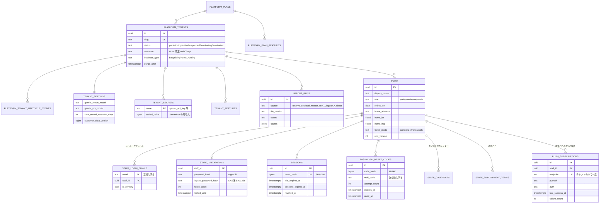
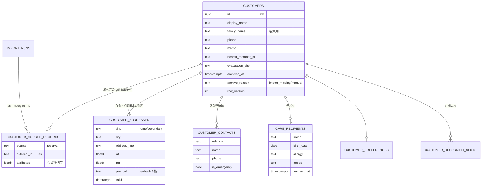
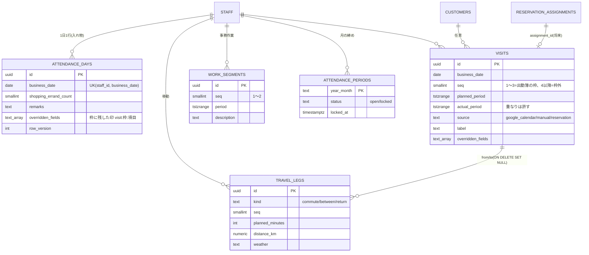
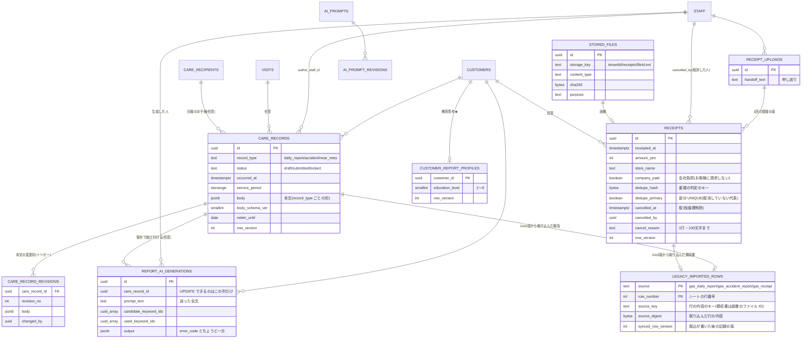
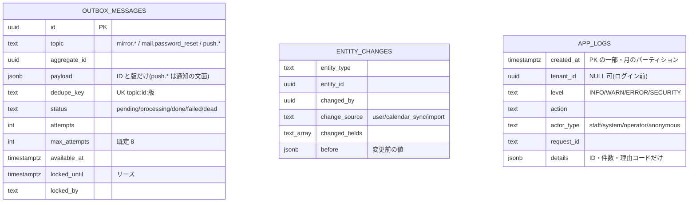

# 03. データベース設計

- 目的: PostgreSQL のスキーマの設計方針と、テナント分離・権限・トリガー・保存データの保護・保存期間・マイグレーションの約束事を決める。
  列ごとの定義は [03_付録_テーブル定義.md](03_付録_テーブル定義.md)(DB から生成)。
- 対象読者: スキーマを変える・レビューする開発者、DB を扱う運用者。

正はコード: スキーマ `packages/db/src/schema/*.ts`(Drizzle ORM)、マイグレーション `packages/db/drizzle/*.sql`、
Unit of Work `packages/db/src/uow.ts`、DB エラーの変換 `packages/db/src/errors.ts`。列挙の値は
`packages/core/src/domain/model/codes.ts`。

## 1. 前提

| 項目 | 内容 |
| --- | --- |
| バージョン | 本番 Cloud SQL for PostgreSQL 17、CI `postgres:17`、ローカル 16 以上。PostgreSQL 18 の機能(SQL の `uuidv7()` 等)は使わない |
| 拡張 | `btree_gist`(EXCLUDE で uuid・整数と範囲を一緒に GiST に載せる)。初期化 SQL(`infra/initdb`・`infra/cloudsql` の `01_bootstrap.sql`)が入れる |
| スキーマ | `public`(テナントの業務データ。全て RLS)、`platform`(テナント・プラン・レート制限・ライフサイクル。RLS なし、アプリは読むだけ) |
| ID | 主キーの UUID はアプリが **UUIDv7** で採番する(`core/domain/ids`)。INSERT 前に決め、子の行・outbox に同じトランザクションで使う。時刻順に並ぶので索引が偏らない。DB の既定値 `gen_random_uuid()` は手で INSERT する運用・テスト用 |
| 命名 | PostgreSQL の既定(`<表>_pkey` / `<表>_<列>_key` / `_fkey` / `_idx` / `_check` / `_excl`)。63バイトを超える名前だけ `tenant_id` を省く(`constraintName()`、`schema/_columns.ts`) |
| 型 | 列挙は `text` + `CHECK (col IN (…))`(enum 型は使わない。値の追加がマイグレーション1本で済む)。自由記述は `text`、記録の本文・変更履歴の変更前は `jsonb`、緯度経度は `double precision` の組(`lat` / `lng`、片方だけは不可)。日時 `timestamptz`、業務日 `date`、壁時計の時刻 `time`。期間は `tstzrange` / `daterange` の半開区間 `[開始, 終了)`(片方だけ分かる期間は端を無限にする) |
| 共通の列 | `created_at`、`updated_at`(トリガー `set_updated_at()` が保つ。アプリは書かない)、`row_version`(楽観的排他。7章)、`archived_at`(消さずに残す表)、`staff.retired_on`(退職日) |

## 2. テーブルの一覧(ドメインごと)

| ドメイン | テーブル | 使っている機能 |
| --- | --- | --- |
| プラットフォーム | `platform.tenants`・`plans`・`plan_features`・`platform_operators`・`rate_limit_buckets`・`tenant_lifecycle_events` | テナント・ログインの回数制限。プラン・運営者は台帳だけ |
| テナント | `tenant_settings`・`tenant_secrets`・`tenant_features`・`import_runs`・`integration_api_keys`・`custom_field_definitions`・`legacy_imported_rows` | 設定・秘密値(Gemini・Chat)・取込の記録・外部システム連携の API キー(運用担当者が発行。ハッシュだけ)・GAS版のスプレッドシートから取り込んだ行と記録の対応(移行の取込。10.1)。機能フラグ・独自項目は表だけ |
| スタッフ・認証 | `staff`・`staff_login_emails`・`staff_credentials`・`sessions`・`password_reset_codes`・`staff_employment_terms`・`staff_calendars` | 全て使用(雇用条件は表だけ) |
| 通知 | `push_subscriptions` | Web Push の購読(スタッフの端末ごと。翌日の予定のお知らせ・テスト通知の送り先) |
| 顧客 | `customers`・`customer_source_records`・`customer_addresses`・`customer_contacts`・`care_recipients`・`customer_preferences`・`customer_recurring_slots` | 取込・閲覧・予定計算(希望・定期の枠は表だけ) |
| 勤怠 | `attendance_days`・`visits`・`work_segments`・`travel_legs`・`attendance_periods` | 出勤簿 |
| 記録・領収書 | `care_records`・`care_record_revisions`・`receipt_uploads`・`receipts`・`stored_files`・`ai_prompts`・`ai_prompt_revisions` | 日報・事故報告・領収書・AIプロンプト |
| 日報AI | `report_keywords`・`report_age_bands`・`report_education_levels`・`report_psi_levels`・`report_phrases`・`report_stance_rules`・`customer_report_profiles`・`report_ai_generations` | 日報キーワード表現マスター(シート01〜06。管理画面「日報AIの調整」)・家庭ごとの教育思考★・AI 生成1回ごとの記録(02 6.1) |
| 非同期・監査 | `outbox_messages`・`entity_changes`・`app_logs`(月のパーティション) | ミラー・メール・Web Push・変更履歴・操作ログ |
| ライフサイクル | `data_export_requests`・`data_subject_requests`・`retention_policies` | 表だけ(画面・処理は未実装) |
| 予約・マッチング | `service_items`・`reservations`・`reservation_recipients`・`reservation_assignments`・`attribute_definitions`・`staff_attributes`・`customer_required_attributes`・`customer_staff_affinities`・`staff_weekly_availability`・`staff_availability_exceptions`・`staff_busy_blocks`・`service_areas`・`staff_service_areas`・`travel_time_cache`・`matching_runs`・`matching_run_candidates` | 表だけ(`staff_busy_blocks` は同期ジョブが書く)。[10_マッチング拡張設計.md](10_マッチング拡張設計.md) |

## 3. ER 図

mermaid の erDiagram は複合キーの線を1本しか描けないため、関係線は `xxx_id` の向きだけを示す(実際は全て `tenant_id` を
含む複合外部キー。4.2)。`tenant_id`・`created_at`・`updated_at` は省く。予約・マッチングの ER 図は 10 にある。

### 3.1 プラットフォーム・テナント・スタッフ



### 3.2 顧客・子ども



### 3.3 勤怠(出勤簿)



出勤簿のシートの1行(列記号 `C`〜`AO` の25列)との対応は **`packages/core/src/domain/attendance/sheetLayout.ts` だけ**が持つ:

- `projectDay(sheet)`: 実体 → `rowData`(25列。空は `''`)+ `changedFields`(手で変えた列)+ `hiddenVisitCount`。
  訪問 `seq` 1〜3 が枠(`C/D/E`・`L/M/N`・`U/V/W`)、4件目以降は保存するが出さない(WARN)。
- `applyRowEdit(sheet, patch, { source })`: 画面の修正(`user`)・カレンダーの反映(`calendar_sync`)・既存出勤簿の取込
  (`import`)→ 実体の差分。値の形式を確かめ、手で変えた項目を実体の `overridden_fields` に足す。枠が空になって実体が
  消えるときは印を `attendance_days.overridden_fields` に `visit:<枠>:<項目>` で移し、次にその枠に作る実体へ引き継ぐ。
- 書き込みは差分(削除 → 更新 → 追加)。変更前の値を `entity_changes.before`(jsonb)に残す(更新は変わった項目、削除は全項目)。
  その日の行を `SELECT … FOR UPDATE` で押さえる(`attendance.lockDay`。手入力とカレンダーの反映が重ならない)。

### 3.4 記録・領収書・ファイル



日報AIのマスター(`report_keywords` 等の6表)はテナントごとの設定で、他の表から外部キーでは参照しない(生成の記録はキーワードの
ID を配列で持つ。行は消さずに `archived_at` で外すため ID は残る)。自然キー(キーワードの `code`・年齢帯の `label`・★と PSI の
`level`・表現の `(kind, body)`・スタンスの `topic`)に UNIQUE、年齢帯の月齢範囲にアーカイブしていない行どうしの EXCLUDE
(`DEFERRABLE INITIALLY DEFERRED`。取込は1つのトランザクションで帯を入れ替えるため、確かめるのはコミットのとき)。家庭の★を
`customers` の列にしないのは、顧客の取込(RESERVA の CSV・外部連携の API)が `customers` を書き換えるため(★は「こちら側の判断」で
取込で消えてはいけない)。

### 3.5 非同期処理・監査



## 4. テナント分離

### 4.1 RLS

- `public` の全テーブルが `tenant_id uuid NOT NULL` を持ち、RLS を有効にして **FORCE**(所有者にも掛ける)。
- ポリシーは `tenant_isolation`: `tenant_id = app_current_tenant()`(USING と WITH CHECK の両方)。
- `app_current_tenant()` は `nullif(current_setting('app.tenant_id', true), '')::uuid`。設定が無ければ NULL になり**何も見えず
  何も書けない**。`nullif` が要るのは、トランザクションの中だけの設定が終わった後、プールの接続では値が `''` に戻るため。
- 例外: `app_logs` は SELECT が `tenant_id = app_current_tenant()`、INSERT が `tenant_id IS NULL OR …`(ログイン前の記録)。
  `outbox_messages` にはワーカーがテナントを横断して取り出すためのポリシー `outbox_messages_worker`(`katahimo_worker` だけ)。
- `platform.*` には RLS が無い(アプリ・ワーカーは読むだけ。`rate_limit_buckets` だけアプリが読み書き)。

### 4.2 複合主キー・複合外部キー

- テナントの表の主キーは `(tenant_id, id)`(自然キーの表は `(tenant_id, …)`)。
- テナントの表への外部キーは全て `(tenant_id, x_id) → (tenant_id, id)`。外部キーの検査は RLS を通らないため、単一列の外部キーでは
  別テナントの行を指せてしまう。複合にすると「同じテナントの行」を DB が保証する(RLS の WITH CHECK と二重の守り)。
- 全テーブルの `tenant_id` は `platform.tenants(id)` へ `ON DELETE CASCADE`(テナントの消去で全データが消える。9章)。
- 所有される子(住所・連絡先・子ども等)は cascade、記録 → 人は `no action`(記録を残したまま人を消さない)。
  移動 → 訪問は `ON DELETE SET NULL (列)`(PostgreSQL 15 以降の構文。`0001_baseline_custom.sql`)。
- これらの約束は `packages/db/src/integration/catalog.integration.test.ts` がカタログから確かめる(書き忘れを CI で見つける)。

### 4.3 アプリ側の約束(Unit of Work)

`packages/db/src/uow.ts` の `DrizzleUnitOfWork.run(tenantId, repos => …, { actorId })`:

1. `BEGIN` → `set_config('app.tenant_id', …, true)` と `set_config('app.actor_id', …, true)`(トランザクションの中だけ)を1回。
2. `repos` はそのトランザクションに結び付いたリポジトリで、**テナントIDを引数に取らない**(取り違えを型で防ぐ)。
3. ドメインの書き込みと outbox への積み込みは同じトランザクション。例外を投げると全て戻る。
4. 外部 API(カレンダー・地図・Gemini・通知・画像の保存・Cloud KMS)はトランザクションの外で呼ぶ。画像は先に置き、トランザクションが
   失敗したら消す(`usecases/receipts.ts`)。
5. 積むトピックは `outboxPolicy`(`core/domain/outbox/topicPolicy.ts`)で決める: ミラーは `MIRROR_TO_GOOGLE_SHEETS` が有効なときの
   `GAS_BRIDGE_TENANT` のテナントだけ、Web Push は `VAPID_PUBLIC_KEY` があるときだけ。それ以外は積まない(ミラーの判定のときだけ
   UoW のテナントの slug を読む)。

## 5. ロールと権限

| ロール | ログイン | 用途(接続文字列) | 主な権限 |
| --- | --- | --- | --- |
| `katahimo_owner` | 不可 | 全テーブル・関数の所有者 | DDL。FORCE RLS のため所有者でもテナントを設定しないと読めない |
| `katahimo_migrator` | 可 | マイグレーション・テナント作成・運用の関数(`MIGRATION_DATABASE_URL`) | `katahimo_owner` のメンバー。ログインすると自動で `SET ROLE katahimo_owner`。`migrate.ts` は現在のロールが所有者でなければ止まる |
| `katahimo_app` | 可 | API(`DATABASE_URL`) | テーブルごとに明示した DML だけ |
| `katahimo_worker` | 可 | ワーカー・ジョブ(`WORKER_DATABASE_URL`) | ジョブが使う表・操作だけ + outbox の横断ポリシー |
| `katahimo_readonly` | 不可 | 将来の分析・調査用の入れ物 | 今は何も読めない |

- どのロールも SUPERUSER・BYPASSRLS を持たない。既定権限(DEFAULT PRIVILEGES)には頼らず、`0001_baseline_custom.sql` の9章で
  テーブルごとに GRANT を書く。**新しいテーブルは GRANT と FORCE RLS を手書きのマイグレーションで足す**。
- 追記専用(`care_record_revisions`・`entity_changes`・`ai_prompt_revisions`・`app_logs`)は SELECT・INSERT だけ。AI 生成の記録
  `report_ai_generations` も SELECT・INSERT と、日報に結び付ける `care_record_id` の列だけの UPDATE(答え・プロンプトは書き換えられない)。
  日報AIのマスターと `customer_report_profiles` は SELECT・INSERT・UPDATE(行は消さずにアーカイブする。DELETE なし)。
- アプリ: `receipts`・`receipt_uploads` は SELECT・INSERT(領収書は会計の記録なので消さない)と、`receipts` の取消の列
  (`cancelled_at`・`cancelled_by`・`cancel_reason`)・`row_version`・重複の判定の代表 `dedupe_primary` だけの UPDATE(取消は論理削除。
  7章。代表の引き継ぎは 8.4)。列ごとの権限は付録の「権限」に `UPDATE(列, …)` で出る。
  `outbox_messages` は SELECT・INSERT、`attendance_periods` は SELECT・INSERT・UPDATE
  (締めるだけ。DELETE なし)、`tenant_settings` は SELECT・UPDATE(行は `provision_tenant()` が作る)、`integration_api_keys` は
  SELECT と `last_used_at` の列だけの UPDATE(キーの発行・失効は運用担当者の CLI が所有者の接続で行う)。`legacy_imported_rows` は
  SELECT・INSERT・UPDATE(移行の取込の CLI がアプリのロールで書く。DELETE なし。ワーカーは触れない)。`platform.tenants` は読むだけ
  (`calendar_settings`・`customer_import_settings` は運用担当者の CLI が所有者の接続で書く)。
- ワーカー: outbox の取り出しと更新、夜間反映(勤怠の4表の読み書き、`attendance_periods`・`staff`・`staff_login_emails` を読む、
  `staff_calendars` の読み書き。`SCHEDULE_PROVIDER=database` の予定として `reservations`・`reservation_assignments` を読む)、顧客CSV の取込(顧客は消さずアーカイブするため DELETE なし)、ミラーの送信(記録・領収書を読む)、
  再設定メール、Web Push(`push_subscriptions` の読み取り・成功と失敗の記録・もう無い購読の削除。INSERT なし)、free/busy、
  保守(保存期間の削除。`report_ai_generations` は SELECT・DELETE だけ)。認証情報・テナントの秘密値・AIプロンプト・日報AIのマスター・
  家庭の★・記録の履歴・マッチングの表
  (候補の削除と、予約・割当の読み取りを除く)には権限が無い。`worker.integration.test.ts` が実際のジョブを `katahimo_worker` で動かして確かめる。
- ロールごとの接続の上限(ロールの設定のためスーパーユーザーが必要。マイグレーションではなく初期化 SQL の `ALTER ROLE … IN DATABASE`):

  | ロール | `statement_timeout` | `lock_timeout` | `idle_in_transaction_session_timeout` |
  | --- | --- | --- | --- |
  | `katahimo_app` | 15s | 5s | 30s |
  | `katahimo_worker` | 60s | 10s | 60s |

表ごとの権限は [03_付録_テーブル定義.md](03_付録_テーブル定義.md) の各表の「権限」。

## 6. トリガーと関数

| 名前 | 種類 | 内容 |
| --- | --- | --- |
| `set_updated_at()` | トリガー(`<表>_set_updated_at`、BEFORE UPDATE) | `updated_at := now()` |
| `enforce_attendance_period_lock()` | トリガー(`attendance_days`・`visits`・`work_segments`・`travel_legs`、BEFORE INSERT/UPDATE/DELETE) | 締めた月の行を拒否(SQLSTATE `KH001`)。締めの判定の前に(テナント・スタッフ・月)の**共有**アドバイザリロックを取る。テナントの行が無い(消去中)なら通す |
| `guard_attendance_period()` | トリガー(`attendance_periods_guard`) | 締めるとき(status を locked にする)は**排他**アドバイザリロックを取る(書き込み中の同じ月を待つ)。締めの解除・締めた月の行の削除は所有者以外 `KH001` |
| `attendance_period_lock_key()` / `attendance_period_is_locked()` | 関数 | ロックのキー(`hashtextextended`)と、共有ロックを取ってからの判定 |
| `care_records_guard()` | トリガー(BEFORE UPDATE/DELETE、全ての行) | `locked` の記録は本文以外も含めて変更・削除を拒否(`KH002`、locked から戻すのも不可)。下書き以外の本文(`body`・`body_schema_ver`)が変わったら変更前を `care_record_revisions` に写す(変更者は `app.actor_id`)。テナント消去中は通す |
| `platform.provision_tenant(id, slug, name, timezone, business_type)` | SECURITY DEFINER | テナント(active)・`tenant_settings`・ライフサイクルの記録を作る。ID は呼び出し側(`core/usecases/tenantProvisioning.ts`)が採番する。PUBLIC から REVOKE、所有者のメンバーだけ |
| `platform.purge_tenant(id)` | SECURITY DEFINER | 解約済み(`terminated`)のテナントだけを消す(全テーブルが cascade で1文の中で消える)。`app_logs` は残る |
| `platform.unlock_attendance_period(tenant, staff, 'YYYY-MM')` | SECURITY DEFINER | 月の締めの解除(運用者だけ) |
| `platform.ensure_app_log_partitions(months_ahead)` | SECURITY DEFINER | 今月から先の月のパーティションを作り、既定のパーティションに入った行を月のパーティションへ移す。ワーカーが実行できる |
| `platform.drop_app_log_partitions(retain_months)` | SECURITY DEFINER | 保存期間より前の月のパーティションを DROP。ワーカーが実行できる |

DB の拒否はアプリで1か所だけ変換する(`packages/db/src/errors.ts` → `DomainError`):

| SQLSTATE・制約 | DomainError | HTTP |
| --- | --- | --- |
| `KH001`(締めた月) | `locked` | 400 |
| `KH002`(確定済みの記録) | `locked` | 400 |
| `23P01`(EXCLUDE) | `conflict` | 409 |
| ログインメールの主キーの重複 | `conflict`(`fields` に項目名) | 409 |

## 7. 楽観的排他と行のロック

- 同時に編集されうる行は `row_version integer`(既定1)を持つ。更新は `UPDATE … SET row_version = row_version + 1 WHERE … AND
  row_version = $期待値`、0件なら `DomainError('conflict')` → 409「…画面を開きなおしてください」の類。
- 契約は表示に `rowVersion` を出し、更新の要求に省略可能な `rowVersion` を受ける(送らなければ最後の書き込みが勝つ)。
- 出勤簿は1日の入れ物(`attendance_days`)の `row_version` を上げ、読んでから書くまでその日の行を `FOR UPDATE` で押さえる。
- AI プロンプトの保存はキーごとにロックしてから版を数える(同時の保存で版がぶつからない)。

領収書の会社負担・取消(論理削除):

- `receipts.company_paid`(既定 `false`): 会社負担(研修等の同行・会社の都合の費用。お客様に請求しない)。スタッフへの支払いの合計には
  入れ、お客様請求と分けて集計する(今月のまとめ・一覧の合計・CSV / Excel の区分)。登録のときに決め、後から変えない(列の UPDATE
  権限も無い)。
- 取消: `cancelled_at`・`cancelled_by`(取消したスタッフ。`(tenant_id, cancelled_by) → staff`)・`cancel_reason`(任意)を入れ、`row_version`
  を上げる(`UPDATE … WHERE row_version = 期待値 AND cancelled_at IS NULL`、0件なら 409)。行は消さない。CHECK
  `receipts_cancel_check`(取消していなければ3列とも null、取消したら `cancelled_at`・`cancelled_by` が入る)と
  `receipts_cancel_reason_check`(100文字まで・改行などの制御文字なし)。
- 取消した行は一覧(灰色で残す)の他、合計・月の明細(`listActiveByStaffAndPeriod`)・CSV・Excel・重複の判定から除く。取消せる期間は
  `core/domain/reports/receiptCancel.ts`(02 7.1。管理者は前の月以前の分も、領収書の月の `attendance_periods` が締め済みでなければ取消せる)。

## 8. 保存データの保護

### 8.1 方針

保存データは**保管場所ごと**(ディスク・バックアップ・バケット)に、このアプリ専用の鍵で暗号化する。列は型つき
(`text` / `jsonb` / 緯度経度)で持ち、検索・並び替え・集計・制約を DB でそのまま使う。

| 保管場所 | 暗号化 | 鍵 |
| --- | --- | --- |
| Cloud SQL(ディスク・自動バックアップ・PITR のログ) | Cloud SQL の CMEK(Google Cloud の利用者=運用側が管理する暗号鍵) | Cloud KMS `katahimo/cloudsql-cmek`(90日ごとの自動ローテーション) |
| 領収書画像(GCS バケット) | バケットの既定の鍵(CMEK) | Cloud KMS `katahimo/storage-cmek` |
| 通信(アプリ ↔ DB) | Cloud SQL Auth Proxy の TLS(直接の接続は `ENCRYPTED_ONLY`) | Google 管理 |
| テナントの秘密値(`tenant_secrets`) | 上記に加え、値そのものを SecretBox で封をする(8.2) | Cloud KMS `katahimo/tenant-secrets` |

データを読める人と経路は、次の仕組みで絞る:

- テナントの分離: RLS + FORCE と複合外部キー(4章)。どのロールも BYPASSRLS を持たない。
- 最小権限: ロールごとのテーブル・操作の GRANT(5章)。ワーカーは認証情報・秘密値・AIプロンプトを読めない。
- 監査: 操作ログ `app_logs`(書き込み・拒否・管理者による他のスタッフのデータの閲覧・顧客の詳細の閲覧)と変更履歴
  `entity_changes`・`care_record_revisions`(追記のみ)。`app_logs.details` には ID・件数・理由コードだけを書き、個人情報の値は書かない。
- 認証の回数制限・アカウントのロック(06「認証」)。

鍵の運用(ローテーション・権限・鍵を失ったときの扱い)は [07](07_インフラ・運用.md) 3.8。脅威と残るリスクは 06「保存データの保護」。

### 8.2 テナントの秘密値(SecretBox)

`tenant_secrets.sealed_value` は Gemini の API キー・Google Chat の Webhook URL を `SecretBoxPort.seal` で封をした暗号文
(`packages/integrations/src/secret-box`)。本番(`SECRET_BOX_PROVIDER=gcp`)は Cloud KMS の鍵で直接 encrypt / decrypt し、
開発(`local`)は `SECRET_BOX_LOCAL_KEY` の AES-256-GCM。どちらも暗号文をテナントIDと秘密値の名前に結び付ける(追加認証データ)
ため、別のテナント・別の名前の行に写しても開けない。封・開封(KMS の呼び出し)は Unit of Work のトランザクションの外で行う。
画面には伏せ字だけを返す(06「秘密値」)。

### 8.3 ハッシュで持つ値

| 列 | 形 | 用途 |
| --- | --- | --- |
| `sessions.token_hash` | SHA-256 | セッションの照合(Cookie のトークンそのものは持たない) |
| `password_reset_codes.code_hash` | HMAC-SHA256(`SESSION_SECRET` から HKDF で導出した鍵) | 再設定コードの照合。メールに書くコード `mail_code` はワーカーの送信までの間だけ持ち、送信後・使用後に消す(期限切れは保守ジョブが消す) |
| `platform.rate_limit_buckets.subject_hash` | HMAC-SHA256 | 回数制限の対象(IP・ログインID)を値のまま持たない |
| `staff_credentials.password_hash` | argon2id | パスワード |
| `receipts.dedupe_hash` | SHA-256 | 領収書の重複判定(8.4) |

### 8.4 領収書の重複判定

GAS版 `processReceiptImages` と同じ正規化(`core/domain/reports/receiptDedupe.ts` の `buildReceiptDedupeKey`: スタッフ・顧客・
日時・金額・店名)で作ったキーの SHA-256 を `receipts.dedupe_hash` に入れる(キーは店名を含み長さに上限が無いため、UNIQUE 索引には
固定長のハッシュを載せる)。同じ操作の中の同じ内容(往復の運賃等)は全て登録するため、同じキーの行は全て同じ `dedupe_hash` を持ち、
そのうち取消していない1行だけが代表(`dedupe_primary`、登録のときは束の最初の1枚)になる。
`receipts (tenant_id, dedupe_hash) WHERE dedupe_primary AND cancelled_at IS NULL` の部分 UNIQUE と、代表の行の
`INSERT … ON CONFLICT DO NOTHING` で、同時の登録でも1件になる(CHECK `receipts_dedupe_primary_check`: 代表はキーのある行だけ)。
取消した領収書は UNIQUE の対象から外れ、同じ内容を登録し直せる(会社負担かどうかはキーに入れない)。金額か店名が未入力の画像は
判定しない(`dedupe_hash` なし)。最初の1枚が既存と重複したら、同じ内容の残りも全て重複にする(同じ束を送り直しても1枚も増えない)。

代表を取消したら、同じトランザクションで同じキーの取消していない行のうち最も古いもの(領収書日時・ID の順)に代表を移す
(`DrizzleReceiptRepository.cancel`。取消した行は UNIQUE の対象から外れているので重ならない。移した行の `row_version` は上げない)。
同じキーの行を同時に取消しても代表が消えないように、取消の前に同じキーの取消していない行を ID の順に `FOR UPDATE` でロックする
(索引 `receipts_tenant_id_dedupe_hash_idx`)。これで、同じ内容の送り直しは取消していない同じ写真が残っている間は重複になり、
全て取消した後は登録できる。

## 9. パーティション・保存期間・ライフサイクル

`app_logs` は `created_at` の月ごとの RANGE パーティション(`app_logs_yYYYYmMM`)と既定のパーティション(`app_logs_default`)。
主キーは `(created_at, id)`、外部キーは持たない(対象が消えても証跡を残す)。月のパーティションを作り忘れても書き込みは
既定のパーティションが受ける。

保守ジョブ(`maintenance`、毎日 04:00 JST。`core/usecases/maintenance.ts` の `RETENTION_DAYS`):

| 対象 | 期間 | 方法 |
| --- | --- | --- |
| `app_logs` | `APP_LOG_RETENTION_MONTHS`(既定13か月) | 月のパーティションごと DROP。12か月先まで先に作り、既定のパーティションの行を移す |
| 失効・期限切れの `sessions` | 30日 | 削除 |
| 完了した `outbox_messages` | done 7日 / failed・dead 90日 | 削除 |
| `password_reset_codes` | 7日 | 削除 |
| `password_reset_codes.mail_code`(期限切れ・使用済み) | 期限の時点 | 値を消す(送信に失敗して送られなかったコードも残さない) |
| `matching_run_candidates` | 90日 | 削除 |
| `platform.rate_limit_buckets` | 2日 | 削除 |
| どこからも参照されない `stored_files` | 1日の猶予 | ファイル置き場と行を削除 |
| `receipts`・`receipt_uploads` | — | 消さない(会計の記録。間違えた登録は取消=論理削除で残す。7章) |
| `care_records` | `tenant_settings.care_record_retention_days`(既定5年) | `retain_until` に記録するだけ。削除は運用の判断(`retention_policies` は表だけ) |
| 日報に結び付いていない `report_ai_generations`(保存されなかった下書き) | 作成から365日 | 削除 |
| 日報に結び付いた `report_ai_generations` | その日報の `retain_until`(テナントの今日より前になったら) | 削除(日報の保存期間に従う) |

- 対象は消去されていない全テナント(停止中・解約済みも)。処理の失敗は ERROR ログに残し、ジョブを失敗(終了コード1)にする。
- テナントの状態の変化は `platform.tenant_lifecycle_events`(作成・停止・解約)。解約後の削除予定日は `tenants.purge_after`、
  消去は `platform.purge_tenant()`(07「手順書」)。
- 開示・削除の請求 `data_subject_requests`、データの書き出し `data_export_requests`、保存期間の上書き `retention_policies` は表だけ。

## 10. 取込(RESERVA 顧客CSV)の書き方

`packages/ingestion` の `applyReservaImport`: 1トランザクションで取込元のID(`customer_source_records(source, external_id)`)で
突き合わせ、無ければ作成・あれば変わった項目だけを更新する(顧客の ID を保つ)。子どもは氏名で突き合わせ、消えた子どもは
アーカイブ。取込元から消えた顧客はアーカイブ(`archive_reason = 'import_missing'`)し、戻れば戻す。消えた顧客が既存の
**20%**(`DEFAULT_REVIEW_THRESHOLD`)を超えたら適用せず `import_runs.status = 'review_required'`。何か変わったら
`tenant_settings.customer_data_version` を上げる(画面の再読込・予定のマスタのキャッシュの作り直しの合図)。
行の値の誤りで全体を止めない(住所2の期間が逆なら期間なし、読めない日時は空、取込元のID・氏名の無い行は飛ばし、数を `counts` に残す)。

### 10.1 GAS版のスプレッドシートからの移行の取込

`pnpm import:legacy-reports` / `import:legacy-receipts`(05 12章)は、取り込んだ行ごとに `legacy_imported_rows` に1行を書く。主キーは
`(tenant_id, source, row_number)`(`source` は `gas_daily_report` / `gas_accident_report` / `gas_receipt`、`row_number` はシートの行番号で
2 から。GAS版は行を末尾に足すか行番号で上書きするだけで、行を消さない・並べ替えない)で、同じ行を2回取り込まない。`source_key` は行の
内容のキー(報告は日時・担当・顧客ID(・開始時刻)で、行が動いたことを見つけるために使う。同じキーの行が2つ以上あってよい。索引
`(tenant_id, source, source_key)`)。領収書は画像の Drive のファイル ID で行を指し、同じ画像は1回だけ(部分一意索引
`(tenant_id, source_key) WHERE source = 'gas_receipt'`)。行は取り込んだ先の `care_records`(報告)か `receipts`(領収書)のどちらか一方だけを
指す(CHECK。`(tenant_id, care_record_id)`・`(tenant_id, receipt_id)` も UNIQUE)。`source_digest`(取り込んだ行の内容の SHA-256)で
シートで直された行を、`synced_row_version`(取込が書いた後の記録の `row_version`)で取込の後に新版で直された記録を見分ける。
記録の表(`care_records`・`receipts`)には GAS版の事情の列を足さない(移行が終われば使わなくなる対応の表だけが残る)。書き込みは
200行(領収書は20件)ずつのトランザクションで、各トランザクションの最初にテナントごとのアドバイザリロック
(`pg_advisory_xact_lock(hashtextextended('legacy_import:<テナントID>', 0))`)を取る(同時に流しても同じ行を2回作らない)。

## 11. マイグレーション

### 11.1 ベースライン

| ファイル | 作り方 | 中身 |
| --- | --- | --- |
| `0000_baseline.sql` | drizzle-kit がスキーマから生成(先頭の `btree_gist`・`app_current_tenant()` だけ手で足した) | テーブル・列・主キー・外部キー・UNIQUE・CHECK・索引・RLS の有効化と `tenant_isolation` |
| `0001_baseline_custom.sql` | 手書き | `set_updated_at` のトリガー、EXCLUDE 制約、`ON DELETE SET NULL (列)`、締めと記録のトリガー、`app_logs`(パーティション)とその関数、`provision_tenant` / `purge_tenant` / `unlock_attendance_period`、FORCE RLS、`outbox_messages_worker`、ロールごとの GRANT |

この2本はまだ本番に適用していないため、公開までのスキーマの変更はこの2本に直接入れる。**本番にデータが入った後は、適用済みの
マイグレーションを書き換えない。** `app_logs` は drizzle-kit の管理外(`packages/db/src/customTables/appLogs.ts` に型だけ)。

### 11.2 次のマイグレーションの足し方

1. `packages/db/src/schema/*.ts` を変える(列挙の値は `codes.ts`)。
2. `pnpm db:generate` で差分の SQL を作る(`packages/db/drizzle/000N_*.sql` と `drizzle/meta`)。
3. drizzle-kit で書けないもの(EXCLUDE・トリガー・FORCE RLS・新しい表の GRANT・`SET NULL (列)`・関数)は、手書きの
   マイグレーションを作って書く: `pnpm --filter @katahimo/db exec drizzle-kit generate --custom --name <名前>`。
   新しいテーブルには必ず `ALTER TABLE … FORCE ROW LEVEL SECURITY` と、アプリ・ワーカーへの GRANT(必要な操作だけ)を書く。
4. `pnpm db:migrate` → `pnpm db:generate` が「No schema changes」になること(CI も確かめる)→ `pnpm test`
   (`catalog.integration.test.ts` が RLS・FORCE・複合外部キー・権限の書き忘れを見つける)。
5. `pnpm db:doc` でテーブル定義(03付録)を作り直す。スキーマ・SQL・`drizzle/meta`・資料を一緒にコミットする。

本番ではマイグレーションが**新しいアプリより先に**流れる(07「デプロイ」)。旧バージョンのアプリでも動く形にする
(列の追加 → アプリの更新 → 旧列の削除は次のリリース、の2段階。NOT NULL の列は既定値つきで足す)。

### 11.3 開発 DB の作り直し

ベースラインを変えたとき(公開前だけ)・開発 DB が壊れたときは、ロールから作り直す:

```bash
psql -U postgres -h localhost -c 'DROP DATABASE IF EXISTS katahimo_dev'
psql -U postgres -h localhost -f infra/initdb/00_create_database.sql
psql -U postgres -h localhost -d katahimo_dev -f infra/initdb/01_bootstrap.sql
pnpm db:migrate && pnpm db:seed
```

Docker の場合は `docker compose -f infra/docker-compose.yml down -v` の後に `up -d`(ボリュームの初期化 SQL が流れ直す)。
