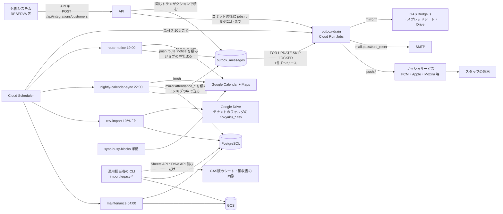
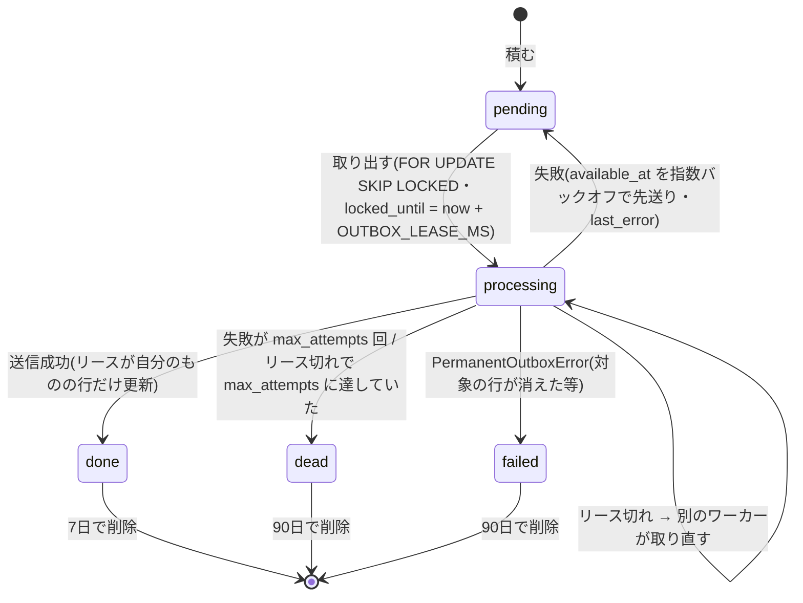
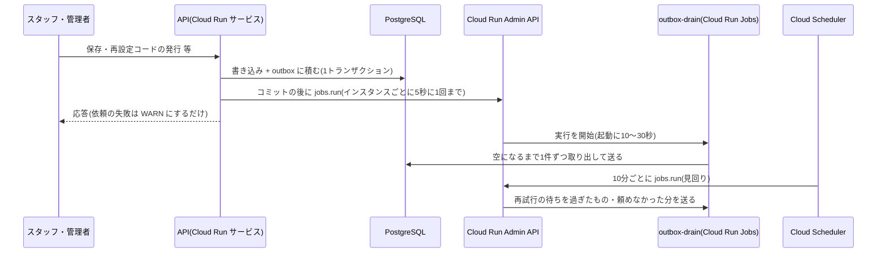
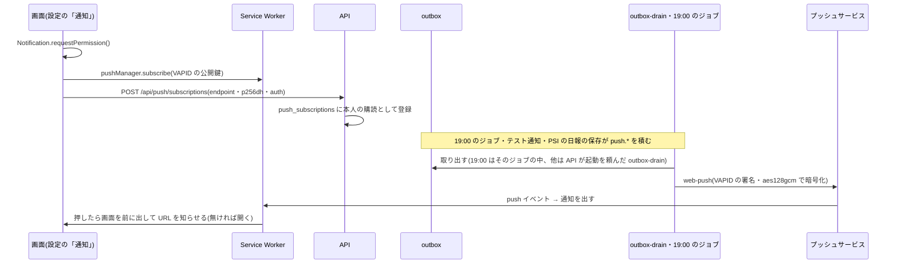

# 05. バッチ・外部連携

- 目的: 画面の要求の外で動く処理(outbox を処理するジョブ・定期ジョブ)と、外部サービスとのつなぎ方(Google Calendar / Maps / Drive /
  Gemini / Chat、SMTP、Web Push、GAS Bridge、外部システムからの顧客の受け取り、GAS版のスプレッドシートからの移行の取込)、
  実装の選び方とキャッシュを決める。
- 対象読者: ワーカー(ジョブ)・連携を直す開発者、本番の設定をする運用者。

正はコード: ワーカー `packages/worker/src/`(`entrypoints/`・`jobs/`、ローカル開発専用の見回り `localWorker.ts`)、outbox の処理
`core/usecases/outboxWorker.ts`、起動の依頼 `core/usecases/outboxDrainTrigger.ts`・`integrations/src/cloud-run/`、
ジョブの usecase(`core/usecases/attendance/nightlySync.ts`・`pushNotifications.ts`・`maintenance.ts`・`staffBusyBlocks.ts`、
`ingestion/src/customerCsvImport/`・`ingestion/src/integrationCustomers/`)、
連携 `packages/integrations/src/*`、環境変数 `integrations/src/runtime-env/sharedEnv.ts`・`worker/src/env.ts`・`api/src/env.ts`。
本番の構成(Cloud Run・Scheduler)は [07_インフラ・運用.md](07_インフラ・運用.md)。

## 1. 全体

## 2. outbox と outbox-drain

### 2.1 トピック

書き込みと**同じ Unit of Work**で `outbox_messages` に積む。ミラー・メールのペイロードは ID と版だけ(個人情報を入れない。
ワーカーが DB から読み直す)。Web Push のペイロードは送る通知の文面(予定の時刻とお名前だけ。10章)。`dedupe_key` は決定的で、
同じキーの再積み込みは何もしない(`(tenant_id, dedupe_key)` の UNIQUE)。送るのは Cloud Run Jobs の `outbox-drain`
(2.3。積んだ操作の後に API が起動を頼み、10分ごとの見回りでも起動する)と、積んだバッチのジョブ自身(3章)。

| トピック | 積む場所 | `dedupe_key` | 送る先 |
| --- | --- | --- | --- |
| `mirror.attendance_day` | 出勤簿の修正・カレンダーの反映(`usecases/attendance/records.ts`) | `mirror.attendance_day:<日のID>:<row_version>` | Bridge `writeAttendanceDay`(その書き込みで表示の変わった列だけ) |
| `mirror.attendance_aggregate` | カレンダーの反映(予定の指紋が前回と違うとき)・`aggregate/refresh`(毎回) | `mirror.attendance_aggregate:<日のID>:<その日の送信の通し番号>` | Bridge `writeAttendanceAggregate` |
| `mirror.care_record` | 日報・事故報告の保存(`usecases/reports.ts`) | `mirror.care_record:<記録のID>:<row_version>` | Bridge `writeDailyReport` / `writeAccidentReport` |
| `mirror.receipt` | 領収書の登録(`usecases/receipts.ts`) | `mirror.receipt:<領収書のID>:0` | Bridge `writeReceipt`(画像を data URL で) |
| `mail.password_reset` | 再設定コードの発行(`usecases/auth/passwordReset.ts`) | `mail.password_reset:<コードのID>:0` | SMTP(件名「【保育日報】パスワード再設定認証コード」) |
| `push.route_notice` | 翌日の予定のお知らせのジョブ(`usecases/pushNotifications.ts`)。購読(端末)ごとに1件 | `push.route_notice:<購読ID>:<スタッフID>:<日付>` | その購読へ Web Push(10章) |
| `push.test` | 設定の「テスト通知を送る」(`POST /api/push/test`)。購読ごとに1件 | `push.test:<購読ID>:<スタッフID>:<UUIDv7>`(押すたびに積む) | 同上 |
| `push.psi_alert` | PSI 2 以下の日報の保存で、新しい日報か PSI が変わったとき(`usecases/reports.ts`)。在籍している管理者の購読ごとに1件 | `push.psi_alert:<購読ID>:<記録ID>:<PSI>:<版>`(知らせる保存ごとに1回) | 同上(10.3) |

- 勤怠集計は中身から決まる送信のため、その日の最後に積んだメッセージ(`OutboxWriter.latestPayload`)と予定の指紋を比べ、
  違うときだけ次の通し番号で積む(A → B → A と戻っても3回目を積む)。
- `mirror.*` を積む・送るのは、`MIRROR_TO_GOOGLE_SHEETS=true` のときの **`GAS_BRIDGE_TENANT` のテナントだけ**
  (`core/domain/outbox/topicPolicy.ts`。Bridge はそのテナントの GAS版・スプレッドシートにつながっているため、別のテナントの記録を
  送るとそのテナントの出勤簿・日報に書かれてしまう)。API の UoW は他のテナントの `mirror.*` を積まず、ワーカーは他のテナントの
  `mirror.*` が残っていても送らずに完了にして WARN `outbox.mirror_other_tenant_skipped` を残す(二重の守り)。ミラーが無効なら
  API は `mirror.*` を積まず、ワーカーは残っているものを送らずに完了にする(API とワーカーは同じ環境変数を読む)。メールは常に送る。
- `VAPID_PUBLIC_KEY` が無ければ API・ジョブは `push.*` を積まず、VAPID の設定が揃っていないワーカーは残っているものを送らずに完了にする。

### 2.2 取り出し・リース・再試行

- 1件ずつ取り出して `processing` とリースを付けてすぐコミットし、送信はトランザクションの外で行う。
- 結果(完了・再試行・諦め)は取り出したときのリース(`locked_by` と `attempts`)のままの行にだけ書く。取り直されていたら
  何も書かず WARN `outbox.lease_lost`(遅れて終わった古い処理が新しい結果を上書きしない)。
- 再試行の待ち時間は `OUTBOX_RETRY_BASE_DELAY_MS × 2^(attempts-1)`(上限 `OUTBOX_RETRY_MAX_DELAY_MS`、`domain/outbox/retryPolicy.ts`)。
  `max_attempts`(既定8)回で `dead` にして ERROR `outbox.message_failed`。
- 領収書の画像が見つからないミラーは送らずに完了(WARN `mirror.receipt.image_missing`)。Bridge の HTTP エラー・JSON 以外の応答・
  タイムアウト(120秒)は失敗。
- 並行性は結合テスト(4つのワーカーが同時に取り出しても1件を二重に処理しない)で確かめている。

### 2.3 起動(操作の後の依頼・バッチの中・見回り)

`outbox-drain`(`dist/outbox-once.js`)は outbox を空になるまで(`OUTBOX_DRAIN_MAX` 件まで)1件ずつ処理して終わるジョブで、
次の3つの契機で動く。実行が重なっても取り出しは `FOR UPDATE SKIP LOCKED` とリースで排他のため、同じメッセージを
二重には送らない。

1. **操作の後の依頼**(`core/usecases/outboxDrainTrigger.ts`): API の Unit of Work(`withOutboxDrainTrigger`)は、`outbox` に
   1件でも積んだ(`enqueue` が true を返した)トランザクションが**コミットされた後**に、`OutboxDrainTriggerPort` で1回の実行を頼む。
   積まなかった・積み済みの重複だけだった・ロールバックしたトランザクションでは頼まない。本番の実装は Cloud Run Admin API の
   `POST https://run.googleapis.com/v2/{OUTBOX_DRAIN_JOB}:run`(本文 `{}`・上書きなし、実行SA `katahimo-api` の ADC のトークン、
   トークンの取得と POST を合わせて5秒で打ち切り。`integrations/src/cloud-run/cloudRunJobDrainTrigger.ts`)。
   - **まとめる**: 1つの API インスタンスは5秒(`DEFAULT_OUTBOX_DRAIN_TRIGGER_COOLDOWN_MS`)に1回だけ頼む。間隔の中で積まれても
     頼まない。間隔はジョブの起動(10〜30秒)より短いため、間隔の中でコミットされたメッセージは、直前に頼んだ実行(起動中か処理中)が
     空になるまで取り出す中で拾う。間隔が明けた後に積まれれば、そのリクエストの中でまた頼む。API は最大2インスタンスのため、依頼は
     多くても5秒に2回。
   - **応答を待たせない・失敗させない**: 依頼はリクエストの処理の中で行う(API は `cpu_idle` のため、応答の後の処理は CPU が
     割り当てられず遅れる)。jobs.run は実行の開始を受け付けた時点で応答するため、待つのは依頼の受け付けまで(通常 0.1〜0.3 秒)。
     依頼の失敗・タイムアウトは例外にせず、WARN `outbox.drain_trigger_failed`(プロセスの構造化ログ。`error` に HTTP ステータスと
     Google API の status)を書くだけにする。利用者の操作は成功のままで、積んだメッセージは見回りが送る。リクエストの外で動く
     処理(タイマー)は使わない(CPU の割り当てられていない間に動き、遅れたり依頼が失敗したりするため)。
   - `OUTBOX_DRAIN_JOB` の無いローカル開発では頼まない(`pnpm worker` か `pnpm outbox:once` で処理する。[08_開発ガイド.md](08_開発ガイド.md))。
2. **バッチのジョブの中**(`worker/src/jobs/outboxDrain.ts` `drainOutboxAfterBatch`): `route-notice`(`push.route_notice` を
   端末ごとに積む)と `nightly-calendar-sync`(`mirror.attendance_*`)は、積み終えた最後に**同じジョブの中で** outbox を送る
   (別のジョブの起動は頼まない)。19:00 のお知らせは積んだそのジョブの中で届く。ここでの送信の失敗はジョブの成否に数えない
   (再試行の待ちか未処理のまま残り、見回りが送る)。停止の合図を受けた後は送らずに終える。
3. **見回り**: Cloud Scheduler が `var.outbox_sweep_schedule`(既定 `*/10 * * * *`)に同じジョブを起動する。再試行の待ち
   (`available_at` が先のもの)が時刻を過ぎたもの、起動を頼めなかった分、リースが切れたままのものを拾う。パスワード再設定メールは
   切替日の前から要るため、見回りは `scheduler_paused` でも止めない。

届くまでの時間の目安:

| 場合 | 目安 |
| --- | --- |
| 通常(操作の後の依頼) | 操作から **10〜30秒**(ジョブの起動の時間。依頼をまとめた間隔の中で積まれたものも、普段は直前に頼んだ実行が拾う) |
| 間隔の中で積まれ、直前の実行が先に終わっていた | 次の見回りまで(**最大10分**)。間隔はジョブの起動より短いため、普段は起こらない |
| 19:00 のお知らせ・22:00 の反映のミラー | 積んだジョブの中ですぐ |
| 起動を頼めなかった・送信に失敗して再試行を待つもの | 次の見回りまで(**最大10分**)。再試行の間隔は `OUTBOX_RETRY_BASE_DELAY_MS`(30秒)× 2^(試行回数−1) だが、実際には待ち時間を過ぎた後の最初の見回りで取るため、初めの数回は10分ごとになる(既定の8回で `dead` になるまでおよそ1〜2時間) |

| 環境変数 | 使う側 | 既定 | 内容 |
| --- | --- | --- | --- |
| `OUTBOX_DRAIN_JOB` | API | —(本番は必須) | 起動を頼むジョブ(`projects/
/locations/<r>/jobs/katahimo-outbox-drain`。Terraform の `local.outbox_drain_job_id`)。無ければ頼まない |
| `WORKER_DATABASE_URL` | ワーカー | (必須) | `katahimo_worker` の接続 |
| `OUTBOX_DRAIN_MAX` / `OUTBOX_LEASE_MS` | ワーカー | 500 / 300000 | 1回の実行で続けて処理する最大件数(残りは次の実行)/ リース |
| `OUTBOX_RETRY_BASE_DELAY_MS` / `OUTBOX_RETRY_MAX_DELAY_MS` | ワーカー | 30000 / 3600000 | 再試行の間隔 |
| `OUTBOX_POLL_INTERVAL_MS` | `pnpm worker` だけ | 5000 | ローカル開発専用の見回りの、空になった後の待ち時間 |
| `WORKER_SHUTDOWN_TIMEOUT_MS` | ワーカー | 8000 | SIGTERM から強制終了まで(処理中の1件は終える) |
| `SMTP_HOST` / `SMTP_PORT` / `SMTP_USER` / `SMTP_PASS` / `SMTP_FROM` | ワーカー | — / 587 / — / — / `保育日報 <noreply@localhost>` | 再設定メール。`SMTP_HOST` が無ければ標準出力に本文を出す(本番は必須) |
| `SMTP_REQUIRE_TLS` | ワーカー | true | STARTTLS(`SMTP_PORT` が 465 以外)で TLS への切り替えを必須にする(TLS 1.2 以上。サーバーが STARTTLS を出さなければ平文では送らずに失敗)。false は TLS の無い開発用の SMTP だけで、本番では起動しない([06](06_セキュリティ設計.md) 7章) |
| `APP_PUBLIC_URL` | ワーカー | — | 画面の URL。管理者が送る「パスワード設定の案内」のメールに `?t=<法人ID>` つきのログイン画面の URL として書く(無ければ法人IDだけを書く。terraform の `app_public_url`) |
| `VAPID_PUBLIC_KEY` / `VAPID_PRIVATE_KEY` / `VAPID_SUBJECT` | ワーカー(公開鍵は API も) | — | Web Push の署名(10章)。3つとも設定するか3つとも空(片方だけなら起動しない)。公開鍵は API と同じ値 |

## 3. ジョブ

同じ worker イメージの別コマンド(`node dist/<ジョブ>.js`)。本番は Cloud Scheduler → Cloud Run Jobs(`infra/gcp/scheduler.tf`・`run.tf`)。

| ジョブ | コマンド(ローカル) | 時刻(JST) | GAS版 | 内容 |
| --- | --- | --- | --- | --- |
| `route-notice` | `pnpm job:route-notice [-- YYYY-MM-DD]` | 毎日 19:00(`var.route_notice_schedule`) | gas-root-serach `main()`(LINE WORKS の DM) | 翌日の予定のお知らせ(10.2)。利用中の全テナントの、明日(テナントの時刻帯)に在籍していて通知の購読を持つスタッフの予定を軽量版で読み(地図 API は呼ばない。読めないカレンダーがあれば欠けたまま送らない `strict`)、1件以上あれば購読ごとに `push.route_notice` を積む。予定を読めなかったスタッフは積まずに失敗として記録して続け(ERROR `push.route_notice.staff_failed`)、ジョブは終了コード1で終わる(再試行で積む)。テナントのまとめは INFO `push.route_notice.done`(`queued` = 新しく積んだスタッフ、`alreadyQueued` = 全ての端末に積み済みだったスタッフ、`noEvents`・`failed`)。流し直しても積み済みの端末には積まず、後からオンにした端末にだけ積む。VAPID の設定が無ければ何もしない。日付を渡すとその日のお知らせを積む(明日でなければタイトルは「9/28(月)の予定 N件」) |
| `nightly-calendar-sync` | `pnpm job:nightly-calendar-sync [-- YYYY-MM-DD]` | 毎日 22:00 | `autoSyncTodayScheduleForAllStaff` | 利用中の全テナントの、その日に在籍しているスタッフの「今日」(テナントの時刻帯)をカレンダーから出勤簿へ反映(02 8.4 と同じ規則・`fresh`)。スタッフごとに失敗を記録して続ける(WARN `attendance.nightly_sync.staff_failed`、テナントのまとめ INFO `.done`)。日付を渡すと取りこぼした日を流し直す |
| `csv-import` | `pnpm job:csv-import` | 10分ごと(毎時 :05・:15 … :55。`var.customer_csv_import_schedule`、既定 `5-59/10 * * * *`。outbox の見回りと5分ずらす) | `checkAndImportLatestCsv`(GAS版は毎日3時台と画面を開くたび) | 各テナントの取込元の最新の `Kokyaku_YYYYMMDDHHmm.csv`(末尾に `_N` が付くこともある。ファイル名の日時が最新)が未取込なら取り込む(03 10章)。10分ごとにするのは、RESERVA に登録したばかりのお客様の日報を、初回の訪問の直前でも書けるようにするため(顧客がDBに無いと日報を書けない)。新しい CSV が無いときは Drive のフォルダの一覧と DB の読み取り1回だけで終わる(軽い)。夜間反映(22:00)は、その時点までに取り込んだ最新の住所を前提にする。終了コード: `failed` と `review_required`(消える顧客が20%超)は1(アラート。ジョブの再試行はせず10分後の実行が代わり)、`busy`(同じテナントの別の取込がロックを持っている)は失敗にしない(次の10分後の実行が取り込む)。直前の実行が既に止めた版(`import_runs` の最新の終了行が同じ版の `review_required`)への `review_required` も失敗にしない(`force` なしでは CSV を読まず `import_runs`・操作ログも残さない。新しい CSV か管理者の `force` で再試行) |
| `maintenance` | `pnpm job:maintenance` | 毎日 04:00 | — | 操作ログのパーティション(12か月先まで作る・保存期間を過ぎたものを消す・既定のパーティションの行を移す)、保存期間を過ぎた行(日報に結び付いていない AI 生成の記録は365日、結び付いた記録は日報の保存期限 `care_records.retain_until` を過ぎたもの)、参照されないファイルの削除(03 9章) |
| `sync-busy-blocks` | `pnpm job:sync-busy-blocks` | 登録しない(使うなら例: 毎時) | — | 在籍スタッフの `staff_calendars` の free/busy を今日から `BUSY_BLOCK_SYNC_DAYS`(既定28)日分 `staff_busy_blocks` に置き換える(予定のタイトル・場所は取らない)。将来のマッチング用。Google の資格情報が必要 |
| `outbox-drain` | `pnpm outbox:once` | 操作の後に API が起動を頼む・10分ごと(`var.outbox_sweep_schedule`) | — | outbox を空になるまで(`OUTBOX_DRAIN_MAX` 件まで)処理して終わる(2.3)。`dead` / `failed` にしたメッセージがあれば終了コード1(再試行はしない。メッセージの再試行は outbox の `available_at`) |
| `migrate` | `pnpm db:migrate` | デプロイの前 | — | マイグレーション(`node db/dist/migrate.js`、`MIGRATION_DATABASE_URL`) |

共通(`worker/src/jobs/runOneShot.ts`):

- 冪等(同じ日に何度流してもよい)。失敗(反映に失敗したスタッフがいる・取込が `failed` / `review_required`(ただし同じ版を前回が既に止めたものは除く。`busy` は失敗にしない)・保守の処理の失敗)
  があれば終了コード1で、Cloud Run Jobs の再試行(1回。`csv-import` は再試行せず10分後の実行が代わり)とアラートに乗る。
- `JOB_TIMEOUT_MS`(既定30分)を超えたら終了コード1。SIGTERM を受けたら区切り(スタッフ・テナントの間)で止め、最後まで
  終わっていなければ終了コード1(`interrupted`。再試行で残りを処理する)。`WORKER_SHUTDOWN_TIMEOUT_MS` で強制終了。
- 終わるときに DB の接続プールを閉じる。ログは1行 JSON(Cloud Logging の構造化ログ)。
- `SCHEDULE_PROVIDER=gas_bridge` のとき、予定を読む `nightly-calendar-sync` と `route-notice` は `GAS_BRIDGE_TENANT` のテナントだけを
  処理し、他のテナントは飛ばす(Bridge は1つのテナントの予定しか読めず、求めても断られて毎晩終了コード1になるため)。飛ばしたテナントごとに
  INFO `attendance.nightly_sync.tenant_skipped` / `push.route_notice.tenant_skipped`(`reason: schedule_provider_other_tenant`)を
  1件残し、ジョブのログの `skippedTenants` に slug を出す。飛ばしたことは失敗に数えない。`sync-busy-blocks` は `SchedulePort` ではなく
  Google Calendar の free/busy を直接読むため対象外(Google の資格情報の無い `gas_bridge` の環境では登録しない)。

## 4. 予定・ルート(`SCHEDULE_PROVIDER`)

### 4.1 実装の選択

| 値 | 実装 | 内容 |
| --- | --- | --- |
| `google` | `GoogleSchedulePort` + `GoogleMapsPlatformPort`(`integrations/src/google-schedule`・`google-calendar`・`google-maps`) | Google Calendar API(読み取り専用)と Geocoding API + Routes API を直接呼ぶ。GAS 不要 |
| `gas_bridge` | `GasBridgeSchedulePort` | GAS版 Web App(`Bridge.js`)に計算ごと任せる(移行期)。`GAS_BRIDGE_TENANT` のテナントだけ |
| `database` | `DatabaseSchedulePort`(`integrations/src/database-schedule`) | DB の予約(`reservations` と、スタッフの確定した割当 `reservation_assignments`)を予定として返す。Google カレンダー・地図 API を使わない(公開デモ。07 3.9) |
| `noop` | `NoopSchedulePort` | 常に予定なし(ローカル開発) |

未指定なら `GOOGLE_MAPS_API_KEY` と `GOOGLE_APPLICATION_CREDENTIALS` が両方あれば `google`、`GAS_BRIDGE_URL`・`GAS_BRIDGE_SECRET`・
`GAS_BRIDGE_TENANT` が揃っていれば `gas_bridge`、どちらも無ければ `noop`(`schedule-provider/scheduleProvider.ts`。`database` は明示したときだけ)。Cloud Run は実行サービスアカウント
(ADC)を使い `GOOGLE_APPLICATION_CREDENTIALS` を持たないため、**本番は `SCHEDULE_PROVIDER` の明示が必須**(起動時に検証)。
選ばれた実装は起動時に「予定・ルート計算の実装: google」とログに出る。

`gas_bridge` の Bridge は1つのテナント(GAS版を使っている法人)の GAS版の予定・スタッフ台帳を読むため、`GAS_BRIDGE_TENANT` の
テナントの予定だけを Bridge に求める(`GasBridgeTenantGuard`。テナントの ID から slug を引いて比べる)。別のテナントの予定は
Bridge に送らずに例外にし、画面・ジョブには 502(`schedule.*.error`)になる。夜間のジョブは他のテナントを初めから飛ばす(3章)。`gas_bridge` ではスタッフの自宅住所のジオコーディングも
しない(ルートは GAS版が計算し、本アプリの緯度経度を使わない。テナントを持たない地図の呼び出しで別のテナントの住所を Bridge に
送らないため、`MapsPort` を持たない)。

`database` は、Google カレンダーを用意しない公開デモ(`pnpm demo:reset` が今日・明日の予約を入れる。07 3.9)や Google の設定の無い環境のためのもの。
予定の正本は予約の表(マッチング拡張の表。10章)で、そのスタッフのその業務日の、予約が `confirmed` / `done` かつそのスタッフの割当が `confirmed` のものを
開始時刻順に、全て顧客の訪問(`CUSTOMER APPOINTMENT`)として返す(`ReservationRepository.listConfirmedVisitsForStaffOnDate`)。顧客の住所・緯度経度・RESERVA の顧客ID は
予定のマスタ(4.4)から引く(予定のマスタに無い、アーカイブした顧客は名前だけで場所なし)。区間の距離・所要時間は地図 API を呼ばずに見積もる
(`core/domain/schedule/estimatedLeg.ts`: 2点の緯度経度の大円距離 × 1.3、移動手段ごとの平均の速さ = 車 25km/h・自転車 12km/h・徒歩 4.5km/h・
公共交通機関 20km/h。分は四捨五入、km は小数2桁、経路の URL は `google` と同じ形)。緯度経度の無い場所(住所だけ・住所2の適用期間中)の区間は空欄。
制約(デモ用のため): スタッフの自宅もジオコーディングしないので、自宅の緯度経度が無いスタッフは出勤・退勤の区間が空欄になり、「予定から反映」・夜間の反映で出勤簿の出勤・退勤の距離も空欄になる(`demo:reset` はデモのスタッフの自宅の緯度経度も入れる)。予定の顧客は RESERVA の顧客ID で出勤簿・日報と結び付くため、RESERVA の ID の無い顧客(`external_api` の取込等)は結び付かない。反映した訪問の出どころは `google_calendar` のまま記録し、`visits.assignment_id` も埋めない(予約を正本にするマッチングのアプリで見直す。10章)。選択はデプロイ単位で全テナントに効くので、本番では使わない(全テナントの予定が予約の表からになり、予約の無いテナントは予定が0件になる)。
目安の値のため、実際の記録に使う環境では `google` にすること。DB が正本なので部分的な結果は無く、`strict` / `fresh` / 🔄 最新にするでも読み方は同じ。
`MapsPort` を持たないため、スタッフの自宅住所はジオコーディングしない(住所だけを保存する)。ワーカー(`nightly-calendar-sync` / `route-notice`)も
同じ値を設定すれば予約を読む(`katahimo_worker` は `reservations`・`reservation_assignments` を読むだけ。`0002_worker_reads_reservations.sql`)。

| 環境変数 | 内容 |
| --- | --- |
| `GOOGLE_MAPS_API_KEY` | Geocoding API と Routes API だけに制限した API キー(Secret Manager) |
| `GOOGLE_APPLICATION_CREDENTIALS` | ローカルだけ。サービスアカウントキー(JSON)のパス |
| `GOOGLE_CALENDAR_IMPERSONATE` | ドメイン全体の委任で成り代わるユーザー(サービスアカウントキーが必要になるため本番では使わない) |

### 4.2 読むカレンダーと持ち主

テナントごとに、`staff_calendars`(`purpose = 'schedule'`)のあるスタッフのカレンダー(持ち主はそのスタッフ)と
テナントの共有カレンダー(`platform.tenants.calendar_settings.sharedCalendars`。RESERVA の予約カレンダー等。持ち主は指定した
スタッフ名、無ければカレンダーの名前)が読む対象になる(同じ ID は1回。`calendarSources.ts`)。同じ予定(iCalUID)が複数のカレンダーにあれば
先に読んだほうの持ち主になる。

実際に読むカレンダーは使い方で変わる(`SCHEDULE_PROVIDER=google` のとき。`gas_bridge` は GAS版が全カレンダーを読む):

| 使い方 | 読むカレンダー |
| --- | --- |
| 画面の閲覧(`/api/schedule`・`/api/schedule/route`。🔄 最新にする を含む) | 他のスタッフの予定のカレンダーを除いたもの(`selectViewCalendarSources`): ① 対象スタッフ自身の予定のカレンダー(許可の一覧の確認は同じ。同じカレンダーを複数のスタッフが設定していれば誰を見ても読み、持ち主は全体と同じく先のスタッフ) ② 共有カレンダー全部(持ち主名の指定の有無・誰の名前かにかかわらない。07 3.6・09 の手順どおり予約カレンダーに持ち主名を付けても、[予約確定] は「施設：」で担当が決まるため他のスタッフにも出る)。他のスタッフの予定のカレンダー(同姓同名のスタッフのものも)は読まない |
| 翌日の予定のお知らせ(`route-notice`、strict)・出勤簿への反映(カレンダーの反映・夜間ジョブ、fresh) | テナントの全カレンダー(取りこぼし防止) |

担当者の判定の規則(`classifyCalendarEvents`: [予約確定] は説明欄の「施設：<名前>[」、[イベント] はゲスト、それ以外はカレンダーの持ち主)と、
読んだ予定から対象スタッフの分を選ぶのはどちらも同じ(読むカレンダーが違うため、下の例外では結果が変わる)。共有カレンダーは数が少ない前提で、
読み込みを減らす主な効果は他のスタッフのカレンダーを読まないこと。顧客の Google では info@ の配下に「スタッフ名のカレンダー」が1人1つずつあり、
RESERVA で担当を変えると予定は新しい担当者のカレンダーへ移る(全員分の予定が入った共有カレンダーは無い)ため、閲覧でも対象スタッフの
予定は対象スタッフのカレンダーか共有カレンダーから読める。例外:

- **他のスタッフのカレンダーに手作業で作った「施設：<対象>」の予定、対象スタッフがゲストだが対象スタッフのカレンダーに無い会議、
  同姓同名の他のスタッフのカレンダーの予定は、予定タブには出ない**(出勤簿には全カレンダーを読む夜間の同期で入る)。
- **同じ予定(iCalUID)が複数のスタッフのカレンダーにあると、閲覧と出勤簿への反映で持ち主が変わることがある**。全体では先に読んだ
  カレンダー(スタッフ台帳の順で先のスタッフ)が持ち主になるが、閲覧では他のスタッフのカレンダーを読まないため対象スタッフのカレンダーが
  持ち主になる。そのため持ち主で担当が決まる [新規]・[事務]・ゲストのいない [イベント] は、**予定タブにだけ出て出勤簿には入らない**ことがある
  (`googleSchedulePort.test.ts` で固定)。

翌日の予定のお知らせは1日1回のジョブで読み込み数の心配が小さく、お知らせの内容を出勤簿に入る予定と揃えるため絞らない。

全テナントのカレンダーを1つの Google の ID(サービスアカウント)で読むため、スタッフのカレンダーはテナントの許可の一覧
(`calendar_settings.allowedStaffCalendars`: 完全一致のカレンダーID か `@ドメイン` の後方一致。`@gmail.com`・
`@group.calendar.google.com` 等の誰でも作れるドメインは後方一致にできない)に合うものだけを読む
(`core/domain/schedule/calendarPolicy.ts`)。管理者が合わないカレンダーを設定しようとすると 400 で断り、許可を後から外した
カレンダーは予定・free/busy を読むときに飛ばして WARN `calendar.staff_calendar_not_allowed` を残す。共有カレンダーと許可の一覧は
運用担当者が `pnpm tenant:calendars` で設定する(07 3.6。テナントの管理者は変えられない)。GAS版は実行アカウントが購読する全カレンダーを
読んでいたが、サーバーには「全部」が無いため読むカレンダーを明示する。

カレンダーへのアクセスは**サービスアカウントへの共有**(推奨): 各カレンダーの「特定のユーザーと共有」に API とワーカーの
サービスアカウントを「予定の表示(すべての予定の詳細)」で追加する(時間枠のみではタイトルが読めずタグを判定できない。
free/busy だけなら時間枠のみで足りる)。

### 4.3 スタッフの自宅・移動手段・カレンダーの設定

出勤経路(自宅 → 最初)・退勤経路(最後 → 自宅)の起点は `staff.home_lat` / `home_lng`(緯度経度)、無ければ
`staff.home_address` をジオコーディング(毎回の計算で1回、課金対象)。どちらも無いスタッフは出勤・退勤の区間が空欄。
移動手段は `staff.travel_mode`(`car` / `bicycle` / `transit` / `walk`、未設定は `car` = GAS版と同じ)。予定を読むカレンダーは
`staff_calendars`(purpose = `schedule`)。

設定するのは管理者の「🛠 管理」→「スタッフ」(`PATCH /api/admin/staff/:id`、02 10.1)か、スタッフ台帳の CSV の取込
(`pnpm import:staff-master`。F列の住所)。どちらも住所を登録・変更したときに `SCHEDULE_PROVIDER` の地図 API
(`MapsPort.geocode`)で1回ジオコーディングし、緯度経度と粗い区画 `home_geo_cell`(geohash 6桁、将来の担当エリアの絞り込み用)を
保存する。見つからない・失敗した・地図 API を使わない(`noop`・`gas_bridge`・`database`)ときは住所だけを保存し、緯度経度は空にする(古い住所の緯度経度は
残さない)。その場合もルート計算で住所をジオコーディングするので、出勤・退勤の区間は出る
(`integrations/src/google-schedule/homeAddressRoute.test.ts` が DB のマスタ → 予定 → 出勤簿の距離までを確かめる)。
変更が予定の計算に届くのは、下の「顧客・スタッフのマスタ」のキャッシュ(5分)の後。区間のキャッシュは緯度経度、ジオコーディングの
キャッシュは住所がキーのため、住所・緯度経度が変われば次の読み込みから新しい位置・経路になる(前の住所の結果は使わない)。

### 4.4 キャッシュ

| 層 | 実装 | 範囲・期限 | 対応する GAS版 |
| --- | --- | --- | --- |
| カレンダーのイベント一覧 | `GoogleSchedulePortDeps.calendarCache`(`InMemoryTtlCache`)、キー `calendar-events:v1:<SHA-256(テナント・カレンダーID・日付)>` | **閲覧だけ**、60秒、2000件の LRU(API のプロセスの中)。担当変更の反映はこの分(最大60秒)遅れる。読めなかったカレンダーは覚えない。`forceRefresh` は読まずに書き直し、strict(翌日のお知らせ)・fresh(公式記録)は使わない | なし(Ver. 1.1.45 から毎回読む。それまでは下の「予定 + ルート」に含まれていた) |
| 区間ごとのルート・住所ごとのジオコーディング | `RouteCalculator` の共有キャッシュ(`GoogleSchedulePortDeps.mapsCache`、`InMemoryTtlCache`)、キー `maps:v2:<route\|geocode>:<SHA-256>`(値は見つからなかった結果も表せる `{ value }`) | **API のプロセスの中**、6時間(公共交通機関の区間は1時間、見つからなかった結果は30分)、5000件の LRU。インスタンスが複数立つと共有しない | Ver. 1.1.45 から区間・住所ごとの `CacheService`(`RS_LEG_V1_` / `RS_GEO_V1_`、6時間、閲覧だけ)。それまではスタッフ × 日の「予定 + ルート」を2時間(`RS_ROUTE_V2_`) |
| 1回の計算の中の住所・区間 | `RouteCalculator` | 1スタッフ × 1日の計算の中だけ。失敗は覚えない | `GEOCODE_MEMO_CACHE_` 等 |
| 顧客・スタッフのマスタ | `createScheduleDirectory` の `InMemoryTtlCache` | テナント × 顧客データの版数ごと(取込で版数が変わると読み直す)。同時の読み込みは1回にまとめる | `CacheService`(30分) |
| 画面 | localStorage | 24時間。最新が届くまでの表示用で、必ずサーバーに最新を取りに行く(02 4章) | localStorage(Ver. 1.1.45 から同じく前回の結果をすぐ出して最新に差し替える、24時間。それまではあればサーバーに問い合わせなかった) |

- 区間のキャッシュのキーは、テナント ID・出発と到着の緯度経度(丸めない)・移動手段、ジオコーディングはテナント ID・住所を SHA-256 にしたもの
  (住所・座標をキーにそのまま残さない。テナントをまたいで使い回さない)。Routes API には出発時刻を渡さず `TRAFFIC_UNAWARE` のため、
  同じ区間は時刻によらず同じ結果になり、キーに時刻を含めない。公共交通機関(`TRANSIT`)だけは出発時刻が「いま」になり時刻で結果が
  変わるため、期間を1時間に短くする。
- 画面の閲覧(`/api/schedule/route`・`/api/schedule`)は予定をカレンダーから読み(対象スタッフのカレンダーと共有カレンダー。4.2。
  イベント一覧はカレンダーごとに60秒だけ使い回すため、共有カレンダーは誰が開いても同じキャッシュを使う)、区間・住所のキャッシュがあれば地図 API を呼ばずに使う。`forceRefresh=1` はイベント一覧・区間・住所のキャッシュを
  読まずに調べ直して書き直す。例外(通信・クォータ等)は書かない(次の読み込みで問い合わせ直す)。見つからなかった結果(住所が地図に無い・
  経路が無い)は開くたびの課金を防ぐため30分だけ覚える。
- 閲覧で読めないカレンダーがあれば、読めた分だけの結果に `partial: true` を付けて返す(WARN `schedule.calendar_read_failed`。閲覧では
  読んだカレンダー = 対象スタッフ自身のカレンダーと共有カレンダーだけが対象で、他のスタッフのカレンダーの失敗・許可外は記録しない)。
  画面はこの結果で前回の表示・端末の値を置き換えない(02 4章)。
- **正式な記録に書く処理(カレンダーの反映・夜間ジョブ)は必ず `getFreshScheduleWithRouteForStaff`(`{ fresh: true }`)**:
  区間・住所のキャッシュを読みも書きもせず(距離はその時点で調べた値にする)、読めないカレンダーがあれば部分的な結果ではなく失敗(502)
  にする。`gas_bridge` では `forceRefresh` として送る(GAS版 Ver. 1.1.45 以降は閲覧でも予定を毎回カレンダーから読み、区間・住所ごとの
  共有キャッシュを閲覧だけで使うため、`gas_bridge` の閲覧でも担当変更はすぐ出る。GAS版は `partial` を返さない)。

### 4.5 ログと料金の目安

| action | level | 内容 |
| --- | --- | --- |
| `schedule.route.succeeded` / `schedule.route_fresh.succeeded` | INFO | ルートつきの予定の計算。件数・日付・(他のスタッフなら)対象、実際に地図 API を呼んだ回数(`geocodeCalls`・`routeCalls`)とキャッシュで済ませた回数(`cacheHits`)、部分的な結果なら `partial`(`google` のみ。キャッシュで済めば有料の呼び出しは0回) |
| `schedule.*.failed` / `schedule.*.error` | WARN / ERROR | 結果の失敗・例外 |
| `schedule.calendar_read_failed` | WARN | 閲覧時に読めなかったカレンダー(閲覧で読む対象スタッフ自身のカレンダーと共有カレンダーだけ) |
| `schedule.route_leg_failed` | WARN | 区間のジオコーディング・経路の失敗(住所は記録しない) |
| `calendar.busy_blocks.sync` / `.sync_error` | INFO / ERROR | free/busy 同期 |

Routes API は `TRAFFIC_UNAWARE`(GAS版と同じく交通状況を考えない・最安の区分)。1回のルート計算は区間数(位置のある予定 + 1)の
Routes と、緯度経度の無い住所の数の Geocoding を呼ぶ。Routes は距離と時間だけを求める(`X-Goog-FieldMask`)ため
Compute Routes Essentials の SKU になる。Compute Routes Essentials・Geocoding とも $5/1,000件で、SKU ごとに月1万件まで無料
(2026-09 時点の目安、要確認。07 10章)。画面の閲覧は開くたびに計算するが、同じ区間は6時間キャッシュから使うため、地図 API を呼ぶのは予定が変わった区間・
`forceRefresh`・夜間の反映(fresh)がおもになる(実際の回数は上の INFO の `geocodeCalls`・`routeCalls` で分かる)。例: スタッフ10人 × 3件(区間4) ×
1日約5回の計算(夜間の反映・画面のキャッシュ切れ・🔄) ≒ Routes 6,000件/月で無料枠の中。Calendar API は呼び出しごとの料金は無いが、
プロジェクト・ユーザーごとの時間あたりの割当て(クォータ)がある(2026-09 時点、要確認)。閲覧1回で読むのは対象スタッフの予定の
カレンダー(1つ)+ 共有カレンダー全部(数が少ない前提)で、スタッフの予定のカレンダーを `staff_calendars` で登録している限りスタッフの人数によらない
(4.2。スタッフのカレンダーを登録せず共有カレンダーとして並べると、その分は毎回読む。これまで(GAS版も)は1人分を見るのにテナントの全カレンダーを
読んでいた)。さらにイベント一覧をカレンダーごとに60秒使い回すため、同じスタッフの予定を続けて開いても、共有カレンダーを何人が続けて読んでも、
API のインスタンスごとにカレンダーあたり60秒に1回分になる。翌日のお知らせ(strict)と出勤簿への反映(fresh)はスタッフごとに全カレンダーを読む
(スタッフ N 人・カレンダー M 個で1日 N × M 回程度)。顧客に緯度経度があればジオコーディングは発生しない。

## 5. 顧客CSV(RESERVA)

| 項目 | 内容 |
| --- | --- |
| 取込元 | テナントごとの設定 `platform.tenants.customer_import_settings`(`{ provider: 'reserva_csv', driveFolderId }`、`@katahimo/shared` の `tenantCustomerImportSettingsSchema`)の Google Drive のフォルダ(Drive API `drive.readonly`、フォルダを API・ワーカーのサービスアカウントに閲覧共有)。設定の無いテナントは `CUSTOMER_CSV_LOCAL_DIR/<テナントslug>/`(ローカル開発だけ。`NODE_ENV=production` で設定すると API・ワーカーは起動しない)、それも無ければ取込の対象外(`not_configured`) |
| 取込元の設定 | 運用担当者だけが `pnpm tenant:customer-source -- <slug> [--drive-folder <ID> \| --clear]`(オプション無しは表示)で変える(07 3.6)。サービスアカウントは全テナントのフォルダを読めるため、テナントの管理者には変えさせない(別のテナントの顧客CSVを取り込ませない。calendar_settings と同じ考え方)。1つのフォルダは1つのテナントだけに設定でき、別のテナントが使っているフォルダは断る(同じ顧客CSVを2つのテナントに取り込ませない)。変えたら SECURITY `tenant.customer_import_settings.updated` |
| ファイル | `Kokyaku_YYYYMMDDHHmm.csv`(末尾に `_N` が付くこともある。どちらも受け付ける)のうちファイル名の日時が最新のもの。取込済みの版(`import_runs.file_version`)なら何もしない(`up_to_date`) |
| 文字コード | UTF-16LE / Shift_JIS / UTF-8 を自動判定、タブ区切り |
| 適用 | 1トランザクションの差分適用。消えた顧客が20%を超えたら `review_required`(03 10章)。CSV の1行は顧客の今の全ての値(空の列は空にする)。同じテナントの他の取込(外部連携の API を含む)とはテナントごとのアドバイザリロックで1つずつ(11章) |
| 起動 | `csv-import` ジョブ(10分ごと)、コーディネーター・管理者の `POST /api/admin/customers/import`(お客様タブの「今すぐ取り込む」は `force: false`。`force`(省くと true)は管理者だけ。1時間30回/人。失敗の応答は本文に `code` が付く。02 5章・04 2.9)、運用スクリプト `pnpm import:reserva -- <slug> <CSV> [--force]` |
| ログ | `customer_csv.imported`(行の問題があれば WARN)、`import_runs.counts`(`skipped`・`issue_<理由>`) |

## 6. Gemini(日報の下書き・領収書の読み取り)

- 実装 `integrations/src/gemini/geminiAiPort.ts`。キーはテナントの設定(`tenant_secrets` の `gemini_api_key`、管理者設定で保存)を
  優先し、無ければ `GEMINI_API_KEY`、どちらも無ければ `NoopReportAiPort`(GAS版と同じ「API Key Missing」の応答)。
- 管理者がキーを保存する前の確認: `AiApiKeyVerifierPort`(`core/ports/ai.ts`)。API は常に `GeminiApiKeyVerifier`
  (`integrations/src/gemini/listModels.ts` `verifyGeminiApiKey`: ListModels を `pageSize=1000` で1ページ、8秒で打ち切り。
  キーはヘッダー)。`NoopAiApiKeyVerifier` は問い合わせずに使えるキーとして返す(結合テスト用。ローカル開発も API は本物で
  確かめるので、Gemini につながらない環境では新しいキーを保存できない)。結果の扱いは 02 10.3。
- モデル: 自動で選ぶ(管理者の設定・環境変数は無い。`core/domain/reports/modelFallback.ts`)。候補はその API キーの ListModels
  (API のプロセスで6時間覚える。一覧は5秒で打ち切り、読めなければ5分間は既知の名前を使う)のうち
  `gemini-<版>-flash[-lite][-NNN]` と `gemini-flash[-lite]-latest` だけ(preview・exp・画像/音声向けは使わない)。系統(Flash /
  Flash-Lite)の中の順番は `-latest` の別名が先頭、次に版つきの名前を新しい版から(同じ版は末尾の3桁が無い名前 → 3桁の大きい順)。
  一覧が読めない・一覧にその系統の名前が1つも無いときは、その系統の既知の名前(Flash `gemini-flash-latest` → `gemini-2.5-flash` →
  `gemini-2.0-flash`、Flash-Lite `gemini-flash-lite-latest` → `gemini-2.5-flash-lite` → `gemini-2.0-flash-lite`)を使う。
  `tenant_settings.gemini_report_model` / `gemini_ocr_model` の列は使っていない(読み書きしない。次の版で消せる)。
- 保育日報・事故報告のモデルの切り替え: 順番は Flash 系(4件まで) → Flash-Lite 系(4件まで)、合わせて最大8件。画面が
  `GET /api/reports/generate/models` の順に `model` を変えて `POST /api/reports/daily/generate` / `POST /api/reports/accident/generate`
  を呼び直す(1回の呼び出しで試すのは1つのモデル。`model` を省略すると順番の先頭)。`model` にはこの形の名前だけを受け付ける
  (それ以外・API キーが無いのに指定は 400 `model_not_allowed`)。API キーの誤り(401・403・400 `API_KEY_INVALID`)はどのモデルでも
  同じなので `retryable: false` で切り替えない。混雑・上限(429・5xx)・モデルが無い・応答の解析の失敗・時間切れなら次のモデル
  (サーバーは1回の generateContent を80秒で打ち切り、画面は1つのモデルを90秒で見切る)。
  失敗は ERROR `ai.daily_report.generate_failed` / `ai.accident_report.generate_failed`(`model` / `fallback` / `retryable`)、
  順番の先頭でないモデルで書けたら WARN `ai.daily_report.model_fallback_succeeded` / `ai.accident_report.model_fallback_succeeded`
  (`model` / `firstModel`)。`report_ai_generations.model` は実際に使ったモデル。
- 領収書の読み取り(`POST /api/receipts/ocr`): Flash-Lite 系だけを、サーバーの中で順に最大3つ試す(画面は1回の呼び出しのまま)。
  1回の generateContent は30秒で打ち切る。試し直す意味のある失敗(上と同じ判定)のときだけ次のモデルに進み、失敗ごとに ERROR
  `ai.receipt_ocr.failed`(`model` / `attempt` / `retryable`)、2つ目以降のモデルで読めたら WARN
  `ai.receipt_ocr.model_fallback_succeeded`(`model` / `firstModel` / `attempt`)。全部だめなら最後の失敗(空値と `error`)を返す。
- キーは URL のクエリではなく `x-goog-api-key` ヘッダーで送る(プロキシ・アクセスログに残さない)。モデル名は URL エンコード。
- 運用のモデル比較(`pnpm ai:compare`、[07_インフラ・運用.md](07_インフラ・運用.md) 8.7)のためだけに、保育日報の呼び出しは
  `thinkingBudget`(指定したときだけ `generationConfig.thinkingConfig` に入れる)を受け、下書きに `diagnostics`(応答の `usageMetadata`
  のトークン数と、応答が `DAILY_REPORT_RESPONSE_SCHEMA` と違った点 `shapeIssues`)を付ける。アプリの生成は思考の量を指定せず、
  `diagnostics` は画面にも生成の記録(`report_ai_generations.output`)にも載せない。
  失敗の応答本文はエラーに含めない。
- プロンプトはテナントの `ai_prompts` → `packages/shared/src/defaults/aiPrompts.ts`。事故報告は GAS版 `DEFAULT_PROMPTS` と同文、
  保育日報はお客様のプロンプト変更案(日報キーワードを保護者向けに組み込む)で、組み立ては `core/domain/reports/promptAssembly.ts`
  (年齢帯 × 教育思考★ × PSI で絞り込んだ候補・補足を差し込む。02 6.1)。差し込みは1回の走査で全ての箇所を置き換える。
  入力メモは氏名を置き換えずに渡す(GAS版と同じ。入力では氏名を書かない運用。02 6章)。回数制限は 04 1.5。
- 保育日報の応答のスキーマは GAS版と同じ `warnings` / `internal` / `customer`(必須)に、任意の `psi` / `eduLevel` /
  `usedKeywords`(使った教育キーワード。「K11 粗大運動」の形)を足したもの(`DAILY_REPORT_RESPONSE_SCHEMA`。必須の項目が GAS版と
  同じことは `integrations/src/gemini/gasParity.test.ts` が確かめる)。
- 呼び出しは Unit of Work の外。生成1回ごとに、送ったプロンプトの全文・入力・答え(または失敗の種類 `api_key_missing` /
  `api_error`)・モデル・使ったプロンプトの版を別のトランザクションで `report_ai_generations` に書く(03 付録。記録の失敗で生成は
  失敗にしない)。プロンプト・メモ・答えの本文は操作ログ・プロセスのログに書かない。

## 7. Google Chat(通知)

- 実装 `integrations/src/google-chat/webhookNotifierPort.ts`(Incoming Webhook)。通知先はテナントの設定(`gchat_report_webhook` /
  `gchat_receipt_webhook`)→ `GCHAT_REPORT_WEBHOOK_URL` / `GCHAT_RECEIPT_WEBHOOK_URL`。無ければ送らず WARN `notification.gchat.not_configured`。
- 日報・事故報告の保存と「訪問終わりました」は report の通知先、領収書の登録・取消は receipt の通知先。文面は GAS版 `GoogleChat.js` と同じ
  (`core/domain/reports/notificationText.ts`)。GAS版に無いもの: 会社負担の領収書は行の末尾に「 / 会社負担(お客様に請求しない)」、
  取消は「【領収書取消】」(担当・取消した人(本人以外のとき)・顧客名・日時・名称と金額の行・取消の理由)。PSI 2 以下の日報を保存したとき
  (新しい日報か PSI が変わったとき)は、日報の通知に続けて report の通知先へ「【PSI緊急】/【PSI注意】PSI N(…)の日報が保存されました」
  (担当・顧客名・訪問日・管理者への依頼。`core/domain/push/psiAlert.ts`)を送る。
- SSRF 対策: 送信のたびに `https://chat.googleapis.com/v1/spaces/…` か確かめ、リダイレクトは追わず(3xx は失敗)、10秒で打ち切る。
  失敗(ERROR `notification.gchat.failed`)には HTTP ステータスと理由コード(`http_error` / `timeout` / `network_error` /
  `invalid_webhook_url`)だけを残す。通知の失敗で保存は失敗にしない。

## 8. 保存先(GCS)と Cloud KMS

| 連携 | 実装 | 設定 |
| --- | --- | --- |
| 領収書の画像 | `GcsStoragePort`(JSON API。`STORAGE_PROVIDER=gcs`、`GCS_BUCKET`)/ ローカル(`LOCAL_RECEIPT_STORAGE_DIR`、既定 `./data/receipts`) | キーは `<テナントID>/receipts/<ファイルID>.<拡張子>`。API が置き、ワーカーがミラーのために読む(同じ設定にする)。領収書の一覧の画像(`GET /api/receipts/:id/image`)も API がこの読み込み(`get`)で返す。`signedUrl`(V4 署名付きURL)は実装済みだが使わない(URL だけで誰でも読める・CSP の `img-src` に GCS を足す必要がある・ローカル実装の `/api/files/…` の配信先が無いため。04 2.7・06 5章) |
| テナントの秘密値の封(API だけ) | `CloudKmsSecretBox`(`SECRET_BOX_PROVIDER=gcp`、`SECRET_BOX_KMS_KEY`)/ `LocalSecretBox`(`SECRET_BOX_LOCAL_KEY`) | Cloud KMS の encrypt / decrypt を直接呼ぶ(管理者設定の保存・通知の送信先・AI のキーを読むとき)。バケット・Cloud SQL の保存時の暗号化(CMEK)は GCP のサービスが行い、アプリは鍵を扱わない(07 3.8) |

## 9. GAS Bridge(GAS版 Web App)

GAS版の `Bridge.js`(`legacy/gas-childcare-visit-app/gas-childcare-visit-app/Bridge.js`)。**書き込み action の本番への配置は
Bridge.js Ver. 1.1.38 以降**(それより前は事故報告の列がずれ、領収書の再送が二重になる)。クライアントは
`integrations/src/gas-bridge/gasBridgeClient.ts`。

| 項目 | 内容 |
| --- | --- |
| URL・認証 | `GAS_BRIDGE_URL`(Web App の `/exec`)に `?api=1&action=<action>&secret=<GAS_BRIDGE_SECRET>`。同じ値を `X-Katahimo-Bridge-Secret` ヘッダーにも付ける |
| 持ち主のテナント | `GAS_BRIDGE_TENANT`(slug)。URL・シークレットと3つ揃えて設定する(揃っていなければ API・ワーカーは起動しない。`gas-bridge/gasBridgeEnv.ts`)。予定の取得・ミラーはこのテナントだけ(4.1・2.1) |
| 読み取り(GET) | `schedule`・`scheduleWithRoute`(`SCHEDULE_PROVIDER=gas_bridge` のとき。Bridge.js の `geocode`・`route` は本アプリからは呼ばない) |
| 書き込み(POST 本体が JSON) | `writeDailyReport`・`writeAccidentReport`・`writeReceipt`・`writeAttendanceDay`・`writeAttendanceAggregate`(ワーカーのミラー) |
| タイムアウト | 120秒。HTTP エラー・JSON 以外の応答(ログイン画面へのリダイレクト等)は失敗 |

書き込みのペイロード(`core/ports/mirrorSender.ts`):

| action | ペイロード | GAS 側の動き |
| --- | --- | --- |
| `writeDailyReport` | `reportId`・`timestampJst`・`startTime`・`endTime`・`staffName`・`customerId`・`customerName`・`inputText`・`internalText`・`customerText`・`riskRating`・`esRating` | 「日報」シートの `KatahimoReportId` 列で既存を上書き、無ければ追記 |
| `writeAccidentReport` | `reportId`・`timestampJst`・`staffName`・`customerId`・`customerName`・`targetName`・`targetDob`・`occurrenceTime`・`location`・`accidentContent`・`situation`・`immediateResponse`・`parentCorrespondence`・`diagnosisTreatment`・`prevention`・`inputText`・`reportType` | 「事故報告」シートの16列(GAS版 `saveAccidentReport` と同じ並び)+ 17列目 `KatahimoReportId`。上書きで事故報告とヒヤリハットを切り替えると同じ行の種別が変わる |
| `writeReceipt` | `receiptId`・`uploadBatchId`・`staffName`・`customerId`・`customerName`(未登録のお客様は入力された氏名)・`receiptTimestampJst`・`amount`・`storeName`・`handoffText`・`imageDataUrl` | 「領収書一覧」の9列目 `KatahimoReceiptId` で追跡し、同じIDの再送は何もしない(`alreadyMirrored`)。重複の判定は本アプリで済んでいるので GAS 側ではしない。登録だけを写す(下の注) |
| `writeAttendanceDay` | `staffName`・`businessDate`・`values`(その書き込みで表示の変わった列だけ。空にした列は `''`)・`highlightColumns` | `values` にある列だけを書く(シートにだけある値は残る)。`highlightColumns` の強調表示(`#fce4e4`)は GAS 側が未対応 |
| `writeAttendanceAggregate` | `staffName`・`businessDate` | 行の中身は GAS 側がカレンダーと Maps から計算し直し、該当スタッフ・該当日の行を消してから書く(再送しても重複しない)。予定の取得を新版にした後も勤怠集計シートは GAS 側の計算のまま |

**領収書の会社負担・取消はシートに写さない**: 「領収書一覧」シートは列が決まっており(Bridge.js は読み取り専用のサブモジュール)、
`writeReceipt` のペイロードに会社負担の区分は入れない。取消(論理削除)は outbox に積まず、ミラーが送った後に取消した領収書はシートの行が
残ったままになる。ミラーが送る前に取消された領収書は、ワーカーが送らずに完了にする(`mirror.receipt` は送る時に DB から読み直し、
取消済みなら送らない)。会社負担・取消を見るのはアプリの「🧾 領収書」の一覧・CSV・出勤簿の Excel
(02 7.1・8.6)。ミラーを続ける間にシートで領収書を集計する人には、この違いを伝える(09)。

個別出勤簿(`writeAttendanceDay` の書き先)は、ミラーを止めた後は要らない: 同じ列・同じ計算式の Excel を新版の今月のまとめから保存できる
(1人分・年度分・管理者の全員分。02 8.6、09 2.2)。

**既知の制約(受け入れているリスク)**: Apps Script の Web App(`doGet(e)` / `doPost(e)`)はリクエストヘッダーを読めないため、
Bridge.js はクエリの `secret` で認証しており、クエリから外せない(URL は Google 側のログ等に残りやすい)。Bridge.js が POST の
本体(`JSON.parse(e.postData.contents).secret`)でも認証できるようにし、読み取り系も POST で受ける action を足したら、
`gasBridgeClient.ts` の POST からクエリの `secret` を外す。シークレットは URL ごとログ・例外の文に入れない。

GAS版の時限トリガー `autoSyncTodayScheduleForAllStaff` / `checkAndImportLatestCsv` は、新版のジョブを本番で動かし始める日に止める
(二重反映・二重取込を避ける。[09_移行計画.md](09_移行計画.md))。gas-root-serach の夜間 `main()`(LINE WORKS の DM)は、スタッフが
端末で通知をオンにした後に止める(10章)。

## 10. Web Push(翌日の予定のお知らせ・PSI の知らせ)

GAS版 gas-root-serach の夜間 `main()` が送っていた LINE WORKS の DM(「【明日の予定: YYYY-MM-DD】」と予約・時刻・予約詳細・ルートの
URL)を、本アプリの PWA の Web Push に置き換える。

### 10.1 購読と送信

- 実装: 送信 `integrations/src/web-push/webPushSender.ts`(`web-push` パッケージ、`WebPushSenderPort`)、処理
  `core/usecases/pushNotifications.ts` の `sendPushNotice`、購読 `db/src/repositories/tenant/push.ts`(`push_subscriptions`、03 付録)。
- 1件のメッセージは1つの購読(端末)に送る。失敗した端末だけが送り直され、届いた端末には送り直さない。結果ごとの扱い:

  | 結果 | 扱い |
  | --- | --- |
  | 受け付けられた | `last_success_at` を残し、`failure_count` を0に戻す |
  | 404 / 410(購読はもう無い) | 購読を消す(INFO `push.subscription.expired`) |
  | それ以外の 4xx(400・401・403・413 等。429 を除く) | 送り直しても直らないため再試行しない。`failure_count` を1増やし、3回続いたら購読を消す(WARN `push.subscription.rejected`) |
  | 5xx・429・通信の失敗・タイムアウト | `last_failure_at` を残して例外にし、outbox の再試行(2.2)でその端末にだけ送り直す(回数は数えない) |

  403(VAPID の署名の不整合)等でもすぐには消さず3回で消すのは、鍵の設定の誤りで全員の購読が一度に消えないようにするため。
- 送る前に確かめる: 購読が消えている・積んだ後に別のスタッフに付け替わった(前の人の予定を出さない)・期限 `expiresAt` を過ぎた
  (INFO `push.notice.expired`)ときは送らずに完了にする。期限は「明日の予定」がその日の0時(当日に「明日」と出さない)、日付を指定した
  お知らせはその日の終わり、テストは積んでから1時間(`core/domain/push/routeNotice.ts` の `routeNoticeExpiresAt`)。
- プッシュサービスへの指定: TTL は期限までの残り(最大1日。`pushTtlSeconds`)、`Urgency: normal`、タイムアウト 10秒。同じ日の
  お知らせは端末の上で同じ `tag`、プッシュサービスの上で同じ `Topic`。例外の文に endpoint は入れない。
- 購読は1人10件まで(登録のたびに、最近使っていない = `updated_at` の古いものから消す)。登録は1時間30回まで(04 1.5)。退職日を
  入れると、そのスタッフの購読を全て消す。
- VAPID(RFC 8292): `VAPID_PUBLIC_KEY`(API とワーカー。画面が購読に使う)、`VAPID_PRIVATE_KEY`・`VAPID_SUBJECT`(ワーカーだけ)。
  鍵は `pnpm push:vapid-keys` で作る(07 3.3)。鍵を作り直すと端末の古い購読は使えなくなる。スタッフが設定を開くと、画面が購読の
  鍵(`applicationServerKey`)を今の公開鍵と比べ、違えば古い購読をサーバーと端末から消して今の鍵で購読し直す(許可は聞き直さない)。
  設定を開かない端末の古い購読はプッシュサービスが断り、上の表のとおり消える。

### 10.2 お知らせの文面

`core/domain/push/routeNotice.ts`(`buildRouteNotice`)。

| 項目 | 内容 |
| --- | --- |
| タイトル | `明日の予定 9/27(日) 3件`(件数は予定の全件)。日付を指定して流し直した明日でない日は `9/28(月)の予定 3件` |
| 本文 | 予定ごとに1行 `HH:mm〜HH:mm 山田 花子様`(お客様の予定だけ「様」、事務・イベントは予定名のまま)。名前は16文字を超えたら「…」。5行を超えるときは4行と「ほかN件」 |
| 押したとき | `/?schedule=YYYY-MM-DD` を開く(予定タブでその日。02 4章) |
| `tag` / `Topic` | `route-notice-<日付>` / `route-<YYYYMMDD>` |

- 住所・電話番号・予約詳細とルートの URL は入れない(通知はロック画面に出るため。ルートは通知を押して予定タブで見る)。GAS版の
  「訪問時お願い」(外部の CRM シートの未登録の案内)は持たない。
- 予定は `getScheduleForStaff`(軽量版。ルート・移動時間を含まず地図 API を呼ばない)を `strict` で読む。予定の無いスタッフには送らない(GAS版と同じ)。
- 時刻帯: 「明日」と期限はテナントの時刻帯(`tenants.timezone`)で決めるが、予定の読み取り(1日の範囲)と時刻の表記は予定の機能全体と
  同じく JST(05 4章・02 4章)。今のテナントは全て `Asia/Tokyo` のため食い違わない。JST 以外のテナントを入れるときは予定の機能ごと
  時刻帯に対応させる。
- テスト通知は「テスト通知」/「この端末に通知が届くことを確かめました。」(押すとアプリを開く)。

### 10.3 PSI の知らせ(管理者)

PSI 2(注意)・1(危険・緊急)の日報が保存されたら(新しい日報か、前の保存から PSI が変わったとき。`shouldAlertPsi`)、
保存と同じトランザクションで、その日に在籍している管理者の全ての購読に
`push.psi_alert` を積む(`core/usecases/reports.ts`・`core/domain/push/psiAlert.ts`。送り方・結果の扱いは 10.1 と同じ)。

| 項目 | 内容 |
| --- | --- |
| タイトル | `🚨 PSI 1（危険・緊急）の日報` / `⚠️ PSI 2（注意）の日報` |
| 本文 | `山田 太郎さん・佐藤 花子様（9/27）` と、PSI 1 は「すぐに担当スタッフへ連絡し、安全を確認してください。」、PSI 2 は「日報の内容を確認してください。」(日報の本文・住所・電話番号は入れない) |
| 押したとき | `/` を開く(管理者は 🛠 管理 → 報告一覧で印「⚠ PSI」の日報を見る) |
| `tag` / `Topic` / 期限 | `psi-alert-<記録ID>` / 記録IDの16進32文字 / 積んでから24時間 |

同じ PSI のまま保存し直しても(文面の手直し等)知らせない(Web Push・Google Chat・操作ログ・保存の案内のどれも)。PSI が変われば
もう一度知らせる(2 → 1 → 2 と変えたときも、変えた保存ごとに知らせる。dedupe キーは記録・PSI・版)。VAPID が無い環境では積まない(Google Chat と操作ログ `report.psi_alert` は残る)。

## 11. 外部システムからの顧客の受け取り(`POST /api/integrations/customers`)

RESERVA 等の外部システムから顧客を API で受け取る受け口(今は RESERVA からの自動の反映は未実装で、顧客CSVの取込が正の経路。
連携先ができたらこの受け口に送ってもらう)。API の形は [04_API仕様.md](04_API仕様.md) 2.11、コードは
`api/src/routes/integrations.ts`・`core/usecases/integrationApiKeys.ts`・`ingestion/src/integrationCustomers/`。

| 項目 | 内容 |
| --- | --- |
| 認証 | テナントごとの API キー(`integration_api_keys`)。`Authorization: Bearer kth_<テナントID>_<乱数>`。Cookie のセッションは使わない |
| キーの発行・失効 | 運用担当者だけが `pnpm tenant:api-keys -- <slug> [--create <名前> [--source reserva\|external_api]] [--revoke <ID>]`(オプション無しは一覧)。トークンは発行のときに1回だけ表示し、DB には SHA-256 だけを残す。SECURITY `tenant.api_key.created` / `.revoked` |
| 取込元 | キーごとに、書ける取込元(`customer_source_records.source`)を1つ決める。`reserva`: RESERVA の顧客ID(顧客CSVと同じ顧客を更新する。予定の RESERVA の顧客IDと突き合わさる)/ `external_api`: それ以外の外部システム(顧客IDは RESERVA と別の空間)。本文では決めない |
| 1件の意味 | 送った項目だけを変える(部分的な送信でよい)。**省いた項目は今の値のまま**、**null は空にする**(新しい顧客では省いた項目は空、表示名は「姓 名」。表示名を省いて姓・名を変えたときは、今の表示名が今の姓名から作った「姓 名」の形なら作り直し、取込元が付けた表示名は今のまま)。住所・住所2・緊急連絡先はまとまりごと(渡せば中の全ての値を置き換える)、属性はオブジェクトごと、子どもは配列ごと(渡せば全員を置き換え、名前で突き合わせて配列に無い子どもはアーカイブ。`[]` で全員を外す。省けば今のまま)。姓は毎回必要。顧客CSVの1行は顧客の今の全ての値(空の列は空にする)で、この点だけが違う(`applyCustomerSnapshot` の `omitted`: CSV は `clear`、API は `keep`) |
| 適用 | 1回の要求を1トランザクション(`import_runs` の `source = external_api` を1行)。顧客CSVと同じ `applyCustomerSnapshot` で作成・変わった項目だけを更新(ID を保つ)。値の誤りは直すか、その1件だけ飛ばす(`skipped`、理由は `issues`)。変わったら顧客データの版数を上げる。同じテナントの取込(この API の再送・送り直しが重なった場合、夜間・手動の顧客CSVの取込)とは、トランザクションの最初に取るテナントごとのアドバイザリロック(`pg_advisory_xact_lock(hashtextextended('customer_import:<テナントID>', 0))`、`r.importRuns.lockTenantCustomerImports()`)で1つずつ適用する(取込元のIDで突き合わせてから作るため、重なると同じ顧客を2人作る・一意制約で全体が失敗するのを防ぐ)。ロックを待つのはロールの `lock_timeout`(API 5秒・ワーカー 10秒)まで。待ちきれなければ `DomainError('conflict', …, 'customer_import_in_progress')`(外部連携の API は 409 `conflict`、顧客CSVの取込は結果 `busy`(管理者の手動取込は 409)。どちらも「別の顧客の取込が実行中です。しばらくしてから送り直してください。」。夜間のジョブは失敗で終わり Cloud Run Jobs が再試行する) |
| しないこと | 削除・アーカイブ(`mode` は `upsert` だけ)。送られなかった顧客はそのまま。消えた顧客のアーカイブは顧客CSVの全件の取込(20% の歯止めつき)だけが行う |
| 上限 | 1回500件・本体 2MB(413)・キーごとに1時間120回(429。`integration_customers_key`) |
| 上限(認証の失敗) | 同じ送信元IPからの認証の失敗が15分に30回で15分ロック(`integration_auth_failure_ip`)。ロック中は正しいキーでも確かめずに 429(DB での確認・操作ログなし)。成功した回は数えない |
| ログ | INFO `integration.customers.ingested`(飛ばした・直したものがあれば WARN。キーのID・`import_runs` のID・件数だけ)、適用に失敗したら全体を戻して ERROR `integration.customers.ingest_failed`(キーのID・件数・エラーの種類だけ。`import_runs` も残らないため)、WARN `integration.auth_failed`(理由コードだけ。トークンは残さない)、ロックの始まりに1回 WARN `integration.auth_locked` |

## 12. GAS版のスプレッドシートからの移行の取込(日報・事故報告・領収書)

切替の前に、GAS版の「日報」「事故報告」シートと「領収書一覧」・領収書の画像を新版に取り込む運用担当者の CLI(手順は
[09_移行計画.md](09_移行計画.md) 2.4)。GAS版のスプレッドシート・Drive は**読むだけ**(何も書かない)で、ミラー(9章)とは逆向きの一度きりの
取込。コードは `integrations/src/legacy-sheets/`(Sheets API・Drive API)・`ingestion/src/legacySheets/`(シートの列の読み方・行のキー)・
`core/usecases/legacyImport/`(突き合わせと書き込み)・`api/src/scripts/importLegacyReports.ts` / `importLegacyReceipts.ts`。

| 項目 | 内容 |
| --- | --- |
| コマンド | `pnpm import:legacy-reports -- <slug> --spreadsheet <ID> [--daily-sheet <名前>] [--accident-sheet <名前>] [--dry-run]`(全ての行)/ `pnpm import:legacy-receipts -- <slug> --spreadsheet <ID> (--month YYYY-MM … \| --from YYYY-MM --to YYYY-MM) [--sheet <名前>] [--dry-run] [--allow-local-storage]`(領収書日時の月で選ぶ。36か月まで。画像の保存先が `STORAGE_PROVIDER=gcs` でなければ dry-run のほかは断る。開発のローカルのファイル置き場は `--allow-local-storage`) |
| 読むもの | GAS版 `Config.js` の `SPREADSHEET_ID`(「日報」「事故報告」シート。既定の名前は GAS版の `REPORT_SHEET_NAME` / `ACCIDENT_SHEET_NAME`)・`IMAGE_LOG_SS_ID`(先頭のシート。GAS版の `getSheets()[0]`)。画像は写真の列の URL(`file.getUrl()`)の Drive のファイル ID で読む(`RECEIPT_FOLDER_ID` のフォルダを共有しておく)。ID はコードに持たない |
| 認証 | Application Default Credentials。スコープは `spreadsheets.readonly`・`drive.readonly`。運用担当者本人の ADC(ユーザーの ADC はログインのときのスコープが効き、割り当てのプロジェクトは ADC の `quota_project_id` か `GOOGLE_CLOUD_QUOTA_PROJECT`)か、3つを共有した `katahimo-api` のサービスアカウントへの成り代わり(06 7.2)。Sheets API(`sheets.googleapis.com`)は `infra/gcp/apis.tf` で有効にする |
| 読み方 | シートを 2000 行ずつ、表示の文字列(`FORMATTED_VALUE`)と書式を付けない値(`UNFORMATTED_VALUE`・日時はシリアル値)の2回読み、セルごとに合わせる(`LegacySheetCell`)。自由記述・氏名・生年月日・発生日時は表示の文字列、日時・時刻・評価・金額・ID は値で読む。列は GAS版の `Main.js` / `Bridge.js` が書く位置で読む(事故報告は見出しに TargetName・TargetDob が無くても16列)。1行目が GAS版の見出しでなければ止まる |
| 日時 | GAS版は `Utilities.formatDate(…, "Asia/Tokyo", "yyyy/MM/dd HH:mm:ss")` を書き、スプレッドシートが日時の値に変えていた。シリアル値でも文字列(`2026/9/5 9:00` 等の揺れを含む)でも `yyyy/MM/dd HH:mm:ss` の壁時計時刻に揃え(`core/domain/legacyImport/wallClock.ts`)、テナントのタイムゾーンで絶対時刻にする。読めない行は取り込まない(`invalid_timestamp`) |
| 本アプリの行 | `KatahimoReportId`(日報12列目・事故報告17列目)・`KatahimoReceiptId`(領収書9列目)のある行はミラーが書いた行なので取り込まない(`from_app`) |
| 行のキー | `legacy_imported_rows`(03)の `(tenant_id, source, row_number)` が主キー。報告の行は**シートの行番号**で指す(GAS版は行を末尾に足すか、上書き保存で同じ行番号の行を書き換えるだけで、行を消さない・並べ替えない。事故報告の日時は保存の時刻で上書き保存のたびに変わり、日報の日付・開始時刻も直せるため、内容では指せない)。`source_key` は行の内容のキーで、日報は `[日時, 担当(空白を除く), 顧客ID, 開始時刻]`、事故報告は `[日時, 担当, 顧客ID]` の JSON(同じ訪問の日報を2回新しく保存した行は同じキー)。領収書は画像の Drive のファイル ID で指す(同じ画像は1回だけ。一意の索引。シートの同じ画像の2行目は `duplicate`) |
| 行番号の確かめ | 同じ行番号の行の担当・お客様が取り込んだ記録と違えば `row_conflict`(領収書は、まだ取り込んでいない画像の行の行番号で別の画像を取り込んでいれば `row_conflict`)。取込済みの行番号の今の行の内容のキーが取り込んだときと違い、取り込んだときのキーが別の行(その行番号で同じキーを取り込んでいない行)にあれば、行が動いた(並べ替えた・行を消した)として、動いた先と元の行を `row_moved` にする(`movedRowNumbersOf`)。どちらも誤りで、取り込まない・直さない(09 2.4: 最後の取込までシートの行を動かさない) |
| 突き合わせ | 担当はスタッフの表示名(`normalizeStaffName`。退職したスタッフも含む。同じ名前が2人いれば `staff_ambiguous`)。GAS版の領収書のユーザーID の列も氏名。お客様は RESERVA の顧客ID(`customer_source_records` の `reserva`)。報告はお客様が要る(見つからなければ `customer_not_found`)。領収書は見つからなければ顧客名を氏名として持つ(`customer_unlinked`) |
| 書き方 | 日報・事故報告は200行、領収書は20件ずつのトランザクション(各トランザクションの最初にテナントごとのアドバイザリロック `pg_advisory_xact_lock(hashtextextended('legacy_import:<テナントID>', 0))`)。画像は Drive から読み、画面の登録と同じく中身のバイト列で JPEG・PNG・WebP か・1.5MB までかを確かめてからトランザクションの外でファイル置き場(`StoragePort`)に置く(失敗したら消す)。記録は提出済み、日報の対象のお子様は世帯の子が1人ならその子。領収書は1行1回の登録・会社負担でない・取消していない。重複の判定は画面の登録と同じキー(`buildReceiptDedupeKey`)で、本アプリの同じ内容は `duplicate`、取り込んだ領収書と同じ内容の行は代表でない行として取り込む。キーの日時は本アプリの登録と同じ分までの形(`yyyy/MM/dd HH:mm`。画面の日時の欄の形)にし(取り込む領収書の `dedupe_hash` はこの形だけ)、本アプリの領収書との突き合わせでは秒つきの形(日時の欄が空の登録の、報告の日付+開始時刻 `HH:mm:00` か登録の時刻)も見る(`legacyReceiptKeyTimestamps`) |
| 2回目以降 | 取込済みの報告の行は、行の内容のキーと SHA-256(`source_digest`)が同じなら何もしない。違えば(GAS版で上書き保存された)記録の本文・評価・種類・日時を直し、対応のキーと SHA-256 を今の行にする(変更前はトリガーが `care_record_revisions` に残す。記録が同じなら(本文は jsonb のキーの順番を見ずに比べる)対応だけを直す)。記録が確定済み(`locked`)か、記録の版が取込の書いた版(`synced_row_version`)と違う(取込の後に新版で直された。`edited_in_app`)なら直さない。領収書は直さない: SHA-256 はシートの値だけ(担当・お客様を探した結果は入れない)から作り、シートの値が変わった行だけを `changed_in_sheet`(注意。変更なしとは別に数える)にする。取り込むときの注意(`customer_unlinked`・`amount_invalid`)は取り込む回にだけ出す。取込済みの報告の行番号が今のシートで空・シートの外なら記録の ID を知らせる(消さない) |
| 積まないもの | スプレッドシートへのミラー・Google Chat・Web Push(PSI の知らせを含む) |
| dry-run | 何も書かない(`import_runs`・操作ログも残さない)。領収書の画像は Drive のメタデータ(種類・大きさ)だけを見る |
| ログ | `import_runs`(`legacy_reports_sheet` / `legacy_receipts_sheet`、`file_name` はスプレッドシートの ID、`counts` は出どころごとの件数)。操作ログは INFO(誤り・シートに無い取込済みがあれば WARN)`legacy_import.reports.done` / `legacy_import.receipts.done`、失敗は ERROR `legacy_import.*.failed`(件数・エラーの種類だけ。どちらも dry-run では書かない)。CLI は行番号と理由のコードだけを出す(セルの値・氏名は出さない)。誤りの行があれば終了コード 1 |
