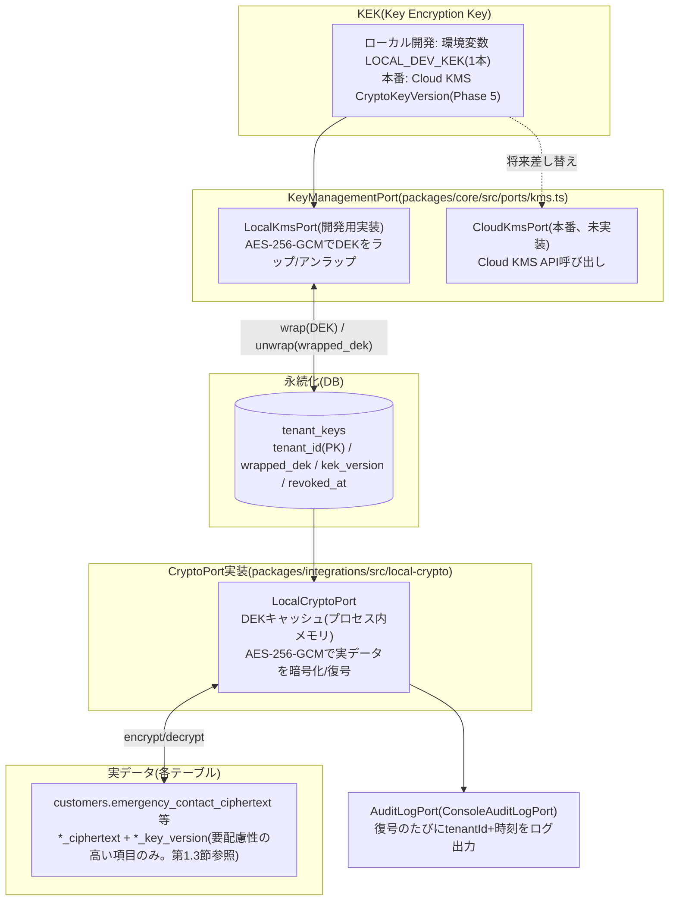
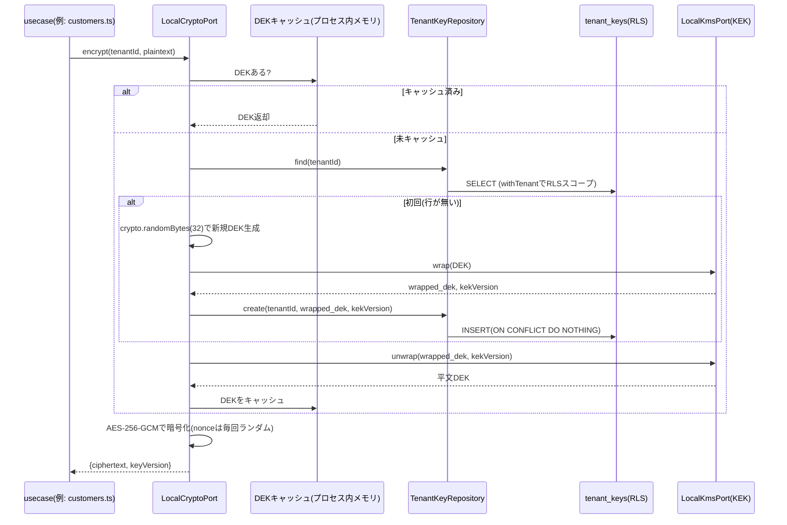

# 目的

katahimo-app(マルチテナントSaaS版)のPostgreSQLスキーマについて、有識者(セキュリティ・DB設計の観点)にレビューいただくための解説資料。実装は `packages/db/src/schema/*.ts`(Drizzle ORM)、マイグレーションは `packages/db/drizzle/*.sql` を正とする。本書はその要約・図解であり、フィールドの詳細な意味は各schemaファイルのコメントを一次情報として参照されたい。

マイグレーションは2026年9月にスキーマを作り直した際に、試作段階の履歴(列の暗号化→平文化の段階移行等)を捨てて次の2本に集約した。

- `0000_initial_schema.sql`: drizzle-kit がスキーマ定義(TypeScript)から生成した初期スキーマ。先頭に `CREATE EXTENSION IF NOT EXISTS btree_gist` のみ手書きで追記している。
- `0001_custom_constraints.sql`: drizzle-kit で表現できないものを手書き(スタッフ二重予約防止のEXCLUDE制約、全テーブルの`FORCE ROW LEVEL SECURITY`、`app_logs`のUPDATE権限剥奪)。

以後のスキーマ変更は `pnpm db:generate` で差分マイグレーションを追加する(この2本は書き換えない)。

対象読者は、実装の詳細(TypeScript/Drizzle)を読まなくても以下を判断できることを想定する。

- テナント分離の方式とその強制力(アプリのバグで他社データが漏れない設計になっているか)
- 個人情報(PII)の暗号化方式と鍵管理の妥当性
- スキーマ上の制約(PK/FK/UNIQUE)が実際にデータ整合性を守れているか

将来の拡張予定(決済・カルテ・分析ダッシュボード)は `doc/07_技術構成提案書.md` 第4〜7章を参照。スタッフ割当(マッチング)用のテーブル群・複数法人対応の列(予約・割当・スタッフ属性・勤務可能時間帯・カレンダーのbusy・相性・機能フラグ)は `doc/10_マッチング拡張DB設計.md` に分けて記載する。

---

# 1. 全体設計方針

## 1.1 マルチテナント分離: shared schema + `tenant_id` + Row Level Security(RLS)

全テーブル(`tenants`自身を除く)が `tenant_id` 列を持ち、PostgreSQLのRLSポリシー `tenant_isolation` を適用している。

```sql
USING      (tenant_id = nullif(current_setting('app.tenant_id', true), '')::uuid)
WITH CHECK (tenant_id = nullif(current_setting('app.tenant_id', true), '')::uuid)
```

アプリはリクエストごとに `withTenant(db, tenantId, fn)`(`packages/db/src/client.ts`)でトランザクションを張り、`SET LOCAL app.tenant_id` をセットしてからクエリを発行する。これにより、**アプリ側のWHERE句の書き忘れがあっても他テナントの行は見えない**(未設定時はNULLになり、`tenant_id = NULL` は常にfalseなので安全側に倒れる)。

- `nullif(..., '')`: 同じ接続で一度 `SET LOCAL` したカスタム設定は、トランザクション終了後にNULLではなく空文字に戻る(PostgreSQLの仕様)。コネクションプールで使い回された接続からテナント未設定で問い合わせた場合に `''::uuid` のキャストエラーにならず、一貫して0件になるようにしている。
- **FORCE ROW LEVEL SECURITY**: テーブル所有者(マイグレーション用ロール `katahimo`)は既定ではRLSをバイパスするため、全テーブルでFORCEを指定し所有者にもポリシーを適用している。アプリは非所有者ロール `katahimo_app` で接続するが、設定ミスで所有者接続になってもテナント分離が効く。全テナント横断の調査はスーパーユーザー(BYPASSRLS)で行う。
- **例外: `app_logs`**: ログイン前(テナント特定前)のイベントを記録するため `tenant_id` がnull許容で、ポリシーを操作別に分けている(SELECT/DELETEは自テナントのみ、INSERTは自テナントまたはnull、UPDATEはポリシー無し+権限剥奪で不可)。

## 1.2 複合主キー/複合外部キー(RLSだけでは防げない取り違えの防止)

RLSは`SELECT`/`UPDATE`/`DELETE`を絞り込むだけで、**PostgreSQLのFK制約(参照整合性チェック)はRLSを常にバイパスする**という仕様上の落とし穴がある。単一列FK(例: `daily_reports.customer_id → customers.id`)のままだと、アプリのバグでテナントAのセッション中にテナントBの`customer_id`を書き込んでも、DBはそれを検知できない。

これに対応するため、テナントスコープの全テーブルに`UNIQUE(tenant_id, id)`を持たせ、参照元テーブルのFKを全て`(tenant_id, xxx_id) → (tenant_id, id)`の複合FKにしている(下記ER図参照)。これにより「そのIDが本当にそのテナントの行か」をDBの制約自体が強制する。null許容の参照列(例: `receipts.customer_id`、`*_by_staff_id`)はPostgreSQL既定のMATCH SIMPLEにより、nullの行はFK検査の対象外になる。

enum相当の値(状態・種別)は `text` 列 + `CHECK (col in (...))` で表す(ENUM型は値の追加・削除がマイグレーションで扱いにくいため)。

## 1.3 PIIの暗号化(対象は要配慮性の高い項目に限定)

個人特定につながる項目のうち、要配慮性が特に高いもの(第三者情報・位置情報・自由記述・識別子)だけをフィールド暗号化の対象とする。

- **平文で保存(TDE+RLS+アクセス制御で保護)**: 氏名・かな・メール・電話・住所・駐車場情報。通常のSaaSと同水準の扱いとし、等値検索・将来の分析要件と両立させる。
- **AES-256-GCMによるランダム化暗号(`*_ciphertext` + `*_key_version`)で保存**: 緊急連絡先(第三者情報)・避難場所(通学先を特定しうる)・自由記述メモ(内容予測不可)・Benefit会員ID(識別子)・緯度経度(顧客/スタッフの自宅の正確な位置情報)、および世帯構成員(児童本人の情報、アレルギー)・日報/事故報告本文・勤怠の入力列・領収書明細・管理者設定のAPIキー等、マッチング拡張の自由記述(相性メモ・NG理由・勤務不可理由・予約メモ等、doc/10)。
- **ハッシュのみ保存(復元不可)**: パスワード(argon2id)、セッショントークン・パスワード再設定コード(SHA-256)。

等値検索が必要な平文項目(氏名の姓)は、通常のインデックス(`customers_tenant_family_name_idx`)で検索する。ブラインドインデックス(HMAC)は、暗号化を維持する項目のうち等値検索が必要なもの(領収書の重複検出`dedupe_blind_index`)にのみ使う。

鍵はテナントごとに独立生成したDEK(データ暗号化鍵)を使い、DEK自体はKEK(Key Encryption Key)でラップした状態のみ`tenant_keys`テーブルに保存する(エンベロープ暗号化。詳細は第3章)。

---

# 2. ER図(論理属性のみ抜粋)

`customers`は実装上42列あるため、ER図には代表的な列のみを示す。全列の一覧は第4章の表を参照。マッチング拡張のテーブル(予約・割当・属性・勤務可能時間帯等)と`staff`のマッチング用プロフィール列は doc/10 のER図を参照。

```mermaid
erDiagram
    TENANTS ||--|| TENANT_KEYS : "1テナント1鍵"
    TENANTS ||--|| APP_SETTINGS : "1テナント1設定"
    TENANTS ||--o{ STAFF : "所属"
    TENANTS ||--o{ CUSTOMERS : "所属"
    TENANTS ||--o{ OUTBOX_JOBS : "所属"
    TENANTS ||--o{ TENANT_FEATURES : "機能フラグ"
    TENANTS ||--o{ AI_PROMPTS : "編集可能プロンプト"
    TENANTS |o--o{ APP_LOGS : "所属(ログイン前はnull)"

    CUSTOMERS ||--o{ FAMILY_MEMBERS : "世帯構成員"
    CUSTOMERS ||--o{ DAILY_REPORTS : "対象顧客"
    CUSTOMERS ||--o{ ACCIDENT_REPORTS : "対象顧客"
    CUSTOMERS |o--o{ RECEIPTS : "対象顧客(任意)"

    STAFF ||--o{ DAILY_REPORTS : "作成者"
    STAFF ||--o{ ACCIDENT_REPORTS : "作成者"
    STAFF ||--o{ RECEIPTS : "登録者"
    STAFF ||--o{ ATTENDANCE_DAYS : "本人"
    STAFF ||--o{ SESSIONS : "ログイン"
    STAFF ||--o{ PASSWORD_RESET_CODES : "再設定コード"
    ATTENDANCE_DAYS ||--o{ ATTENDANCE_DAY_CHANGES : "変更履歴"

    TENANTS {
        uuid id PK
        string name
        string slug UK "ログイン時のテナント特定に使用"
        string status "active / suspended"
        string timezone "既定 Asia/Tokyo"
        string business_type "既定 babysitting"
        timestamp created_at
    }

    TENANT_FEATURES {
        uuid id PK
        uuid tenant_id FK
        string feature_key "UK(tenant_id, feature_key)"
        boolean enabled
        jsonb config
    }

    TENANT_KEYS {
        uuid tenant_id PK "FK -> tenants.id"
        int dek_version "DEKローテーション回数"
        text wrapped_dek "KEKでラップ済みDEK(平文DEKは保存しない)"
        int kek_version "KEKローテーション回数"
        timestamp revoked_at "非nullで暗号学的削除(解約)"
    }

    STAFF {
        uuid id PK
        uuid tenant_id FK "UK(tenant_id, id)としても機能"
        string name "平文"
        string email "平文。UK(tenant_id, email)、ログイン検索キー"
        string alt_email "平文。2つ目のログイン用メール。部分UK(tenant_id, alt_email)"
        string phone "平文"
        string password_hash "argon2id"
        string legacy_password_hash "GAS版移行用、移行後null"
        boolean is_admin
        date retirement_date
        jsonb custom_fields "テナント独自の表示・検索項目"
        string gender "ほかのマッチング用プロフィール列はdoc/10参照"
    }

    CUSTOMERS {
        uuid id PK
        uuid tenant_id FK "UK(tenant_id, id)としても機能"
        string external_source "取込元(例: reserva)"
        string external_id "UK(tenant_id, external_source, external_id)"
        string name "平文"
        string family_name "平文。idx(tenant_id, family_name)で苗字検索"
        string given_name "平文"
        string email "平文"
        string phone "平文"
        string city "平文"
        string address_detail "平文"
        text emergency_contact_ciphertext "第三者情報のため暗号化"
        text evacuation_site_ciphertext "通学先特定リスクのため暗号化"
        text memo_ciphertext "自由記述のため暗号化"
        text lat_lng_ciphertext "自宅の正確な位置情報のため暗号化"
        string member_type "分類情報は平文"
        string payment_status "分類情報は平文"
        timestamp deactivated_at "ソフトデリート(物理削除しない)"
    }

    FAMILY_MEMBERS {
        uuid id PK
        uuid tenant_id FK
        uuid customer_id FK "複合FK(tenant_id, customer_id)"
        text name_ciphertext
        text dob_ciphertext
        text info_ciphertext "職業等の自由記述"
        text allergy_ciphertext "アレルギー(健康情報のため暗号化)"
    }

    DAILY_REPORTS {
        uuid id PK
        uuid tenant_id FK
        uuid staff_id FK "複合FK(tenant_id, staff_id)"
        uuid customer_id FK "複合FK(tenant_id, customer_id)"
        timestamp occurred_at "平文(並び替えに使用)"
        int risk_rating "平文(集計用の小さな数値)"
        int es_rating "平文(集計用の小さな数値)"
        text content_ciphertext "本文JSONを1本にまとめて暗号化"
    }

    ACCIDENT_REPORTS {
        uuid id PK
        uuid tenant_id FK
        uuid staff_id FK "複合FK(tenant_id, staff_id)"
        uuid customer_id FK "複合FK(tenant_id, customer_id)"
        timestamp occurred_at
        string report_type "事故報告 | ヒヤリハット"
        text content_ciphertext
    }

    RECEIPTS {
        uuid id PK
        uuid tenant_id FK
        uuid staff_id FK "複合FK(tenant_id, staff_id)"
        uuid customer_id FK "複合FK・nullable(経費領収書は顧客に紐付かない)"
        string customer_name_text "未登録のお客様の氏名(customer_idがnullの場合)"
        uuid upload_batch_id "1回のアップロード操作の束。申し送りはバッチ先頭行のみ"
        timestamp receipt_timestamp
        string dedupe_blind_index "重複登録検出用HMAC。idx(tenant_id, dedupe_blind_index)"
        text amount_ciphertext
        text store_name_ciphertext
        string file_key "画像実体はStoragePort(GCS想定)"
    }

    ATTENDANCE_DAYS {
        uuid id PK
        uuid tenant_id FK
        uuid staff_id FK "複合FK(tenant_id, staff_id)"
        date business_date "UK(tenant_id, staff_id, business_date)"
        text row_data_ciphertext "入力列のみJSON化。派生値(残業時間等)は保存せず都度計算"
        jsonb changed_fields "手で変更された列記号(ミラー時にセルを強調)"
        uuid last_changed_by_staff_id FK
    }

    ATTENDANCE_DAY_CHANGES {
        uuid id PK
        uuid tenant_id FK
        uuid attendance_day_id FK "複合FK(tenant_id, attendance_day_id)"
        uuid changed_by_staff_id FK "自動転記はnull"
        jsonb changed_fields
        text previous_row_data_ciphertext "変更前のrow_data"
    }

    PASSWORD_RESET_CODES {
        uuid id PK
        uuid tenant_id FK
        uuid staff_id FK "複合FK(tenant_id, staff_id)"
        string code_hash "生コードはメール本文のみ"
        string sent_to_email
        timestamp expires_at
        timestamp used_at
        int attempt_count "誤入力回数"
    }

    APP_LOGS {
        uuid id PK
        uuid tenant_id FK "nullable(ログイン前)"
        string level "INFO/WARN/ERROR/SECURITY"
        string action
        uuid actor_staff_id FK
        uuid target_staff_id FK
        jsonb details "個人情報・本文は入れない"
        string ip
        string user_agent
        timestamp created_at "idx(tenant_id, created_at)"
    }

    AI_PROMPTS {
        uuid id PK
        uuid tenant_id FK
        string kind "prompt / placeholder"
        string key "UK(tenant_id, key)"
        text body "平文(業務ノウハウ、個人情報を含めない)"
        uuid updated_by_staff_id FK
    }

    SESSIONS {
        uuid id PK
        uuid tenant_id FK
        uuid staff_id FK "複合FK(tenant_id, staff_id)"
        string token_hash UK "生トークンのSHA-256。生トークン自体はCookieのみ"
        timestamp expires_at
    }

    OUTBOX_JOBS {
        uuid id PK
        uuid tenant_id FK
        string kind "ミラー対象種別(attendance_day等)"
        uuid target_id
        string idempotency_key "UK(tenant_id, idempotency_key)"
        string status "pending/processing/done/failed"
        int attempts
        timestamp next_attempt_at "バックオフ中は取得しない"
        string last_error
    }

    APP_SETTINGS {
        uuid tenant_id PK "FK -> tenants.id"
        text gemini_api_key_ciphertext
        text gchat_report_webhook_url_ciphertext
        text gchat_receipt_webhook_url_ciphertext
        string customer_csv_last_imported_version "最後に取り込んだ顧客CSVの版"
        bigint data_version "顧客データ更新ごとに+1(キャッシュ無効化用)"
    }
```



### ER図の読み方の補足

- 図中の複合FKは、mermaidのerDiagram記法が複合キーの関係線を1本しか表現できないため、実際の制約(`(tenant_id, xxx_id) → (tenant_id, id)`)は各エンティティの属性コメントに注記する形で表現している。実体は`packages/db/drizzle/*.sql`のDDLを参照。
- `RECEIPTS`と`CUSTOMERS`の関係のみ「任意(customer_idがnullable)」。経費のみの領収書(駐車場代等)を許容するための設計。

---

# 3. 暗号化アーキテクチャ(エンベロープ暗号化)

## 3.1 鍵の階層と依存関係



## 3.2 初回暗号化〜復号までの流れ(シーケンス)



## 3.3 設計上のポイント

- DEKはテナントごとに`crypto.randomBytes(32)`で独立に生成し、平文のままでは保存せず、常にKEKでラップした状態のみ`tenant_keys`に保存する。KEKが漏洩しても、攻撃者はテナントごとの`wrapped_dek`(DBの実体)も別途手に入れない限り実値を復号できない。
- テナント解約時は`tenant_keys`の該当行を`revoke()`するだけで、バックアップに残った暗号文も含めて復号不能にできる(暗号学的削除)。
- 本番のCloud KMSへの移行は、`KeyManagementPort`の実装(`LocalKmsPort`→Cloud KMS呼び出し)を差し替えるだけで済む設計にしてある(呼び出し側・DBのデータ形式は変えずに済む)。

## 3.4 現時点で未対応の項目(レビューで論点にしていただきたい点)

- **KEKのみのローテーション(rewrap)**は`TenantKeyRepositoryPort.updateWrappedDek`で軽量に実装済みだが、**DEKそのもののローテーション**(実データの再暗号化を伴う)は未実装。
- **復号の監査ログ**は「どのテナントのデータをいつ復号したか」までで、「どのスタッフが」までは記録していない(`CryptoPort.decrypt(tenantId, value)`のシグネチャに呼び出し元情報が無く、全呼び出し箇所(usecases配下40箇所以上)への配線は影響範囲が大きいため見送った)。
- **ブラインドインデックスの使用範囲**: ブラインドインデックス(HMAC)を使うのは`receipts.dedupe_blind_index`(スタッフ・顧客・日時・金額・店舗名の組み合わせ)のみ。単一の低カーディナリティ属性(姓名等)ではなく複合キーであるため、辞書攻撃(想定される組み合わせの総当たり)の実現可能性は相対的に低いと考えられるが、鍵が漏洩すれば依然としてリスクは残る。

---

# 4. テーブル一覧と役割

| テーブル | 役割 | RLS | 備考 |
|---|---|---|---|
| `tenants` | テナント(法人)マスタ | 対象外(ログイン前のテナント特定に必要) | `slug`でテナントを特定後、RLSスコープ内で`staff`を検索する2段階方式。`status`/`timezone`/`business_type`(doc/10) |
| `tenant_features` | テナント単位の機能フラグ | ○ | `(tenant_id, feature_key)`にUNIQUE(doc/10) |
| `tenant_keys` | テナントごとのDEK(ラップ済み) | ○ | 1テナント1行。第3章参照 |
| `staff` | スタッフ(認証情報を兼ねる) | ○ | `(tenant_id, email)`・`(tenant_id, alt_email)`(null以外)にUNIQUE。マッチング用プロフィール列(doc/10) |
| `sessions` | ログインセッション | ○ | 生トークンはCookieのみ、DBにはSHA-256ハッシュだけ保存 |
| `password_reset_codes` | パスワード再設定の確認コード | ○ | コードはハッシュのみ保存。`attempt_count`で誤入力回数、`used_at`/`expires_at`で失効 |
| `customers` | 顧客(利用世帯の代表者) | ○ | RESERVA CSVの全列に対応、42列 |
| `family_members` | 世帯構成員(子ども等) | ○ | `customers`の1:N。氏名・生年月日・アレルギー等は全て暗号化 |
| `daily_reports` | 保育日報 | ○ | `staff`・`customers`双方への複合FK。PSI/ES評価は`CHECK 1〜5`またはnull |
| `accident_reports` | 事故報告/ヒヤリハット | ○ | 同上 |
| `receipts` | 領収書登録 | ○ | `customer_id`はnullable(経費のみ・未登録のお客様は`customer_name_text`)。`upload_batch_id`で1回のアップロードを束ね、申し送りはバッチ先頭行のみに保存 |
| `attendance_days` | 勤怠(出勤簿)1日分 | ○ | 入力列のみ暗号化JSONで保存し派生値は都度計算。`changed_fields`で手修正セルを保持 |
| `attendance_day_changes` | 勤怠の変更履歴(追記のみ) | ○ | 誰がいつどの列を変えたか+変更前の値(暗号化) |
| `outbox_jobs` | スプレッドシート等へのミラー書き込みジョブキュー | ○ | `(tenant_id, idempotency_key)`にUNIQUE。`attempts`/`next_attempt_at`/`last_error`でリトライ |
| `app_settings` | テナント単位の管理者設定(APIキー等) | ○ | 1テナント1行、`tenant_id`がPK。顧客CSVの取込版数・データ版数 |
| `ai_prompts` | 編集可能なAIプロンプト・入力欄プレースホルダー | ○ | `(tenant_id, key)`にUNIQUE。行が無いkeyはコード側の既定値 |
| `app_logs` | 操作ログ・監査ログ(追記のみ) | ○(操作別ポリシー、第1.1節) | `tenant_id`はnull許容(ログイン前)。アプリロールはUPDATE不可 |
| マッチング拡張(13テーブル) | `attribute_definitions`・`staff_attributes`・`staff_weekly_availability`・`staff_availability_exceptions`・`staff_busy_blocks`・`calendar_sync_states`・`customer_preferences`・`customer_required_attributes`・`customer_staff_affinities`・`reservations`・`reservation_assignments`・`matching_runs`・`matching_run_candidates` | ○ | **doc/10_マッチング拡張DB設計.md を参照**。二重予約防止のEXCLUDE制約を含む |

## 4.1 勤怠(`attendance_days.row_data`)の形

`row_data`は出勤簿テンプレート(GAS版の個別出勤簿スプレッドシート)の入力列1日分を、列記号をそのままキーにしたJSON(`packages/core/src/domain/attendance/types.ts` の `AttendanceRowData`)で1本に暗号化したもの。

| 列記号 | 内容 |
|---|---|
| C / D / E | #1 訪問先 / 始業 / 終業 |
| H / I | #1→#2 計画移動時間(分) / #1後の気象状況 |
| L / M / N | #2 訪問先 / 始業 / 終業 |
| Q / R | #2→#3 計画移動時間(分) / #2後の気象状況 |
| U / V / W | #3 訪問先 / 始業 / 終業 |
| X〜Z / AA〜AC | 事務作業1・2(内容 / 開始 / 終了) |
| AG / AH / AI / AJ | #1移動距離 / #2移動距離 / 出勤距離 / 退勤距離(km) |
| AN / AO | 買物代行 / 備考 |

労働時間・残業・移動距離合計などの数式列は保存せず、常に`row_data`から計算する。`changed_fields`には、自動転記された値からスタッフ/管理者が手で変更した列記号の配列(例: `["D","E"]`)を持ち、スプレッドシートへのミラー時に該当セルを強調表示する。変更の都度`attendance_day_changes`に履歴を追記する。

## 4.2 `customers` の全42列(暗号化方針別)

紙面の都合上ER図では代表列のみを示したため、全項目をカテゴリ別に列挙する。

| カテゴリ | 列 | 暗号化 |
|---|---|---|
| 識別子 | `id`, `tenant_id`, `external_source`, `external_id` | 平文(識別子そのもの) |
| 氏名 | `name`, `family_name`, `given_name`, `family_name_kana`, `given_name_kana` | 平文(TDE+RLSで保護)。`family_name`は`(tenant_id, family_name)`のインデックスで苗字検索に使う |
| 連絡先・住所 | `email`, `phone`, `address_detail`, `city`, `parking_area`, `parking_detail`, `address2` | 平文(TDE+RLSで保護) |
| 第三者情報・位置情報・自由記述 | `emergency_contact`, `emergency_contact_relation`, `evacuation_site`, `memo`, `lat_lng` | `*_ciphertext`+`*_key_version`(要配慮性が高いため暗号化) |
| 識別子(他システムの会員証番号) | `benefit_member_id` | `*_ciphertext`+`*_key_version` |
| 分類情報 | `member_type`, `member_status`, `payment_method`, `payment_status`, `gender`, `age_bracket` | 平文(個人特定に直結しない運用区分のため) |
| テナント独自項目 | `custom_fields`(JSONB) | 平文(表示・検索用途に限定。要配慮情報は入れない) |
| 日時 | `registered_at`, `external_last_updated_at`, `address2_start_date`, `address2_end_date`, `deactivated_at`, `created_at`, `updated_at` | 平文 |

---

# 5. レビュー観点(確認いただきたい点)

1. 複合PK/FK(第1.2節)によるテナント跨ぎ防止は、RLSと組み合わせた「二重の防御」として妥当か。他に見落としているPostgreSQLの仕様上の落とし穴はないか。
2. エンベロープ暗号化(第3章)の鍵階層(KEK→DEK→実データ)は、本番のCloud KMS移行を見据えた設計として妥当か。DEKローテーション(実データの再暗号化)を実装する際の推奨手順(オンライン再暗号化 vs メンテナンス時間を確保したバッチ)に定石はあるか。
3. 復号の監査ログ(第3.4節)について、「誰が」まで記録する必要性・優先度をどう評価すべきか(医療系記録(将来の訪問看護展開、`doc/07`第7章)を扱う場合のコンプライアンス要件との関係)。
4. フィールド暗号化の対象を要配慮性の高い項目(緊急連絡先・避難場所・メモ・Benefit会員ID・緯度経度等、第1.3節)に限定している選定基準は妥当か。見直すべき点はあるか。
5. `daily_reports`/`attendance_days`のように自由記述をJSON1本にまとめて暗号化する設計は、将来の分析要件(日報からの傾向分析、勤怠ダッシュボード)とトレードオフになる。フィールド単位での暗号化に切り替える閾値(どの項目から平文分離すべきか)についての助言。
