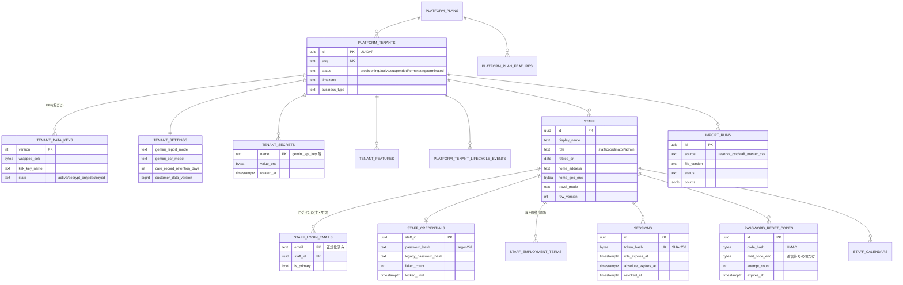
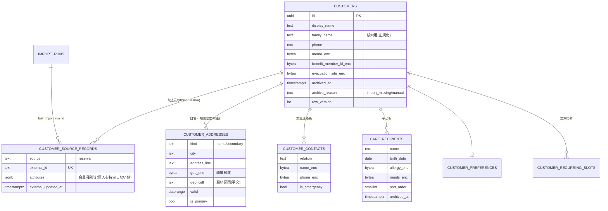
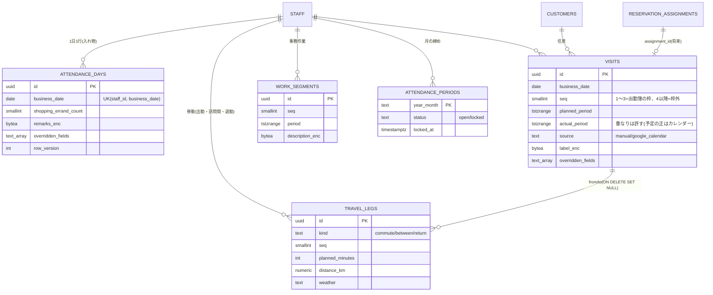
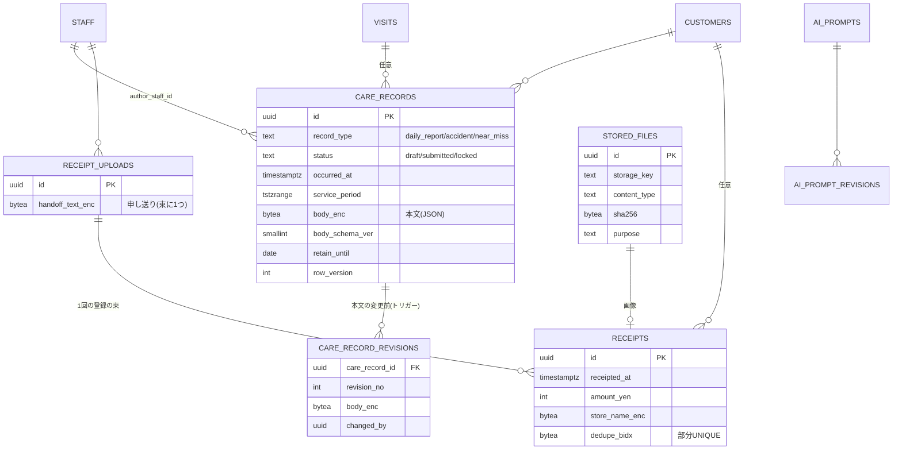
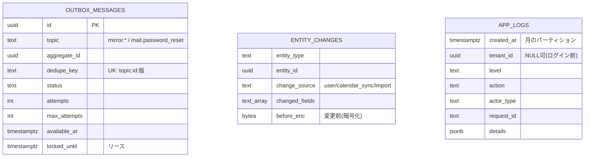
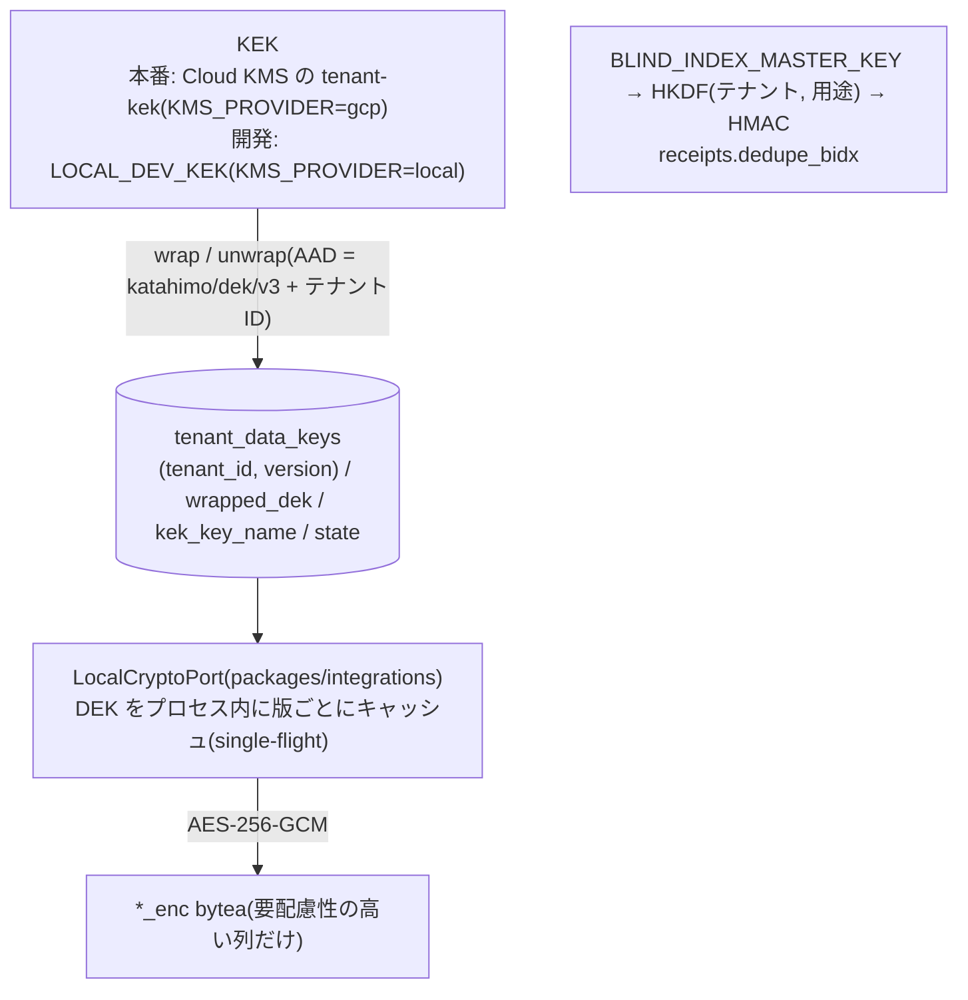

# 目的

katahimo-app(マルチテナント SaaS 版)の PostgreSQL スキーマの解説。実装は `packages/db/src/schema/*.ts`(Drizzle ORM)、
マイグレーションは `packages/db/drizzle/*.sql` を正とする。本書はその要約・図解であり、列の細かな意味は各 schema ファイルの
コメントを一次情報とする。

2026年9月にアプリの公開前であることを前提にスキーマを作り直し、試作の履歴を捨てて次の2本を新しいベースラインにした。

- `0000_baseline.sql`: drizzle-kit がスキーマ定義(TypeScript)から生成したもの。先頭だけ手で `btree_gist` と
  `app_current_tenant()` を足している。
- `0001_baseline_custom.sql`: drizzle-kit では書けない定義(手書き): `updated_at` のトリガー、EXCLUDE 制約、
  `ON DELETE SET NULL (列)`、締めた月の勤怠を守るトリガーと締めの行の守り、記録の守りと本文の履歴のトリガー、月のパーティションの
  `app_logs`(既定のパーティションつき)、テナントの作成・消去の関数 `platform.provision_tenant()` / `platform.purge_tenant()`、
  締めの解除の関数 `platform.unlock_attendance_period()`、全テーブルの `FORCE ROW LEVEL SECURITY`、ロールごとの権限。

以後のスキーマ変更は `pnpm db:generate` で差分を足す(この2本は書き換えない。公開前のレビューの指摘(Ver. 0.2.1)までは、
本番の DB が無いためこの2本を直接直した)。`pnpm db:generate` が
「No schema changes」になることを CI が確かめる。`app_logs` は drizzle-kit の管理外(`packages/db/src/customTables/`)。

対象と前提:

- 本番は Cloud SQL for PostgreSQL 17、CI は `postgres:17`、ローカルは 16 以上。PostgreSQL 18 の機能(`uuidv7()` 等)は使わない。
- 主キーの UUID はアプリが UUIDv7 で採番する(`packages/core/src/domain/ids`。時刻順に並ぶため索引が偏らない)。
  DB の既定値は `gen_random_uuid()`(手で INSERT する運用の CLI・テスト用)。
- 名前は PostgreSQL の既定の命名(`<表>_pkey`、`<表>_<列>_fkey`、`<表>_<列>_idx`、`<表>_<列>_check`、
  `<表>_<列>_excl`)。63バイトを超える場合だけ `tenant_id` を省く。

将来の拡張(決済・カルテ・分析)は `doc/07_技術構成提案書.md`、マッチング用のテーブルの使い方は
`doc/10_マッチング拡張DB設計.md` を参照。

---

# 1. 全体設計方針

## 1.1 マルチテナント分離: shared schema + `tenant_id` + FORCE RLS

- 業務データのテーブルは全て `public` にあり、全て `tenant_id uuid NOT NULL` を持つ。
- 全テーブルで RLS を有効にし、`FORCE ROW LEVEL SECURITY`(所有者にも掛ける)。ポリシーは1つ(`tenant_isolation`):
  `tenant_id = app_current_tenant()`(`USING` と `WITH CHECK` の両方)。
- `app_current_tenant()` は `nullif(current_setting('app.tenant_id', true), '')::uuid`。設定が無ければ NULL になり、
  **何も見えず何も書けない**(設定し忘れで全件が見えることは無い)。
- アプリは1回の Unit of Work(下の 1.5)の最初に `set_config('app.tenant_id', …, true)` を1回だけ行う
  (`true` = トランザクションの中だけ。プールの接続が使い回されても残らない)。
- テナントそのもの・プラン・レート制限など、テナントに属さないものは `platform` スキーマに置く(RLS なし、アプリは読むだけ)。

## 1.2 複合主キー・複合外部キー(RLS だけでは防げない取り違えの防止)

- テナントのテーブルの主キーは `(tenant_id, id)`(自然キーの表は `(tenant_id, …)`)。
- テナントのテーブルへの外部キーは全て `(tenant_id, xxx_id) → (tenant_id, id)`。別テナントの行の ID を知っていても、
  その行を指す行は作れない(RLS の WITH CHECK と二重の防御)。
- 全テーブルの `tenant_id` は `platform.tenants(id)` への外部キー(`ON DELETE CASCADE`。テナントの完全な削除は運用の手順で行う)。
- これらは結合テスト(`packages/db/src/integration/catalog.integration.test.ts`)がカタログから確かめる(書き忘れを CI で見つける)。

## 1.3 型と制約の方針

- 列挙は `text` + `CHECK (col IN (…))`(値の一覧は `packages/core/src/domain/model/codes.ts`。enum 型は使わない。
  値の追加がマイグレーション1本で済むため)。
- 日時は `timestamptz`、業務日は `date`、時刻(週の勤務可能時間帯等)は `time`。期間は `tstzrange` / `daterange` の `[開始, 終了)`。
  片方だけ分かる期間は端を無限にする(訪問の終了だけが未入力等)。
- 楽観的排他が要る表は `row_version integer`(更新のたびに1上げる。食い違えば 409)。
- `updated_at` はトリガー `set_updated_at()` が保つ(アプリは書かない)。
- 消さずに残す表は `archived_at`(顧客・子ども・マスタ)、退職は `staff.retired_on`(この日以降はログインできない)。

## 1.4 ロールと権限(最小権限)

| ロール | ログイン | 用途 | 主な権限 |
|---|---|---|---|
| `katahimo_owner` | 不可 | 全テーブル・関数の所有者 | DDL。RLS は FORCE のため所有者でもテナントを設定しないと読めない |
| `katahimo_migrator` | 可 | マイグレーション・テナント作成(`MIGRATION_DATABASE_URL`) | `katahimo_owner` のメンバー。ログインすると自動で `SET ROLE katahimo_owner` |
| `katahimo_app` | 可 | API(`DATABASE_URL`) | テーブルごとに明示した DML だけ |
| `katahimo_worker` | 可 | ワーカー・ジョブ(`WORKER_DATABASE_URL`) | ジョブが使う表・操作だけ(下記)。`outbox_messages` をテナント横断で取れるポリシー(`outbox_messages_worker`) |
| `katahimo_readonly` | 不可 | 将来の分析・調査用の入れ物 | 今は何も読めない |

- どのロールも `SUPERUSER`・`BYPASSRLS` を持たない。既定権限(DEFAULT PRIVILEGES)には頼らず、テーブルごとに GRANT を書く。
- 追記専用の表(`care_record_revisions`・`entity_changes`・`ai_prompt_revisions`・`app_logs`)は SELECT・INSERT だけ。
- `tenant_data_keys` はアプリ・ワーカーとも SELECT だけ(鍵の作成は `provision_tenant()`)。
- `outbox_messages` はアプリが SELECT・INSERT、ワーカーが取り出し・状態の更新。
- `attendance_periods` はアプリが SELECT・INSERT・UPDATE(締めるだけ。DELETE なし。解除はトリガーが拒否)、ワーカーは SELECT
  (締めの判定)だけ。
- ワーカーの権限はジョブ(outbox・夜間のカレンダー反映・顧客CSV取込・free/busy・保守)が使う表・操作に絞る。
  認証情報(`staff_credentials`)・テナントの秘密値(`tenant_secrets`)・AIプロンプト・記録の履歴・予約とマッチングの表
  (候補の保存期間の削除を除く)には権限が無い。記録・領収書・スタッフは読むだけ、顧客は消さずにアーカイブするため
  DELETE なし。`packages/db/src/integration/catalog.integration.test.ts` がカタログから、
  `worker.integration.test.ts` が実際のジョブを `katahimo_worker` で動かして確かめる。
- `platform.tenants` はアプリ・ワーカーとも SELECT だけ(`plans` 等はアプリだけ)。
- テナントの作成・消去は `platform.provision_tenant()` / `platform.purge_tenant()`、締めの解除は
  `platform.unlock_attendance_period()`(SECURITY DEFINER、所有者の権限)。実行できるのは所有者のメンバー
  (`katahimo_migrator`)だけ(PUBLIC からは REVOKE)。
- アプリ・ワーカーの接続には、ロールの設定で文の上限(`statement_timeout`)・ロック待ちの上限(`lock_timeout`)・放置された
  トランザクションの上限(`idle_in_transaction_session_timeout`)を掛ける(アプリ 15s / 5s / 30s、ワーカー 60s / 10s / 60s)。
  ロールの設定はスーパーユーザーにしか変えられないため、マイグレーションではなく初期化SQL(`infra/initdb/01_bootstrap.sql`・
  `infra/cloudsql/01_bootstrap.sql`)で `ALTER ROLE … IN DATABASE` する(カタログのテストが設定の有無を確かめる)。

## 1.5 Unit of Work(アプリ側の約束)

`packages/db/src/uow.ts` の `DrizzleUnitOfWork.run(tenantId, repos => …)`:

- 1回の `run` が1トランザクション。最初にテナント(と操作者 `app.actor_id`)を1回だけ設定する。
- トランザクションを開く前にテナントの鍵を用意する(`CryptoPort.prepare`: 鍵の一覧の読み込みと KMS でのアンラップ)。
  トランザクションの中で鍵の読み込み(別の接続)・KMS の呼び出し(ネットワーク)を待たない(4.1)。
- `repos` のリポジトリはそのトランザクションに結び付いており、テナントIDを引数に取らない(テナントの取り違えを型で防ぐ)。
- ドメインの書き込みと outbox への積み込みは同じトランザクション(片方だけコミットされることが無い)。
- DB の拒否(締めた月 `KH001`・確定済みの記録 `KH002`・EXCLUDE・一意制約)は `DomainError`(locked / conflict)に変換する
  (`packages/db/src/errors.ts`)。API はそれを1か所(`app.onError`)で応答にする。
- 外部 API(カレンダー・地図・Gemini・通知)はトランザクションの外で呼ぶ。

---

# 2. ER 図

mermaid の erDiagram は複合キーの線を1本しか描けないため、関係線は `xxx_id` の向きだけを示す(実際は全て `tenant_id` を
含む複合外部キー)。`tenant_id`・`created_at`・`updated_at` は省略した。

## 2.1 プラットフォーム・テナント・スタッフ



## 2.2 顧客・子ども



## 2.3 勤怠(出勤簿)



## 2.4 活動記録・領収書・ファイル



## 2.5 非同期処理・監査



予約・割当・スタッフ属性・勤務可能時間帯・カレンダーの busy・相性・マッチングの実行(`service_items`・`reservations`・
`reservation_recipients`・`reservation_assignments`・`attribute_definitions`・`staff_attributes`・`customer_required_attributes`・
`customer_staff_affinities`・`staff_weekly_availability`・`staff_availability_exceptions`・`staff_busy_blocks`・`service_areas`・
`staff_service_areas`・`travel_time_cache`・`matching_runs`・`matching_run_candidates`)は doc/10。データのライフサイクル
(`data_export_requests`・`data_subject_requests`・`retention_policies`)は第6章。

---

# 3. 出勤簿(GAS版のシート)と実体の対応

DB の正は実体(`attendance_days`・`visits`・`work_segments`・`travel_legs`)。GAS版の出勤簿の1行(列記号 `C`〜`AO` の25列、
画面・API・ミラーの `rowData`)との対応は **`packages/core/src/domain/attendance/sheetLayout.ts` だけ** が持つ:

- `projectDay(sheet)`: 実体 → 25列の `rowData`(全列。空は `''`)と、手で変えた列(`changedFields`、シートの強調表示)。
  訪問は `seq` 1〜3 が枠(`C/D/E`・`L/M/N`・`U/V/W`)、4件目以降は保存するが出勤簿には出さない(読み出し時に WARN
  `attendance.day.hidden_visits`)。
- `applyRowEdit(sheet, patch, {source})`: 画面の修正・カレンダーの反映・既存の出勤簿の取込 → 実体。値の形式を確かめ
  (時刻 `HH:mm`、距離は小数2桁)、手入力で変えた項目を実体の `overridden_fields` に加える。訪問の時間帯の重なりは拒否しない
  (GAS版の手入力・カレンダーの反映と同じ。重なる予定がある日の反映が丸ごと失敗しないように)。枠の値が全て空になって
  実体が消えるときは、その実体の `overridden_fields` を入れ物の `attendance_days.overridden_fields` に `visit:<枠>:<項目>` の形で
  移し、次にその枠に作る実体へ引き継ぐ(GAS版の強調表示はセルの背景色で、値を書き直しても残っていたため)。
- API の `rowData` の契約(`@katahimo/shared`)と GAS版との一致テスト(`gasParity.test.ts`)は変えていない。

変更は差分で書き(削除 → 更新 → 追加)、変更前の値を `entity_changes` に残し(更新は変わった項目だけ、削除は実体の全ての項目)、
その日の行を `SELECT … FOR UPDATE` で押さえる(手入力とカレンダーの反映が重ならない)。訪問の時間帯の重なりの EXCLUDE 制約は
置かない(二重予約の防止は将来の予約の割当 `reservation_assignments` の EXCLUDE が受け持つ)。

締めた月(`attendance_periods.status = 'locked'`)の行はトリガーが拒否する(SQLSTATE `KH001`)。締めと書き込みが同時に
走っても食い違わないよう、(テナント・スタッフ・月)ごとのアドバイザリロックで順序を付ける: 勤怠の書き込みのトリガーは
共有ロックを取ってから締めを読み、締め(status を locked にする INSERT・UPDATE)のトリガーは排他ロックを取る(締めの行が
まだ無い月でも効く)。締めの解除(locked → open)・締めた月の行の削除はトリガーが拒否し(所有者の
`platform.unlock_attendance_period()` とテナントの消去だけが通る)、アプリには DELETE の権限も無い。

活動記録(`care_records`)は、確定済み(`locked`)なら本文以外の列も含めて変更・削除をトリガーが拒否する(SQLSTATE `KH002`。
locked から他の状態にも戻せない)。下書き以外の記録の本文(暗号文・形式の版)が変わるたびに変更前を `care_record_revisions` に
写す。履歴から記録への外部キーは `no action`(履歴のある記録は消せない。記録と一緒に履歴が消えない)。

テナントの消去(`platform.purge_tenant()`、解約済みのテナントだけ)は `platform.tenants` の行を消し、全てのテーブルの
`tenant_id` の `ON DELETE CASCADE` で1つの文の中で全データを消す。上の各トリガーは、テナントの行が既に無いことで消去と
判断して通す(アプリ・ワーカーは `platform.tenants` を消せない)。

---

# 4. 暗号化(エンベロープ暗号化)

## 4.1 鍵の階層



- DEK はテナント作成時にアプリが乱数で作り、KMS でラップした値だけを `provision_tenant()` に渡す(平文の DEK は DB に無い)。
- 版(`version`)ごとに複数持てる。`active` は1つ(部分 UNIQUE)。ローテーションは新しい版を `active` にし、古い版を
  `decrypt_only` にする(古い暗号文も読める)。`destroyed` にすると(ラップ済みの値も消す)バックアップを含めて復号できない
  (暗号学的削除)。`kek_key_name` でどの KEK でラップしたかを確かめる(`local` と KMS の鍵の取り違えを検出する)。
- プロセス内のキャッシュ: 鍵の一覧は10分ごとに読み直し、読み直した一覧に無い版(destroyed にした版)のアンラップ済みの DEK は
  捨てる(破棄した鍵がプロセス内で使え続けない。遅くとも10分で効く)。Unit of Work はトランザクションを開く前に
  `prepare`(一覧の読み込みと全ての版のアンラップ)を呼ぶ。一覧の読み込みは UoW とは別の小さな接続プール(1本)で行う
  (トランザクションの途中で読み直しが要っても、UoW のプールの空きを待ち合って全員が止まらない)。

## 4.2 暗号文の形式(v3)

`*_enc` は自己記述のバイト列:

```
[0]      形式の版 0x03
[1..2]   DEK の版(符号なし16ビット)
[3..14]  nonce(12バイト、値ごとにランダム)
[15..]   AES-256-GCM の暗号文 | 認証タグ(16バイト)
AAD = "katahimo/field/v3" \0 テナントID \0 用途(テーブル.列) \0 行ID
```

- 用途は `packages/core/src/domain/pii/encryptionPurposes.ts` の1か所で定義する。行ID は主キー(自然キーの表はその値)。
  暗号文を別テナント・別の列・別の行にコピーすると復号に失敗する。
- 変更履歴(`entity_changes.before_enc`)は元の暗号文を写さず、`entity_changes.before` の用途と履歴の行IDで暗号化し直す。
  記録の本文の履歴(`care_record_revisions`)だけはトリガーが暗号文を写すため、元の記録の用途・記録のIDで復号する。
- 復号の監査は操作ごとに1件(`AuditLogPort.recordDecrypt({tenantId, operation, count, actorStaffId})`。値ごとには書かない)。

## 4.3 暗号化する列・しない列

暗号化するのは要配慮性の高い自由記述・連絡先・位置だけ(メモ・受給者番号・避難場所・住所の緯度経度・緊急連絡先・
アレルギー・配慮事項・自宅の緯度経度・出勤簿の備考と訪問の表示名と事務作業の内容・記録の本文・店名・申し送り・テナントの秘密値・
送信待ちの再設定コード)。氏名・電話・住所の文字列・市区町村は検索・一覧・予定計算に使うため平文(アクセスは RLS と監査ログで守る)。
緯度経度は暗号化し、粗い区画(geohash 6桁、`geo_cell`)だけを平文で持つ(マッチングの距離の目安に使う)。

---

# 5. 非同期処理(outbox)

- 書き込みと同じトランザクションで `outbox_messages` に積む。`dedupe_key` は決定的(`<topic>:<aggregate_id>:<版>`、
  `packages/core/src/domain/outbox/dedupeKey.ts`)で、同じキーの再積み込みは何もしない(二重送信の防止)。
- ワーカー(`katahimo_worker`)は `FOR UPDATE SKIP LOCKED` で1件ずつ取り出し、`processing`・`locked_until`(リース)にして
  すぐコミットし、処理はトランザクションの外で行う。リースが切れた `processing` は別のワーカーが取り直す(試行回数が
  `max_attempts` に達していれば取り直さず `dead`)。結果(完了・再試行・諦め)は取り出したときのリース(`locked_by` と
  `attempts`)がまだ自分のものである行にだけ書く(リースが切れた後に遅れて終わった古い処理が、取り直した処理の結果を
  上書きしない)。失敗は指数バックオフで再試行し、`max_attempts` 回で `dead`(ERROR ログ)、再試行しても直らない失敗は `failed`。
- 勤怠集計のミラーは内容から決まる送信のため、その日の最後に積んだメッセージ(`OutboxWriter.latestPayload`、
  `(tenant_id, aggregate_id, id)` の索引。id は UUIDv7 で積んだ順)と予定の指紋が違うときだけ積み、`dedupe_key` の版は
  その日の送信の通し番号(`seq`)にする(予定が A → B → A と戻っても3回目を積む)。
- 出勤簿のミラーはペイロードの `columns` に、その書き込みで表示の変わった列を持つ(ワーカーはその列だけを今の値で送り、
  シートにだけある値を空で上書きしない)。
- `MIRROR_TO_GOOGLE_SHEETS=false` なら API はミラーのトピックを積まず、ワーカーも残っているものを送らずに完了にする。
- 並行性は結合テスト(4つのワーカーが同時に取り出しても1件を二重に処理しない)で確かめている。

---

# 6. 保存期間とライフサイクル

保守ジョブ(ワーカーの `job:maintenance`、毎日 04:00 JST。`packages/core/src/usecases/maintenance.ts`):

| 対象 | 期間 | 方法 |
|---|---|---|
| `app_logs` | `APP_LOG_RETENTION_MONTHS`(既定13か月) | 月のパーティションごと削除(`platform.drop_app_log_partitions`)。12か月先まで先に作る(`ensure_app_log_partitions`)。パーティションの無い月の行は既定のパーティション(`app_logs_default`)が受け、次の `ensure_app_log_partitions` が月のパーティションを作って移す(保守ジョブが止まっても書き込みは失敗しない) |
| 失効・期限切れの `sessions` | 30日 | 行を削除 |
| 完了した `outbox_messages` | done 7日 / failed・dead 90日 | 行を削除 |
| `password_reset_codes` | 7日 | 行を削除 |
| `matching_run_candidates` | 90日 | 行を削除 |
| `platform.rate_limit_buckets` | 2日 | 行を削除 |
| どこからも参照されない `stored_files` | 1日の猶予 | ファイル置き場と行を削除 |
| `care_records` | `tenant_settings.care_record_retention_days`(既定5年) | `retain_until` に記録。削除は運用の判断(将来の `retention_policies`) |

- 保守ジョブの対象は消去されていない全てのテナント(停止中・解約済みを含む)。処理の失敗は ERROR ログに残し、ジョブは
  失敗(終了コード1)として終わる(監視が Cloud Run Jobs の失敗を知らせる)。
- テナントの状態の変化は `platform.tenant_lifecycle_events` に残す(作成・停止・解約)。解約後の削除予定日は `tenants.purge_after`。
  消去は `platform.purge_tenant()`(第3章の最後、doc/11 5章)。
- 開示・削除の請求は `data_subject_requests`、データの書き出しは `data_export_requests`、テナントごとの保存期間の上書きは
  `retention_policies`(入れ物。画面は未実装)。

---

# 7. 取込(RESERVA の顧客CSV)

`packages/ingestion` の `applyReservaImport`: 1トランザクションで、取込元の ID(`customer_source_records(source, external_id)`)で
突き合わせ、無ければ作成・あれば変わった項目だけを更新する(ID を保つ。子どもは氏名で突き合わせ、消えた子どもはアーカイブ)。
取込元から消えた顧客はアーカイブ(`archive_reason = 'import_missing'`)し、戻ってきたら戻す。消えた顧客の割合が 20% を超えたら
適用せず `import_runs.status = 'review_required'` を残す(管理者が確かめて `force`)。何か変わったら
`tenant_settings.customer_data_version` を上げる(画面の再読込・予定計算のキャッシュの作り直しの合図)。
行の値の誤りで取込全体を止めない: 書く前に確かめ(`normalizeCustomerSnapshot`)、住所2の適用終了日が開始日より前なら期間なしで
持ち(GAS版と同じく予定計算で使わない)、読めない日時は空にし、取込元のID・氏名の無い行は飛ばす。数は
`import_runs.counts`(`skipped`・`issue_<理由>`)に残す。

---

# 8. レビュー観点

- テナント分離: FORCE RLS・複合外部キー・`app_current_tenant()` が NULL のときに何も見えないこと(結合テストで確認済み)。
- 鍵: DEK の版とローテーション、`kek_key_name`、暗号学的削除の手順(運用手順は doc/11)。
- ブラインドインデックスは領収書の重複判定の複合キー(スタッフ・顧客・日時・金額・店名)だけに使う。単一の低カーディナリティの
  属性には使わない(辞書攻撃を避けるため)。
- 追記専用の表・outbox の権限、ワーカー専用の DB ユーザー。
