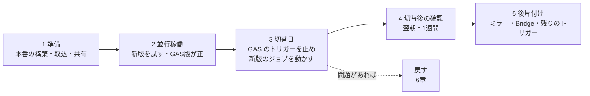

# 09. 移行計画(GAS版 → 新版)

- 目的: 稼働中の GAS版(`gas-childcare-visit-app`)から新版(katahimo-app)へ、業務を止めずに切り替える手順・確認・戻し方を決める。
- 対象読者: 切替を行う運用者、業務担当(スタッフへの案内・並行稼働の判断)。

GAS 側の変更は `katahimo-dev/gas-childcare-visit-app` リポジトリで行う(このリポジトリの `legacy/` は読み取り専用)。
本番の構築は [07_インフラ・運用.md](07_インフラ・運用.md) 3章、GAS のプロジェクトとトリガーの一覧は [01_システム概要.md](01_システム概要.md) 2章。

## 1. 全体の流れ



| 段階 | 正のデータ | 夜間の反映・顧客CSV の取込 | スタッフが使う画面 |
| --- | --- | --- | --- |
| 準備・並行稼働 | GAS版(スプレッドシート) | GAS版のトリガー | GAS版(新版は一部の人が試す) |
| 切替後 | 新版(PostgreSQL) | 新版のジョブ(22:00 / 03:00 JST。翌日の予定のお知らせは 19:00) | 新版。ミラーを使うなら GAS版の画面・他の GAS プロジェクトもシートを読める |

## 2. 準備(切替の前)

### 2.1 本番とデータ

- [ ] 07 3章の構築を終え、`/api/health/db`・ログイン・予定・出勤簿を確かめた(Scheduler は `scheduler_paused = true` のまま)。
- [ ] テナントと最初の管理者を作った: `pnpm tenant:create -- <slug> <法人名> <管理者のメール>`(07 3.6)。
- [ ] `legacy-auth-salt`(GAS版の Script Properties の `AUTH_SALT`)を登録し、スタッフ台帳を取り込んだ:
      `pnpm import:staff-master -- <slug> <スタッフ台帳CSV> --dry-run` → 内容を確かめて `--dry-run` を外す。
      既存のスタッフが**今のパスワードで**ログインできることを確かめた(初回のログインで argon2id に移る)。
- [ ] 顧客CSV を取り込んだ(`pnpm import:reserva -- <slug> <最新の Kokyaku_*.csv>`、または `csv-import` ジョブを手動実行)。
- [ ] テナントのカレンダーの設定をした(運用担当者): GAS版が読んでいた共有カレンダー(RESERVA の予約カレンダー等)を
      `pnpm tenant:calendars -- <slug> --add-shared '<ID>[=持ち主のスタッフ名]'` で足し、スタッフのカレンダーの許可を
      `--allow @<法人のドメイン>`(Gmail 等の個人のカレンダーは `--allow <ID>` で1つずつ)で登録した(07 3.6)。
- [ ] スタッフの予定を読むカレンダー(`staff_calendars`)と自宅住所・移動手段を設定した(🛠 管理 →「スタッフ」。05 4.3)。
- [ ] カレンダーと顧客CSV の Drive フォルダを api / worker のサービスアカウントに共有した(07 3.4)。
- [ ] Google Chat の Webhook と Gemini のキーを、管理者の設定画面で保存した(または `GCHAT_*_WEBHOOK_URL`・`gemini-api-key`)。
- [ ] Web Push の鍵を作って設定した(`pnpm push:vapid-keys` → `vapid-private-key`・`web_push`・`optional_secrets`。07 3.3)。
      設定の「通知」が出て、「テスト通知を送る」が自分の端末(Android・PC、iPhone はホーム画面に追加したアプリ)に届くことを確かめた。

### 2.2 ミラー(スプレッドシートへの書き込み)を続けるか

切替後も GAS版の画面・他の GAS プロジェクト(`gas-root-serach` 等)・人がスプレッドシートを読むなら、ミラーを続ける。

- [ ] 続ける場合: GAS版に **Bridge.js Ver. 1.1.38 以降** をデプロイした(それより前は事故報告の列がずれ、領収書の再送が二重になる。
      05 9章)。`gas_bridge_url`・`gas-bridge-secret`(GAS版の `BRIDGE_API_SECRET`)・`mirror_to_google_sheets = true` を設定した。
- [ ] ミラーを続ける間(と `SCHEDULE_PROVIDER=gas_bridge` を使う間)は GAS版の Web App を公開したままにする。
- [ ] ミラーを続ける間は、新しい年度・新しいスタッフの個別出勤簿(`<スタッフ名>_出勤簿_<年度>年度`)を今までどおり
      gas-childcare-daily-report で作る(無いとその出勤簿へのミラーが失敗し続け、`dead` になる)。スタッフ台帳のシートには新版から
      書き込まないため、GAS の他のプロジェクトがまだ台帳を読む間は、新版での登録・退職をシートにも手で入れる。
- [ ] ミラーを止める前に、シートで見ていたもの(領収書の画像・出勤簿のファイル)を新版で見る手段を用意する
      (今は未実装。[11_GAS版との機能比較.md](11_GAS版との機能比較.md) 13.2)。
- [ ] ミラーを止める前に、全員分の日報・事故報告を新版の「🛠 管理」→「📋 報告一覧」で見られることを、管理者とコーディネーターで
      確かめた(期間・種類・スタッフ・お客様で絞れる。[02_機能仕様.md](02_機能仕様.md) 10.2)。シートを読んでいた人・作業(集計・
      転記など)には、報告一覧の「⬇ 日報のCSV」「⬇ 事故報告・ヒヤリハットのCSV」(シートと同じ列の順+最終更新)に切り替えてもらった。
      ミラーを止める日までにシートに入った分と、止めた後の分は、CSV の期間(366日まで)で書き出せる。

### 2.3 当月の出勤簿を DB に揃える

出勤簿のミラーは、新版の書き込みで表示の変わった列だけをシートに書く(新版に無い値を空で上書きしない)。ただし新版の DB に当月の
手入力が無いまま動かし始めると、画面・月のまとめ・次のカレンダー反映は DB だけを見るため、GAS版で手入力した当月の値(天候・備考・
手で直した時刻等)が新版に出てこない。**切替の直前に**、各スタッフの個別出勤簿(`<スタッフ名>_出勤簿_<年度>年度`)の当月のシートを
CSV(「ファイル → ダウンロード → CSV」)に書き出して取り込む:

```bash
pnpm import:attendance -- <slug> <スタッフのログインメール> <CSV> [--year YYYY]
```

- 1日ずつ差分で書き(`entity_changes.change_source = 'import'`)、同じ内容の再実行は何も書かない。ミラーは積まない。
- 当月の編集期限は掛けない(締めた月は DB が拒否する)。手で変えた強調表示は CSV に無いため取り込まれない。
- 読めないセルはそのセルだけ飛ばして表示するので、画面で直す。
- 取込から切替までに GAS版で手入力した日は、切替後に取込をやり直すか画面で直す。

### 2.4 ジョブを手で試す

- [ ] `gcloud run jobs execute katahimo-nightly-calendar-sync|katahimo-csv-import|katahimo-maintenance --region=asia-northeast1 --wait`
      を1回ずつ流し、結果(Cloud Logging・出勤簿・顧客データ)を確かめた。
- [ ] 通知をオンにしたスタッフ(試す人)がいる状態で `gcloud run jobs execute katahimo-route-notice --region=asia-northeast1 --wait` を流し、
      明日の予定のお知らせが届くこと・押すと予定タブで明日の予定が開くことを確かめた。お知らせは試す人にだけ届く(オンにした人だけが対象)。

## 3. 並行稼働

- GAS版を正のまま、一部のスタッフ(管理者・コーディネーター)が新版で予定・お客様・日報・出勤簿を試す。
- **同じ日を両方で手入力しない**(ミラーを使う場合、後から書いた側の列だけがシートに残る)。新版で試した日報・領収書は、
  ミラーが off ならスプレッドシートに出ない。
- この間、新版の Scheduler は止めたまま(二重反映・二重取込を防ぐ)。取込が要るときはジョブを手で流す。
- 見る点: ログインできない人がいないか(退職日・メール)、予定の分類・ルートが GAS版と同じか、出勤簿の値が GAS版と同じか。

## 4. 切替日(同じ日に行う)

夜間の反映(22時)より前に行う。

- [ ] 2.3 の当月の出勤簿の取込をやり直した(前回の取込から GAS版で手入力があった場合)。
- [ ] **gas-childcare-visit-app**(`Triggers.js` の `VISIT_APP_TRIGGER_DEFS`): `autoSyncTodayScheduleForAllStaff`(毎日22時台)と
      `checkAndImportLatestCsv`(毎日3時台)を `enabled: false` にして `clasp push` → `setupAllTriggers()` を実行 →
      `listProjectTriggers()` で2件が消えたことを確かめる。トリガーの削除は**トリガーを作ったアカウント**で行う
      (`ScriptApp.getProjectTriggers()` は実行ユーザーのものしか返さない。`legacy/gas-childcare-visit-app/gas-account-migration/README.md`)。
- [ ] 新版の Scheduler を動かす: `terraform.tfvars` の `scheduler_paused = false` で apply → `gcloud scheduler jobs list --location=asia-northeast1`
      で ENABLED を確かめる。
- [ ] スタッフに新しい URL を案内する(ホーム画面に追加して PWA として使う。ログインは今のメールとパスワード。法人IDの欄が出る場合は
      `?t=<slug>` 付きの URL を案内するか、`VITE_DEFAULT_TENANT_SLUG` を設定してビルドする)。
- [ ] GAS版の画面を使わないよう案内する(ミラーを続けても、GAS版の画面での書き込みは新版に入らない)。
- [ ] スタッフに、自分の端末で通知をオンにするよう案内する(設定 →「通知」→「翌日の予定を通知する」→ 通知を許可 →「テスト通知を送る」で
      届くか確かめる)。iPhone・iPad は Safari の共有ボタンから「ホーム画面に追加」し、**ホーム画面のアプリから開いて**オンにする
      (iOS 16.4 以降)。通知は端末ごとなので、複数の端末で受け取るなら端末ごとにオンにする。それまでは GAS版の LINE WORKS の DM が
      届き続ける(5.3 で止める)。

## 5. 切替後

### 5.1 翌朝

- [ ] 夜間ジョブ2件(22:00 反映・03:00 取込)と保守(04:00)、前日 19:00 のお知らせ(`katahimo-route-notice`)が成功した
      (`gcloud run jobs executions list`・Cloud Logging・アラートが無い)。
      ジョブが**起動しなかった**ことはアラートで分からないため、実行の一覧を見て確かめる。
- [ ] 出勤簿に前日の予定が反映され、顧客データが更新された(`GET /api/data-version` の版数が進む)。
- [ ] ミラーを使う場合: outbox に `dead` が溜まっていない、スプレッドシートの出勤簿・勤怠集計・日報・領収書に反映された。

### 5.2 1週間

- [ ] 日報・事故報告・領収書の Google Chat の通知が届く。
- [ ] 月のまとめ(出勤簿・領収書)が GAS版の集計と合う。
- [ ] 再設定メールが届く(SMTP)。回数制限のロックで困った人がいない。
- [ ] 予定・ルートの Maps の利用量が予算の中(予算アラート)。

### 5.3 後片付け

- [ ] **gas-childcare-visit-app の `flushLogsToDrive`**(10分おき): GAS版の画面と Bridge を誰も使わなくなった時点で `enabled: false` にして
      `setupAllTriggers()`(最後にバッファを書き出すため、止める直前に一度手動実行する)。GAS版の Web App の公開停止も同じとき。
- [ ] **gas-root-serach**: `autoRunSaveAttendance()`(今日のルート → 勤怠集計)は visit-app で代替済みのため、残っていれば
      `Decommission.js` の `deleteDecommissionTriggers()` で削除。
- [ ] **gas-root-serach の `main()`**(夜間。翌日のルート集計・LINE WORKS の DM): 新版の翌日の予定のお知らせ(Web Push)が代わる。
      スタッフ全員が端末で通知をオンにした(4章)ことを確かめてから、Apps Script の画面で時限トリガーを削除する(止めた後は LINE WORKS の
      DM と「ルート集計」シートの更新が無くなる。翌日のルートは新版の予定タブで見る。LINE WORKS の DM の「訪問時お願い」は新版に無い)。
      オンにしていない人は `push_subscriptions` に行が無い(`SELECT s.display_name FROM staff s WHERE s.retired_on IS NULL AND NOT EXISTS
      (SELECT 1 FROM push_subscriptions p WHERE p.tenant_id = s.tenant_id AND p.staff_id = s.id);` をテナントを設定して流す)。
- [ ] **gas-childcare-daily-report**: `autoRunDailyTransfer()`(勤怠集計 → 個別出勤簿の夜間転記)を `deleteDecommissionTriggers()` で削除。
- [ ] **gas-integrated-system**: Web App の公開を停止(廃止は確認済み)。
- [ ] ミラーをやめる場合: `mirror_to_google_sheets = false`(API は積まず、ワーカーは残りを送らずに完了にする)。
- [ ] 移行が終われば `legacy-auth-salt` は不要(全員が一度ログインすれば argon2id に移っている。`GET /api/admin/staff` の `passwordStatus`
      が `legacy` の人が残っていないことを確かめてから外す)。

## 6. 戻し方

切替から問題が見つかった場合、GAS版に戻せるように**切替後しばらくは GAS版を消さない**。

| 状況 | 戻し方 |
| --- | --- |
| 新版のアプリの不具合(直前のデプロイが原因) | リビジョンを戻す(07 8.2)。GAS版には戻さない |
| 新版を使い続けられない(業務が止まる) | ① 新版の Scheduler を止める(`scheduler_paused = true`)② gas-childcare-visit-app の2つのトリガーを `enabled: true` に戻して `setupAllTriggers()` ③ スタッフに GAS版の URL を案内する |
| 切替後に新版だけに入ったデータ | ミラーが on なら、日報・事故報告・領収書・出勤簿の変わった列はスプレッドシートにも入っている。off なら、新版の画面(今月のまとめ等)から手でシートに写す。勤怠集計は GAS版の夜間反映が作り直す |

戻した後にもう一度切り替えるときは、2.3 の当月の出勤簿の取込からやり直す。

## 7. 役割と連絡

| 作業 | 担当 |
| --- | --- |
| 本番の構築・ジョブ・Scheduler・監視 | 運用者 |
| GAS 側(Bridge.js のデプロイ・トリガーの停止) | GAS版のトリガーを作ったアカウントを持つ人 |
| スタッフへの案内・並行稼働の判断・切替後の確認(出勤簿・月のまとめ) | 業務担当(管理者) |
