# 目的

次期アプリ「管理者が顧客にスタッフを最適に割り当てる(マッチング)」のために、DB に先に用意しておく土台の設計。
割当のアルゴリズム・画面はまだ作らない(テーブルだけがあり、リポジトリ・usecase は無い)。扱うのは次の2点。

1. **複数法人(テナント)・業種の拡張**: テナントの状態・タイムゾーン・業種・プラン、機能フラグ、テナント独自項目。
2. **マッチングの入力と結果**: 予約(需要)と割当、スタッフの属性・雇用条件・勤務可能時間帯・カレンダーの busy、顧客の条件・相性、
   マッチングの実行記録。

実装は `packages/db/src/schema/{platform,tenancy,staff,services,matching}.ts`、マイグレーションは
`0000_baseline.sql` / `0001_baseline_custom.sql`(EXCLUDE 制約は後者)。全体の方針(FORCE RLS・複合キー・暗号化・ロール)は
`doc/09_データベース構造解説.md` 第1章に従う。

---

# 1. 共通方針

- 全テーブルが `tenant_id` を持ち、主キーは `(tenant_id, id)`、親への参照は全て `(tenant_id, xxx_id) → (tenant_id, id)` の
  複合外部キー。RLS は `tenant_isolation`(FORCE)。
- 自由記述(相性のメモ・勤務不可の理由・予約のメモ・顧客の希望のメモ・属性の備考)は `*_enc bytea`(v3 の暗号文。doc/09 第4章)。
  分類値・数値・時間帯は平文(SQL で絞り込むため)。
- 時間帯は `tstzrange` の `[開始, 終了)`。10:00–12:00 と 12:00–14:00 は重ならない。重なりは `&&`、GiST 索引
  (`btree_gist` で uuid と一緒に索引化)。有効期間は `daterange`。
- 列挙は `text` + `CHECK`(値は `packages/core/src/domain/model/codes.ts`)。
- 位置は暗号化した緯度経度(`*_geo_enc`)と、平文の粗い区画(`*_geo_cell`、geohash 6桁 ≒ 1.2km × 0.6km)。
  距離の事前の絞り込み・移動時間のキャッシュのキーには区画だけを使う。

---

# 2. ER 図

```mermaid
erDiagram
    PLATFORM_PLANS ||--o{ PLATFORM_TENANTS : ""
    PLATFORM_TENANTS ||--o{ TENANT_FEATURES : ""
    PLATFORM_TENANTS ||--o{ CUSTOM_FIELD_DEFINITIONS : ""
    STAFF ||--o{ STAFF_EMPLOYMENT_TERMS : "期間ごと(EXCLUDE)"
    STAFF ||--o{ STAFF_ATTRIBUTES : ""
    ATTRIBUTE_DEFINITIONS ||--o{ STAFF_ATTRIBUTES : "attribute_id"
    ATTRIBUTE_DEFINITIONS ||--o{ CUSTOMER_REQUIRED_ATTRIBUTES : "attribute_id"
    STAFF ||--o{ STAFF_WEEKLY_AVAILABILITY : ""
    STAFF ||--o{ STAFF_AVAILABILITY_EXCEPTIONS : ""
    STAFF ||--o{ STAFF_CALENDARS : ""
    STAFF ||--o{ STAFF_BUSY_BLOCKS : ""
    STAFF ||--o{ STAFF_SERVICE_AREAS : ""
    SERVICE_AREAS ||--o{ STAFF_SERVICE_AREAS : ""
    CUSTOMERS ||--o| CUSTOMER_PREFERENCES : ""
    CUSTOMERS ||--o{ CUSTOMER_REQUIRED_ATTRIBUTES : ""
    CUSTOMERS ||--o{ CUSTOMER_STAFF_AFFINITIES : ""
    STAFF ||--o{ CUSTOMER_STAFF_AFFINITIES : ""
    CUSTOMERS ||--o{ CUSTOMER_RECURRING_SLOTS : ""
    SERVICE_ITEMS ||--o{ RESERVATIONS : ""
    CUSTOMERS ||--o{ RESERVATIONS : ""
    RESERVATIONS ||--o{ RESERVATION_RECIPIENTS : "対象の子ども"
    RESERVATIONS ||--o{ RESERVATION_ASSIGNMENTS : ""
    STAFF ||--o{ RESERVATION_ASSIGNMENTS : ""
    RESERVATION_ASSIGNMENTS ||--o| VISITS : "実績(assignment_id)"
    MATCHING_RUNS ||--o{ MATCHING_RUN_CANDIDATES : "run_id"
    MATCHING_RUNS ||--o{ RESERVATION_ASSIGNMENTS : "matching_run_id"

    STAFF_EMPLOYMENT_TERMS {
        daterange valid
        text employment_type "full_time/part_time/contractor"
        smallint max_visits_per_day
        int max_weekly_minutes
    }
    STAFF_ATTRIBUTES {
        uuid attribute_id FK
        smallint level
        text value_text
        daterange valid "資格の有効期間(EXCLUDE)"
        bytea note_enc
    }
    STAFF_WEEKLY_AVAILABILITY {
        smallint weekday "0=日〜6=土"
        time start_time
        time end_time
        date effective_from
        date effective_to
    }
    STAFF_BUSY_BLOCKS {
        tstzrange period
        text source "google_calendar/manual"
        text external_event_id
    }
    RESERVATIONS {
        text status "requested/tentative/confirmed/cancelled/done"
        tstzrange scheduled_period
        date business_date
        smallint required_staff_count
        bytea notes_enc
        int row_version
    }
    RESERVATION_ASSIGNMENTS {
        tstzrange period "EXCLUDE(proposed/confirmed の重なり禁止)"
        text status "proposed/confirmed/declined/cancelled"
        numeric match_score
        jsonb match_reasons
    }
    MATCHING_RUN_CANDIDATES {
        uuid run_id FK
        uuid reservation_id FK
        uuid staff_id FK
        bool is_feasible
        numeric score
        jsonb breakdown
    }
```

---

# 3. テーブルごとの説明

## 3.1 複数法人・業種

| テーブル/列 | 役割 |
|---|---|
| `platform.tenants.status` | `provisioning` / `active` / `suspended` / `terminating` / `terminated`。`active` 以外はログイン・セッションを拒否する。 |
| `platform.tenants.timezone` | IANA のタイムゾーン(既定 `Asia/Tokyo`)。業務日の境界・週の勤務可能時間帯の壁時計時刻の解釈に使う。 |
| `platform.tenants.business_type` | 業種(`babysitting` / `home_nursing`)。業種ごとにスキーマを分けず、差分は機能フラグと追加テーブルで吸収する。 |
| `platform.plans` / `plan_features` | プランと、プランの既定の機能。テナントの上書きは `tenant_features`。 |
| `tenant_features` | 機能フラグ(`(tenant_id, feature_key)`)。`config` に機能固有の設定(マッチングの重み等)。秘密値は置かない(`tenant_secrets`)。 |
| `custom_field_definitions` + `staff.custom_fields` / `customers.custom_fields` | テナント独自の表示・検索用の項目(JSONB)。要配慮情報は置かない。 |

## 3.2 スタッフ

- **`staff_employment_terms`**: 雇用条件を期間(`valid daterange`)ごとに持つ。同じスタッフの期間は重ならない(EXCLUDE)。
  `max_visits_per_day`・`max_weekly_minutes` はハード制約。
- **`attribute_definitions`**: テナントが定義する属性のカタログ(`category`: skill / qualification / trait / language / other、
  `value_type`: boolean / level(1〜`max_level`) / text)。割当の理由から参照されるため消さずに `archived_at`。
- **`staff_attributes`**: スタッフ×属性。資格の有効期間は `valid`(同じ属性の期間は重ならない。EXCLUDE)。確認者・証跡のファイル
  (`verified_by`・`evidence_file_id`)、備考は暗号化。
- **`staff` のプロフィール**: `gender`・`birth_year`(生年月日は持たない)・`home_area`(市区町村)・`home_geo_enc` / `home_geo_cell`・
  `travel_mode`。予定を読むカレンダーは `staff_calendars`(`purpose`: schedule / busy)。
- **`service_areas`** / **`staff_service_areas`**: 担当エリア(区画の集合)と優先度。

## 3.3 勤務可能時間帯・予定あり

- **`staff_weekly_availability`**: 週の勤務可能枠(テナントのタイムゾーンの壁時計時刻)。同じ曜日の枠は、有効期間
  (`effective_from`〜`effective_to`、両端を含む)の重なる範囲で時間帯が重ならない(EXCLUDE。`tsrange` に 2000-01-01 を足して判定)。
- **`staff_availability_exceptions`**: 日・時間帯の例外(`unavailable` = 休み等、`extra_available` = 臨時の勤務可)。理由は暗号化。
- **`staff_busy_blocks`**: 予定あり時間帯のキャッシュ。ワーカーの `job:sync-busy-blocks` が Google Calendar の freeBusy から
  取り込む(予定のタイトル・場所は保存しない)。同期の状態(`sync_token`・最終同期・直近のエラー)は `staff_calendars`。

## 3.4 顧客の条件

- **`customer_preferences`**(1顧客1行): 希望のスタッフの性別と、それがハード制約か(`gender_is_hard`)、メモ(暗号化)。
- **`customer_required_attributes`**: 顧客が求める属性(`min_level`、`is_hard`)。
- **`customer_staff_affinities`**: 顧客×スタッフの相性(`score` -2〜+2、`is_ng` = 絶対に割り当てない、`source`: manual / feedback、
  メモは暗号化)。
- **`customer_recurring_slots`**: 定期の利用枠(曜日・時刻・有効期間・サービス)。予約を作るときの元。

## 3.5 需要(予約)と割当

予定(`reservations`)と実績(`visits`。doc/09 第3章)を分ける。

- **`service_items`**: サービスの種類(既定の時間・単価)。
- **`reservations`**: 訪問の需要。`status`: requested(担当未定)/ tentative / confirmed / cancelled / done。
  `scheduled_period`・`business_date`・`required_staff_count`・訪問先の住所(`address_id`)・メモ(暗号化)・外部の予定との対応
  (`external_source` / `external_id` で一意)。`row_version` で楽観的排他。
- **`reservation_recipients`**: 予約の対象の子ども。
- **`reservation_assignments`**: 予約へのスタッフの割当(`status`: proposed / confirmed / declined / cancelled)。
  **二重予約の防止**: 同じスタッフの proposed・confirmed の割当の時間帯は重ならない
  (`EXCLUDE USING gist (tenant_id WITH =, staff_id WITH =, period WITH &&) WHERE (status IN ('proposed','confirmed'))`、
  重なると SQLSTATE `23P01` → API は 409)。
- **`matching_runs`** / **`matching_run_candidates`**: 実行の記録(入力の `params` を丸ごと残し、同じ入力で再現・監査できる)と、
  予約×スタッフごとのスコアの内訳(ハード制約で除いた候補は `is_feasible = false`、理由は `breakdown`)。候補は保守ジョブが
  90日で消す。
- **`travel_time_cache`**: 区画 → 区画・移動手段・出発の時間帯ごとの移動時間のキャッシュ(外部の地図 API の呼び出しを減らす)。

---

# 4. 将来のマッチングでの使い方(想定)

ハード制約(1つでも満たさない候補は除く): 在籍(`retired_on`)・雇用条件の期間と上限・勤務可能枠と例外・`staff_busy_blocks` と
既存の割当の空き(移動時間の分の前後の余白を付けて判定)・NG(`customer_staff_affinities.is_ng`)・必須の属性(期限内)・
性別の必須の希望・担当エリア。

ソフトスコア(順位付け): 相性・属性のレベル・移動時間(区画から見積もり、上位だけ地図 API)・過去の担当の実績・負荷の平準化。
重みはテナントの機能フラグの `config` に置く。

---

# 5. マルチテナントの注意

- マッチングの処理はテナントごとの Unit of Work の中で行う(`app.tenant_id` を設定してから読む)。テナントを横断する処理は無い。
- `travel_time_cache` もテナントごと(区画は平文だが、テナント間で共有しない)。

# 6. 今回の範囲外

- 割当のアルゴリズム・画面、予約の取込、`staff_busy_blocks` の増分同期(今は期間ごとの置き換え)。
