# 目的

次期アプリ「管理者が顧客にスタッフを最適に割り当てる(マッチング)アプリ」のために、DB側で先に用意しておく土台の設計をまとめる。アプリ本体(割当アルゴリズム・画面)はまだ作らない。本書で扱うのは次の2点。

1. **複数法人(テナント)・将来の業種拡張への備え**: テナントの状態・タイムゾーン・業種、機能フラグ、テナント独自項目。
2. **マッチングの入力データ**: 顧客とスタッフの相性、スタッフの属性(特技・資格・性別・特性)、勤務可能な曜日・時間帯、Googleカレンダー由来の予定あり(busy)時間帯、予約(需要)と割当(結果)。

実装は `packages/db/src/schema/*.ts`(Drizzle ORM)、マイグレーションは `packages/db/drizzle/0000_initial_schema.sql`(drizzle-kit生成)と `0001_custom_constraints.sql`(手書き: EXCLUDE制約・FORCE RLS等)。既存テーブル全体の方針(RLS・複合FK・暗号化)は `doc/09_データベース構造解説.md` を参照。本書のテーブルも全てその方針に従う。

---

# 1. 共通方針(全テーブル共通)

- **テナント分離**: 全テーブルが `tenant_id` を持ち、RLSポリシー `tenant_isolation`(`tenant_id = nullif(current_setting('app.tenant_id', true), '')::uuid`)を適用し、さらに `FORCE ROW LEVEL SECURITY` でテーブル所有者にも適用する。
- **複合キー**: 全テーブルに `UNIQUE(tenant_id, id)` を持たせ、テナントスコープの親への参照は全て `(tenant_id, xxx_id) → 親(tenant_id, id)` の複合FKにする(RLSはFK検査をバイパスするため、単一列FKだと他テナントのIDの混入をDBが検知できない。doc/09 第1.2節)。
- **暗号化**: 自由記述(相性のメモ・NG理由・勤務不可の理由・予約メモ・顧客の希望メモ)は `*_ciphertext` + `*_key_version` でエンベロープ暗号化する。自宅の緯度経度(`staff.home_lat_lng`)も `customers.lat_lng` と同じく暗号化する。性別・属性キー・レベル・時間帯などの分類値/数値は平文(マッチングの絞り込みにSQLで使うため)。
- **時間帯**: 時間帯は PostgreSQL の `tstzrange`(Drizzleでは `packages/db/src/schema/_types.ts` の customType `tstzrange`)で持ち、常に半開区間 `[開始, 終了)` で書き込む。10:00–12:00 と 12:00–14:00 は「重ならない」。重なり判定は `&&` 演算子で、GiSTインデックス(`btree_gist` 拡張で uuid 列と一緒に索引化)が効く。
- **enum相当の値**: `text` 列 + `CHECK (col in (...))`。PostgreSQLのENUM型は値の追加・削除がマイグレーションで扱いにくいため使わない。
- 全テーブルに `created_at` / `updated_at`。

---

# 2. ER図

```mermaid
erDiagram
    TENANTS ||--o{ TENANT_FEATURES : "機能フラグ"
    TENANTS ||--o{ ATTRIBUTE_DEFINITIONS : "属性カタログ"
    TENANTS ||--o{ STAFF : "所属"
    TENANTS ||--o{ CUSTOMERS : "所属"

    STAFF ||--o{ STAFF_ATTRIBUTES : "保有属性"
    ATTRIBUTE_DEFINITIONS ||--o{ STAFF_ATTRIBUTES : "定義"
    STAFF ||--o{ STAFF_WEEKLY_AVAILABILITY : "週次の勤務可能枠"
    STAFF ||--o{ STAFF_AVAILABILITY_EXCEPTIONS : "休み・臨時勤務"
    STAFF ||--o{ STAFF_BUSY_BLOCKS : "予定あり(カレンダー)"
    STAFF ||--o{ CALENDAR_SYNC_STATES : "カレンダー同期状態"

    CUSTOMERS ||--o| CUSTOMER_PREFERENCES : "希望条件(1:1)"
    CUSTOMERS ||--o{ CUSTOMER_REQUIRED_ATTRIBUTES : "求める属性"
    ATTRIBUTE_DEFINITIONS ||--o{ CUSTOMER_REQUIRED_ATTRIBUTES : "定義"
    CUSTOMERS ||--o{ CUSTOMER_STAFF_AFFINITIES : "相性"
    STAFF ||--o{ CUSTOMER_STAFF_AFFINITIES : "相性"

    CUSTOMERS ||--o{ RESERVATIONS : "予約(需要)"
    RESERVATIONS ||--o{ RESERVATION_ASSIGNMENTS : "割当(結果)"
    STAFF ||--o{ RESERVATION_ASSIGNMENTS : "担当"
    MATCHING_RUNS |o--o{ RESERVATION_ASSIGNMENTS : "提案元(任意)"
    MATCHING_RUNS ||--o{ MATCHING_RUN_CANDIDATES : "候補スコア"
    RESERVATIONS ||--o{ MATCHING_RUN_CANDIDATES : "対象予約"
    STAFF ||--o{ MATCHING_RUN_CANDIDATES : "候補スタッフ"

    TENANTS {
        uuid id PK
        string slug UK
        string status "active / suspended"
        string timezone "既定 Asia/Tokyo"
        string business_type "既定 babysitting、将来 home_nursing 等"
    }
    TENANT_FEATURES {
        uuid id PK
        uuid tenant_id FK
        string feature_key "UK(tenant_id, feature_key)"
        boolean enabled
        jsonb config
    }
    STAFF {
        uuid id PK
        uuid tenant_id FK
        string gender "マッチング用プロフィール(全て任意)"
        smallint birth_year
        string employment_type
        smallint max_visits_per_day "ハード制約"
        int max_weekly_minutes "ハード制約"
        string home_area "市区町村"
        text home_lat_lng_ciphertext "暗号化"
        string travel_mode "car/bicycle/transit/walk"
        string calendar_id "free/busy取得用"
        jsonb custom_fields "テナント独自の表示・検索項目"
    }
    ATTRIBUTE_DEFINITIONS {
        uuid id PK
        uuid tenant_id FK
        string category "skill/qualification/trait/language/other"
        string key "UK(tenant_id, key)"
        string label
        string value_type "boolean/level/text"
        smallint max_level
        int sort_order
        timestamp archived_at "ソフトデリート"
    }
    STAFF_ATTRIBUTES {
        uuid id PK
        uuid staff_id FK "複合FK"
        uuid attribute_definition_id FK "複合FK。UK(tenant, staff, attr)"
        smallint level
        string value_text
        date expires_on "資格の有効期限"
        text note_ciphertext
    }
    STAFF_WEEKLY_AVAILABILITY {
        uuid id PK
        uuid staff_id FK
        smallint weekday "0=日〜6=土"
        time start_time "CHECK start < end"
        time end_time
        date effective_from
        date effective_to "null=無期限"
    }
    STAFF_AVAILABILITY_EXCEPTIONS {
        uuid id PK
        uuid staff_id FK
        tstzrange period "GiST"
        string kind "unavailable / extra_available"
        text reason_ciphertext
    }
    STAFF_BUSY_BLOCKS {
        uuid id PK
        uuid staff_id FK
        tstzrange period "GiST(tenant_id, staff_id, period)"
        string source "google_calendar/manual/assignment"
        string external_event_id
        timestamp synced_at
    }
    CALENDAR_SYNC_STATES {
        uuid id PK
        uuid staff_id FK
        string calendar_id "UK(tenant, staff, calendar)"
        string sync_token
        timestamp last_synced_at
        string last_error
    }
    CUSTOMER_PREFERENCES {
        uuid id PK
        uuid customer_id FK "UK(tenant_id, customer_id)"
        string preferred_staff_gender
        boolean gender_is_hard
        jsonb preferred_weekdays
        jsonb preferred_time_windows
        text notes_ciphertext
    }
    CUSTOMER_REQUIRED_ATTRIBUTES {
        uuid id PK
        uuid customer_id FK
        uuid attribute_definition_id FK
        smallint min_level
        boolean is_hard
    }
    CUSTOMER_STAFF_AFFINITIES {
        uuid id PK
        uuid customer_id FK "UK(tenant, customer, staff)"
        uuid staff_id FK
        smallint score "CHECK -2..+2"
        boolean is_ng
        string source "manual/feedback/history"
        text note_ciphertext
        uuid updated_by_staff_id FK
    }
    RESERVATIONS {
        uuid id PK
        uuid customer_id FK
        string status "requested/tentative/confirmed/cancelled/done"
        tstzrange scheduled_period
        date business_date
        smallint required_staff_count "CHECK >= 1"
        string service_type
        string address
        text notes_ciphertext
        string external_source "UK(tenant, source, id)"
        string external_id
    }
    RESERVATION_ASSIGNMENTS {
        uuid id PK
        uuid reservation_id FK
        uuid staff_id FK "EXCLUDE: 同スタッフの時間帯重複を禁止"
        tstzrange period
        string status "proposed/confirmed/cancelled"
        numeric match_score
        jsonb match_reasons
        uuid matching_run_id FK
        uuid assigned_by_staff_id FK
    }
    MATCHING_RUNS {
        uuid id PK
        uuid requested_by_staff_id FK
        jsonb params
        string status "queued/running/succeeded/failed/cancelled"
        timestamp started_at
        timestamp finished_at
        jsonb result_summary
    }
    MATCHING_RUN_CANDIDATES {
        uuid id PK
        uuid matching_run_id FK "UK(tenant, run, reservation, staff)"
        uuid reservation_id FK
        uuid staff_id FK
        boolean is_feasible
        numeric score
        jsonb breakdown
        int rank
    }
```

図の FK は全て `(tenant_id, xxx_id)` の複合FK(mermaidでは複合キーの関係線を表現できないため属性コメントで注記)。

---

# 3. テーブルごとの説明

## 3.1 複数法人・業種拡張

| テーブル/列 | 役割 |
|---|---|
| `tenants.status` | `active` / `suspended`。停止中テナントのログイン・API利用拒否はアプリ層で判定する。 |
| `tenants.timezone` | IANAタイムゾーン(既定 `Asia/Tokyo`)。`business_date` の境界、`staff_weekly_availability` の壁時計時刻、終日の休み(00:00〜翌00:00)の解釈に使う。 |
| `tenants.business_type` | 業種(既定 `babysitting`、将来 `home_nursing` 等)。業種の追加でマイグレーションが要らないようCHECKは付けない。業種ごとにスキーマを分岐させず、差分は機能フラグと追加テーブルで吸収する(doc/07 第4.2節)。 |
| `tenant_features` | 機能フラグ。`(tenant_id, feature_key)` で一意。行が無い機能はコード側の既定値。`config` に機能固有の設定(例: マッチングの重み係数)を置く。秘密情報は置かない。 |
| `staff.custom_fields` / `customers.custom_fields` | テナント独自の表示・検索用項目(JSONB)。請求・記録などの本体データや要配慮情報は置かない。 |

## 3.2 スタッフ属性

- **`attribute_definitions`**: テナントが自由に定義する属性カタログ。`category`(skill=特技 / qualification=資格 / trait=性格・特性 / language=対応言語 / other)、`key`(プログラム用の安定キー、テナント内で一意)、`label`(表示名)、`value_type`(boolean=有無 / level=習熟度1〜`max_level` / text=短い値)。過去の割当理由から参照されるため物理削除せず `archived_at` でソフトデリートする。
- **`staff_attributes`**: スタッフ×属性定義(1組1行)。`level`・`value_text`・`expires_on`(資格の有効期限。期限切れはハード制約を満たさない扱い)、`note`(暗号化)。
- **`staff` のマッチング用プロフィール列**(全て任意、nullは「制約なし/不明」): `gender`、`birth_year`(生年月日そのものは持たない)、`employment_type`、`max_visits_per_day`・`max_weekly_minutes`(上限、ハード制約)、`home_area`(市区町村、粗い距離の事前絞り込み)、`home_lat_lng`(暗号化、移動時間計算用)、`travel_mode`、`calendar_id`(free/busy取得に使うGoogleカレンダーID)。

特技・資格を `staff` の列にしないのは、法人・業種ごとに全く異なり(訪問看護なら「看護師免許」「精神科訪問看護の経験」)、列追加のたびにマイグレーションが要る設計を避けるため。

## 3.3 勤務可能時間帯

- **`staff_weekly_availability`**: 週次の勤務可能枠。`weekday`(0=日〜6=土、`CHECK 0..6`)、`start_time`/`end_time`(テナントのタイムゾーンの壁時計時刻、`CHECK start_time < end_time`)。同じ曜日に複数行可。日付を跨ぐ枠は当日の `22:00〜24:00` と翌曜日の `00:00〜02:00` の2行に分ける(PostgreSQLの `time` は `24:00` を許容する)。`effective_from`〜`effective_to`(両端含む、nullは無期限)で履歴を残し、シフト体系の変更は `replaceWeekly()` が既存行を前日で打ち切ってから新しい行を追加する。
- **`staff_availability_exceptions`**: 日単位・時間帯単位の例外。`kind=unavailable`(有給・通院等、週次枠より優先して不可)、`extra_available`(臨時の追加勤務可)。`period` は tstzrange。`reason` は健康情報を含みうるため暗号化。

## 3.4 Googleカレンダー由来の予定(free/busy)

- **`staff_busy_blocks`**: 予定あり時間帯のキャッシュ。同期ワーカー(将来)がGoogle Calendar API(freeBusy.query または events.list)から取り込み、マッチングはDBだけで判定する(実行のたびに全スタッフ分APIを呼ぶと遅く、レート制限にもかかるため)。予定のタイトル・場所は保存しない(判定に不要で、顧客名等の個人情報を複製しないため)。`source`: `google_calendar` / `manual`(管理者の手入力)/ `assignment`(本アプリの割当から展開したもの)。`(tenant_id, staff_id, source, external_event_id)` で一意(再同期での重複防止。NULLは重複扱いされない)。`(tenant_id, staff_id, period)` のGiSTインデックス。
- **`calendar_sync_states`**: スタッフ×カレンダーごとの増分同期トークン(`sync_token`、失効時はnullに戻して全件再同期)・最終同期日時・直近エラー。認証情報はここに置かない。

## 3.5 顧客側の条件

- **`customer_preferences`**(1顧客1行): `preferred_staff_gender` と `gender_is_hard`(trueならハード制約、falseならソフトスコアの加点のみ)、`preferred_weekdays` / `preferred_time_windows`(定期利用の希望。予約が無い段階での事前検討用、個々の予約の時間帯は `reservations.scheduled_period` を正とする)、`notes`(暗号化)。
- **`customer_required_attributes`**: 顧客が求める属性。`min_level`(level型の最低レベル)、`is_hard`(true=必須、false=できれば)。配列列ではなく行にしたのは、属性定義への複合FKで参照整合性を保てる・レベル条件を持てるため。
- **`customer_staff_affinities`**: 顧客×スタッフの相性。`score`(-2〜+2、`CHECK`)、`is_ng`(NG=絶対に割り当てない。scoreとは独立)、`source`(manual/feedback/history)、`note`(NG理由等、暗号化)、`updated_by_staff_id`。`(tenant_id, customer_id, staff_id)` で一意。

## 3.6 需要(予約)と割当

doc/07 第5章の「予定(reservations)と実績(visits)を分離する」方針に従う(実績側 `visits` は今回は作らない)。

- **`reservations`**: 訪問の需要。`status`(requested=担当未定 / tentative=仮押さえ / confirmed / cancelled / done)、`scheduled_period`(tstzrange)、`business_date`(テナントのタイムゾーンでの業務日)、`required_staff_count`(`CHECK >= 1`)、`service_type`、`address`(顧客住所と異なる場合のみ、平文)、`notes`(暗号化)、`external_source`/`external_id`(Googleカレンダー・RESERVA等の外部予定とのID連携。`(tenant_id, external_source, external_id)` で一意)。
- **`reservation_assignments`**: 予約へのスタッフ割当。`period`(通常は予約と同じ。途中合流等に備え割当ごとに持つ)、`status`(proposed=提案 / confirmed / cancelled)、`match_score`・`match_reasons`(マッチングのスコアと根拠)、`matching_run_id`(提案元)、`assigned_by_staff_id`。
  - **二重予約の防止**: `EXCLUDE USING gist (tenant_id WITH =, staff_id WITH =, period WITH &&) WHERE (status <> 'cancelled')`(制約名 `reservation_assignments_no_staff_double_booking`、`0001_custom_constraints.sql`)。同じスタッフの cancelled 以外の割当の時間帯が重なると挿入/更新がエラー(SQLSTATE `23P01`)になる。proposed も対象なので、確定前の提案同士でも重ならない。drizzle-kit はEXCLUDE制約を表現できないため手書きマイグレーションにしている。
  - 同一予約に同じスタッフを有効な状態で2重に割り当てないよう、`(tenant_id, reservation_id, staff_id) WHERE status <> 'cancelled'` の部分UNIQUEインデックスも持つ。
- **`matching_runs`**: マッチング実行の記録。`params`(対象期間・対象予約・重み等の入力を丸ごと保存し、同じ入力で再現・監査できるようにする)、`status`、`started_at`/`finished_at`、`result_summary`(割当件数・未割当理由の集計等)、`last_error`。
- **`matching_run_candidates`**: 実行時の候補(予約×スタッフ)ごとのスコア内訳。「なぜこの人が選ばれた/選ばれなかったか」を管理者に説明するためのもの。`is_feasible=false` はハード制約で除外された候補で、`breakdown.excludedBy` に理由を入れる。

---

# 4. 将来のマッチングアルゴリズムでの使い方

## 4.1 ハード制約(1つでも満たさない候補は除外)

予約 r(顧客 c、時間帯 P = `scheduled_period`、業務日 d)に対して、スタッフ s が候補になる条件:

1. **在籍**: `staff.retirement_date` が d より後、または null。
2. **勤務可能時間帯に収まる**: P が、d の曜日・有効期間に該当する `staff_weekly_availability` の枠(テナントのタイムゾーンで d の日付と組み合わせて絶対時刻に変換)と `extra_available` 例外の和集合に完全に含まれ、かつ `unavailable` 例外と重ならない。
3. **予定が空いている**: `staff_busy_blocks` に `period && P` の行が無い(移動時間を考慮する場合は P の前後に移動時間分のバッファを付けて判定)。
4. **他の割当と重ならない**: `reservation_assignments` の cancelled 以外の行と重ならない(最終的にはEXCLUDE制約がDBで保証するが、候補段階で除外しておく)。
5. **NGでない**: `customer_staff_affinities` に `(c, s)` の `is_ng = true` の行が無い。
6. **必須属性を満たす**: `customer_required_attributes` の `is_hard = true` の全行について、`staff_attributes` に同じ属性定義の行があり、`min_level` 以上で、`expires_on` が d 以降(または null)。
7. **性別の希望**: `customer_preferences.gender_is_hard = true` なら `staff.gender = preferred_staff_gender`。
8. **上限**: その日の割当件数 < `max_visits_per_day`、その週の割当合計分数 + P の長さ ≤ `max_weekly_minutes`(null は上限なし)。

## 4.2 ソフトスコア(候補の順位付け)

重みは `tenant_features(feature_key='staff_matching').config` や `matching_runs.params` で調整できるようにする想定。

| 要素 | 入力 | 例 |
|---|---|---|
| 相性 | `customer_staff_affinities.score`(-2〜+2) | 重み × score |
| 希望属性・習熟度 | `customer_required_attributes`(`is_hard=false`)と `staff_attributes.level` | 満たす属性ごとに加点、level が高いほど加点 |
| 性別の希望(ソフト) | `customer_preferences.gender_is_hard=false` | 一致で加点 |
| 移動距離・時間 | `staff.home_lat_lng`/`home_area`・`travel_mode`、直前/直後の割当の訪問先、`customers.lat_lng` | 移動時間が短いほど加点(Routes APIの結果はキャッシュする) |
| 継続性・履歴 | 過去の `reservation_assignments`(done)や `daily_reports` の担当実績 | 同じ顧客の担当経験があれば加点(`source='history'` の相性として保存してもよい) |
| 負荷の平準化 | その週の割当合計 | 上限に近いスタッフを減点 |
| 希望曜日・時間帯 | `customer_preferences.preferred_*` | 定期枠の事前検討時に使用 |

割当結果は `reservation_assignments`(status=proposed、`match_score`・`match_reasons`)に書き、管理者が確認して confirmed にする。全候補のスコアは `matching_run_candidates` に残す。

## 4.3 実装上の想定

- 読み込みは `packages/db/src/repositories/` の以下を起点にする(core側のPortはまだ作っていないため、型は各リポジトリファイルで定義している。マッチングのユースケースを作る段階で `packages/core/src/ports` へ移す)。
  - `DrizzleAttributeRepository`: 属性定義の一覧・作成・アーカイブ、スタッフ属性のまとめ読み・upsert・削除
  - `DrizzleStaffAvailabilityRepository`: 週次枠の期間指定読み込み・置き換え(履歴を残す)、例外の重なり検索・作成・削除
  - `DrizzleCustomerStaffAffinityRepository`: 顧客群/スタッフ単位の相性読み込み・upsert・削除
  - `DrizzleStaffBusyBlockRepository`: busy時間帯の重なり検索、同期ウィンドウ単位の置き換え、同期状態の読み書き
- 1回の実行で対象期間の全予約・全候補スタッフ分を数クエリでまとめて読み、メモリ上で制約判定・スコア計算する(N+1を避ける)。
- 割当の確定は1トランザクションで行い、EXCLUDE制約違反(`23P01`)は「他の管理者が先に同じスタッフを割り当てた」競合として扱って再計算する。

---

# 5. マルチテナントの注意点

- 全テーブルRLS + FORCE RLS。`withTenant()` の外(テナント未設定)では常に0件になる。テナントを跨ぐマッチングは存在しない(属性カタログも相性もテナント内で閉じる)。
- 属性の `key` はテナント内でのみ一意。テナント横断の集計(将来の分析)をする場合は `key` の命名規約を揃えるか、別途マッピングを持つ。
- `tenants.timezone` は現状全テナント `Asia/Tokyo`。DB接続のセッションタイムゾーンも `Asia/Tokyo`(`packages/db/src/client.ts`)のため、別タイムゾーンのテナントを受け入れる際は、日付⇔時刻の変換を必ず `tenants.timezone` で明示的に行うこと(接続のタイムゾーンに依存しない)。
- 外部カレンダーの認証情報(OAuthトークン・サービスアカウント鍵)はDBの平文列に置かない。テナントごとに必要になったら `app_settings` の暗号化列か Secret Manager に置く。
- EXCLUDE制約は `tenant_id WITH =` を含むため、テナント間では干渉しない。

---

# 6. 今回スコープ外

- マッチングアルゴリズム・画面・API(次期アプリで作る)
- 訪問実績(`visits`)、請求(`invoices` 等、doc/07 第6章)
- Googleカレンダー同期ワーカー本体(`staff_busy_blocks` / `calendar_sync_states` はその書き込み先として用意のみ)
