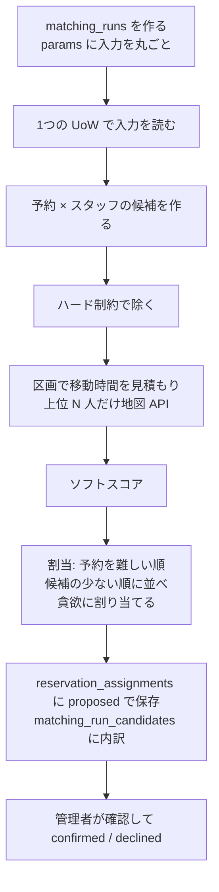

# 10. マッチング拡張設計(未実装)

- 目的: 次期アプリ「管理者が予約(顧客の依頼)にスタッフを最適に割り当てる(マッチング)」を、今ある表の上にどう作るかを決める。
- 対象読者: 次の開発の担当、業務担当(割当のルールの確認)。

> **状態: 未実装。** DB の表(このページの2〜3章)だけがベースラインに入っている。リポジトリ・usecase・API・画面・アルゴリズムは無い
> (例外: `staff_busy_blocks` は `sync-busy-blocks` ジョブが書く。定期実行は登録していない。`reservations`・`reservation_assignments` は
> 公開デモの `pnpm demo:reset` が今日・明日の確定した予約を入れ、`SCHEDULE_PROVIDER=database` の予定の取得が読む(`ReservationRepository`。05 4.1))。4〜6章は設計の案。

実装は `packages/db/src/schema/{platform,tenancy,staff,services,matching}.ts`、マイグレーションは `0000_baseline.sql` /
`0001_baseline_custom.sql`(EXCLUDE 制約は後者)。全体の方針(FORCE RLS・複合キー・保存データの保護・ロール)は
[03_データベース設計.md](03_データベース設計.md)、列の定義は [03_付録_テーブル定義.md](03_付録_テーブル定義.md)。

## 1. 共通方針

- 全テーブルが `tenant_id` を持ち、主キーは `(tenant_id, id)`、親への参照は全て `(tenant_id, xxx_id) → (tenant_id, id)` の
  複合外部キー。RLS は `tenant_isolation`(FORCE)。
- 自由記述(相性のメモ・勤務不可の理由・予約のメモ・顧客の希望のメモ・属性の備考)は `text`。分類値・数値・時間帯は型つきの列で
  持ち、SQL で絞り込む。保存データは保管場所ごとに暗号化される(CMEK。03 8章)。
- 時間帯は `tstzrange` の `[開始, 終了)`。10:00–12:00 と 12:00–14:00 は重ならない。重なりは `&&`、GiST 索引
  (`btree_gist` で uuid と一緒に索引化)。有効期間は `daterange`。
- 列挙は `text` + `CHECK`(値は `packages/core/src/domain/model/codes.ts`)。
- 位置は緯度経度(`lat` / `lng`、スタッフは `home_lat` / `home_lng`)と、粗い区画(`*_geo_cell`、geohash 6桁 ≒ 1.2km × 0.6km)。
  距離の事前の絞り込み・移動時間のキャッシュのキーには区画だけを使う。

---

## 2. ER 図

```mermaid
erDiagram
    PLATFORM_PLANS ||--o{ PLATFORM_TENANTS : ""
    PLATFORM_TENANTS ||--o{ TENANT_FEATURES : ""
    PLATFORM_TENANTS ||--o{ CUSTOM_FIELD_DEFINITIONS : ""
    STAFF ||--o{ STAFF_EMPLOYMENT_TERMS : "期間ごと(EXCLUDE)"
    STAFF ||--o{ STAFF_ATTRIBUTES : ""
    ATTRIBUTE_DEFINITIONS ||--o{ STAFF_ATTRIBUTES : "attribute_id"
    ATTRIBUTE_DEFINITIONS ||--o{ CUSTOMER_REQUIRED_ATTRIBUTES : "attribute_id"
    STAFF ||--o{ STAFF_WEEKLY_AVAILABILITY : ""
    STAFF ||--o{ STAFF_AVAILABILITY_EXCEPTIONS : ""
    STAFF ||--o{ STAFF_CALENDARS : ""
    STAFF ||--o{ STAFF_BUSY_BLOCKS : ""
    STAFF ||--o{ STAFF_SERVICE_AREAS : ""
    SERVICE_AREAS ||--o{ STAFF_SERVICE_AREAS : ""
    CUSTOMERS ||--o| CUSTOMER_PREFERENCES : ""
    CUSTOMERS ||--o{ CUSTOMER_REQUIRED_ATTRIBUTES : ""
    CUSTOMERS ||--o{ CUSTOMER_STAFF_AFFINITIES : ""
    STAFF ||--o{ CUSTOMER_STAFF_AFFINITIES : ""
    CUSTOMERS ||--o{ CUSTOMER_RECURRING_SLOTS : ""
    SERVICE_ITEMS ||--o{ RESERVATIONS : ""
    CUSTOMERS ||--o{ RESERVATIONS : ""
    RESERVATIONS ||--o{ RESERVATION_RECIPIENTS : "対象の子ども"
    RESERVATIONS ||--o{ RESERVATION_ASSIGNMENTS : ""
    STAFF ||--o{ RESERVATION_ASSIGNMENTS : ""
    RESERVATION_ASSIGNMENTS ||--o| VISITS : "実績(assignment_id)"
    MATCHING_RUNS ||--o{ MATCHING_RUN_CANDIDATES : "run_id"
    MATCHING_RUNS ||--o{ RESERVATION_ASSIGNMENTS : "matching_run_id"

    STAFF_EMPLOYMENT_TERMS {
        daterange valid
        text employment_type "full_time/part_time/contractor"
        smallint max_visits_per_day
        int max_weekly_minutes
    }
    STAFF_ATTRIBUTES {
        uuid attribute_id FK
        smallint level
        text value_text
        daterange valid "資格の有効期間(EXCLUDE)"
        text note
    }
    STAFF_WEEKLY_AVAILABILITY {
        smallint weekday "0=日〜6=土"
        time start_time
        time end_time
        date effective_from
        date effective_to
    }
    STAFF_BUSY_BLOCKS {
        tstzrange period
        text source "google_calendar/manual"
        text external_event_id
    }
    RESERVATIONS {
        text status "requested/tentative/confirmed/cancelled/done"
        tstzrange scheduled_period
        date business_date
        smallint required_staff_count
        text notes
        int row_version
    }
    RESERVATION_ASSIGNMENTS {
        tstzrange period "EXCLUDE(proposed/confirmed の重なり禁止)"
        text status "proposed/confirmed/declined/cancelled"
        numeric match_score
        jsonb match_reasons
    }
    MATCHING_RUN_CANDIDATES {
        uuid run_id FK
        uuid reservation_id FK
        uuid staff_id FK
        bool is_feasible
        numeric score
        jsonb breakdown
    }
```

---

## 3. テーブルごとの説明

### 3.1 複数法人・業種

| テーブル/列 | 役割 |
|---|---|
| `platform.tenants.status` | `provisioning` / `active` / `suspended` / `terminating` / `terminated`。`active` 以外はログイン・セッションを拒否する。 |
| `platform.tenants.timezone` | IANA のタイムゾーン(既定 `Asia/Tokyo`)。業務日の境界・週の勤務可能時間帯の壁時計時刻の解釈に使う。 |
| `platform.tenants.business_type` | 業種(`babysitting` / `home_nursing`)。業種ごとにスキーマを分けず、差分は機能フラグと追加テーブルで吸収する。 |
| `platform.plans` / `plan_features` | プランと、プランの既定の機能。テナントの上書きは `tenant_features`。 |
| `tenant_features` | 機能フラグ(`(tenant_id, feature_key)`)。`config` に機能固有の設定(マッチングの重み等)。秘密値は置かない(`tenant_secrets`)。 |
| `custom_field_definitions` + `staff.custom_fields` / `customers.custom_fields` | テナント独自の表示・検索用の項目(JSONB)。要配慮情報は置かない。 |

### 3.2 スタッフ

- **`staff_employment_terms`**: 雇用条件を期間(`valid daterange`)ごとに持つ。同じスタッフの期間は重ならない(EXCLUDE)。
  `max_visits_per_day`・`max_weekly_minutes` はハード制約。
- **`attribute_definitions`**: テナントが定義する属性のカタログ(`category`: skill / qualification / trait / language / other、
  `value_type`: boolean / level(1〜`max_level`) / text)。割当の理由から参照されるため消さずに `archived_at`。
- **`staff_attributes`**: スタッフ×属性。資格の有効期間は `valid`(同じ属性の期間は重ならない。EXCLUDE)。確認者・証跡のファイル
  (`verified_by`・`evidence_file_id`)、備考(`note`)。
- **`staff` のプロフィール**: `gender`・`birth_year`(生年月日は持たない)・`home_area`(市区町村)・`home_lat` / `home_lng` / `home_geo_cell`・
  `travel_mode`。予定を読むカレンダーは `staff_calendars`(`purpose`: schedule / busy)。
- **`service_areas`** / **`staff_service_areas`**: 担当エリア(区画の集合)と優先度。

### 3.3 勤務可能時間帯・予定あり

- **`staff_weekly_availability`**: 週の勤務可能枠(テナントのタイムゾーンの壁時計時刻)。同じ曜日の枠は、有効期間
  (`effective_from`〜`effective_to`、両端を含む)の重なる範囲で時間帯が重ならない(EXCLUDE。`tsrange` に 2000-01-01 を足して判定)。
- **`staff_availability_exceptions`**: 日・時間帯の例外(`unavailable` = 休み等、`extra_available` = 臨時の勤務可)と理由(`reason`)。
- **`staff_busy_blocks`**: 予定あり時間帯のキャッシュ。ワーカーの `job:sync-busy-blocks` が Google Calendar の freeBusy から
  取り込む(予定のタイトル・場所は保存しない)。同期の状態(`sync_token`・最終同期・直近のエラー)は `staff_calendars`。

### 3.4 顧客の条件

- **`customer_preferences`**(1顧客1行): 希望のスタッフの性別と、それがハード制約か(`gender_is_hard`)、メモ(`notes`)。
- **`customer_required_attributes`**: 顧客が求める属性(`min_level`、`is_hard`)。
- **`customer_staff_affinities`**: 顧客×スタッフの相性(`score` -2〜+2、`is_ng` = 絶対に割り当てない、`source`: manual / feedback、
  メモ `note`)。
- **`customer_recurring_slots`**: 定期の利用枠(曜日・時刻・有効期間・サービス)。予約を作るときの元。

### 3.5 需要(予約)と割当

予定(`reservations`)と実績(`visits`。03 3.3)を分ける。

- **`service_items`**: サービスの種類(既定の時間・単価)。
- **`reservations`**: 訪問の需要。`status`: requested(担当未定)/ tentative / confirmed / cancelled / done。
  `scheduled_period`・`business_date`・`required_staff_count`・訪問先の住所(`address_id`)・メモ(`notes`)・外部の予定との対応
  (`external_source` / `external_id` で一意)。`row_version` で楽観的排他。
- **`reservation_recipients`**: 予約の対象の子ども。
- **`reservation_assignments`**: 予約へのスタッフの割当(`status`: proposed / confirmed / declined / cancelled)。
  **二重予約の防止**: 同じスタッフの proposed・confirmed の割当の時間帯は重ならない
  (`EXCLUDE USING gist (tenant_id WITH =, staff_id WITH =, period WITH &&) WHERE (status IN ('proposed','confirmed'))`、
  重なると SQLSTATE `23P01` → API は 409)。
  いまの読み書きは `core/ports/reservations.ts` の `ReservationRepository` だけ(確定した予約と割当の登録・スタッフのその日の確定した訪問の読み出し)。
  割当のアプリを作るときは、ここに提案・確定・取消を足していく。
- **`matching_runs`** / **`matching_run_candidates`**: 実行の記録(入力の `params` を丸ごと残し、同じ入力で再現・監査できる)と、
  予約×スタッフごとのスコアの内訳(ハード制約で除いた候補は `is_feasible = false`、理由は `breakdown`)。候補は保守ジョブが
  90日で消す。
- **`travel_time_cache`**: 区画 → 区画・移動手段・出発の時間帯ごとの移動時間のキャッシュ(外部の地図 API の呼び出しを減らす)。

---

## 4. 割当のルール(案)

### 4.1 入力

| 入力 | 表 | 取り方 |
| --- | --- | --- |
| 需要 | `reservations`(`status = requested / tentative`)・`reservation_recipients`・`customer_addresses` | 期間・日付で絞る。予約は RESERVA・カレンダーから作る(取込は未実装)か、`customer_recurring_slots` から作る |
| 在籍・雇用条件 | `staff.retired_on`・`staff_employment_terms`(`max_visits_per_day`・`max_weekly_minutes`) | 予約の日に有効な期間 |
| 勤務可能 | `staff_weekly_availability`・`staff_availability_exceptions` | テナントの時刻帯の壁時計時刻を日時にする |
| 予定あり | `staff_busy_blocks`・既存の `reservation_assignments`(proposed / confirmed)・`visits` | 前後に移動時間の余白を付けて重なりを判定 |
| 条件 | `customer_preferences`(性別・`gender_is_hard`)・`customer_required_attributes`・`staff_attributes`(有効期間) | 必須(is_hard)とできれば |
| 相性 | `customer_staff_affinities`(`score` −2〜+2、`is_ng`) | NG は除く、score は加点 |
| 距離 | `staff.home_geo_cell`・`customer_addresses.geo_cell`・`service_areas` / `staff_service_areas`・`travel_time_cache` | 区画で事前に絞り、上位だけ地図 API で正確に |
| 重み | `tenant_features.config`(機能 `matching`) | テナントごとに変えられる |

### 4.2 ハード制約(1つでも満たさない候補は除く)

1. 在籍している(`retired_on` が予約の日より後か空)。
2. 雇用条件の期間の中で、その日の訪問数・その週の分数が上限を超えない。
3. 勤務可能枠の中(例外の `unavailable` を除き、`extra_available` を足す)。
4. `staff_busy_blocks`・既存の有効な割当・訪問と、移動時間の余白を含めて重ならない(DB の EXCLUDE も二重予約を拒否する)。
5. `customer_staff_affinities.is_ng` ではない。
6. 必須の属性を期限内に持つ(`min_level` 以上)。
7. 性別の希望が必須なら満たす。
8. 担当エリア(設定されている場合)の中。

除いた候補も `matching_run_candidates` に `is_feasible = false` と理由(`breakdown`)を残す(なぜ候補にならなかったかを説明できるように)。

### 4.3 ソフトスコア(順位付け)

`score = Σ 重み × 項目の値`(各項目は 0〜1 に正規化):

| 項目 | 値 |
| --- | --- |
| 相性 | `(score + 2) / 4` |
| 属性 | できればの属性の充足率・レベル |
| 移動 | 前後の予定・自宅からの移動時間が短いほど高い |
| 継続性 | 同じ顧客の過去の担当回数(`visits`) |
| 負荷の平準化 | その週の割当が少ないほど高い |

### 4.4 アルゴリズムの流れ

- 最初は貪欲法(予約を候補の少ない順に処理し、各予約にスコアの最も高いスタッフを当てる。当てたらそのスタッフの予定を更新)。
  規模(数社・各社スタッフ10名・予約は1日数十件)ならこれで十分。足りなくなったら割当問題(ハンガリアン法・整数計画)に置き換える。
- 同じ `params` で同じ結果になるよう、並びの同点は ID で決める(再現・監査)。
- 地図 API の呼び出しは `travel_time_cache`(区画 → 区画・移動手段・時間帯)に貯める。

### 4.5 実行の単位

- テナントごとの Unit of Work で読む(テナントを横断しない)。重い処理はワーカーのジョブ(`matching_runs.status` を queued → running →
  succeeded / failed)。
- 割当の保存は予約ごとのトランザクション。二重予約は `reservation_assignments_tenant_id_staff_id_period_excl`(23P01 → 409)が最後に拒否する。

## 5. 画面(案)

管理者向けの別の画面(スタッフ用の PWA とは別のルート。管理者だけ)。

| 画面 | 内容 |
| --- | --- |
| 予約の一覧 | 日付・状態で絞り、担当未定の予約を上に。1件を開くと候補の一覧(スコアと内訳、除いた理由) |
| 割当の案 | 「割当の案を作る」でジョブを動かし、日ごとの表(スタッフ × 時間)に proposed を出す。ドラッグで入れ替え、確定・却下 |
| マスタ | スタッフの属性・雇用条件・勤務可能枠・例外、顧客の希望・必須の属性・相性(NG)、担当エリア、重み |

API は `/api/admin/matching/*`(`requireAdmin`)、契約は `packages/shared/src/contracts/matching.ts` を足す(04 4章の手順)。
自由記述(相性のメモ・勤務不可の理由・予約のメモ・属性の備考)は一覧では出さない(詳細を開いたときだけ)。

## 6. 範囲外・未決定

- 予約の取込(RESERVA・カレンダーから)、`staff_busy_blocks` の増分同期(今は期間ごとの置き換え)、`sync-busy-blocks` の定期実行。
- 割当をスタッフに知らせる方法(通知・カレンダーへの書き込み)。カレンダーへの書き込みはしない方針(読み取りだけ)を変えるかも含めて未決定。
- 重みの既定値、移動時間の余白の長さ。
## 7. マルチテナントの注意

- マッチングの処理はテナントごとの Unit of Work の中で行う(`app.tenant_id` を設定してから読む)。テナントを横断する処理は無い。
- `travel_time_cache` もテナントごと(区画で持ち、テナント間で共有しない)。
